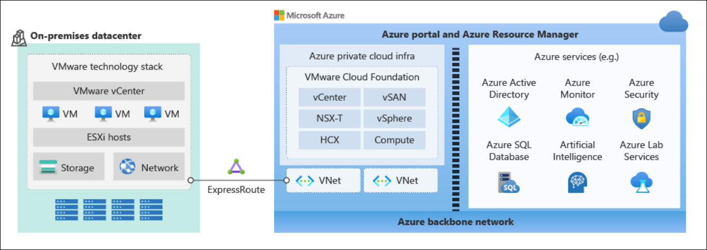
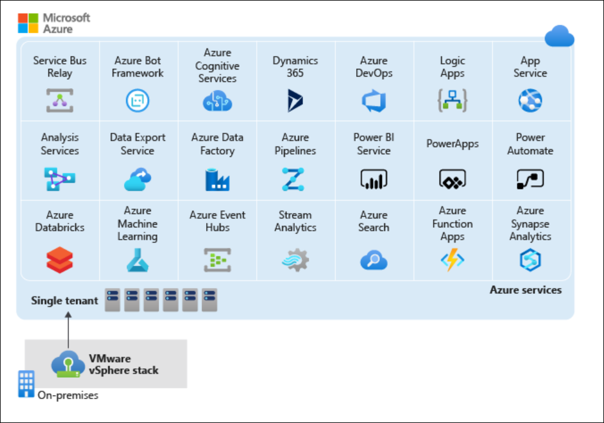
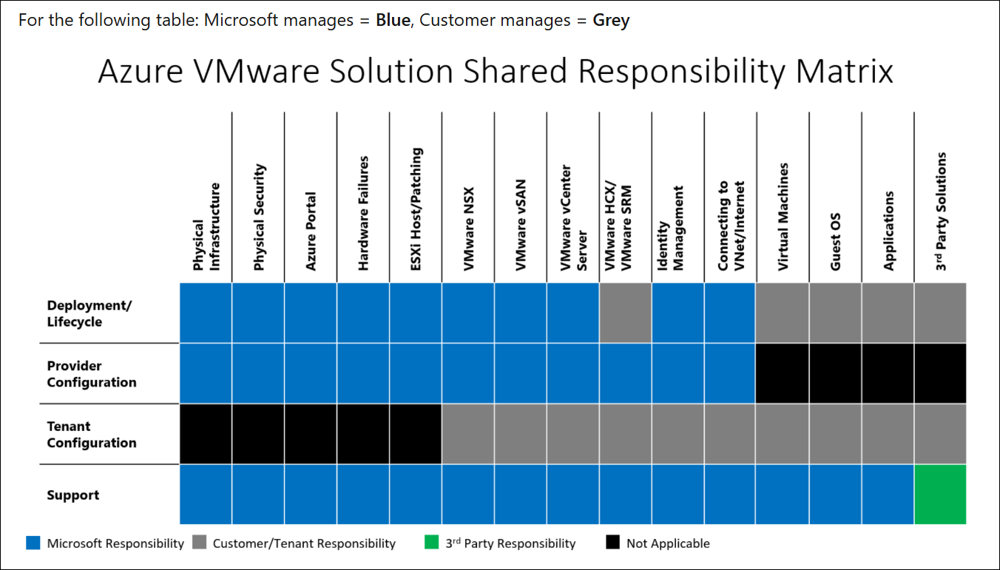
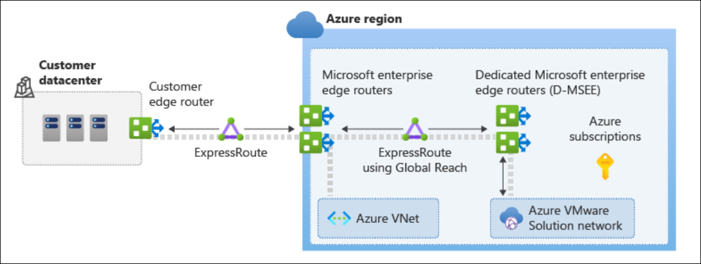
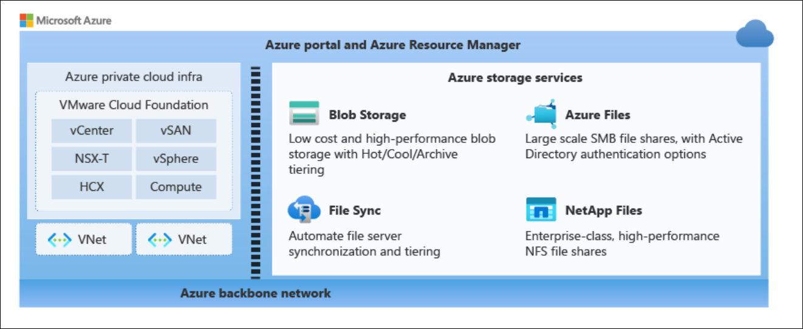
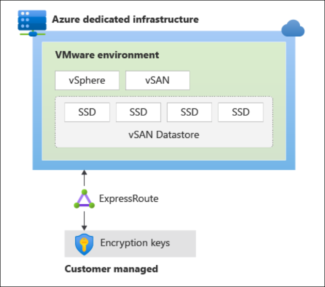

# Lab 1: Introduction to Azure VMware Solution (AVS)

**Module:** [Introduction to Azure VMware Solution](https://learn.microsoft.com/en-us/training/modules/intro-azure-vmware-solution/)

Learn how Azure VMware Solution helps enterprises move to the cloud. Review its features and unique advantages. Explore common use cases and customer examples. Understand the available support options. Get an overview of the service components.

**Learning objectives:**  
By the end of this module, you will be able to:

* Assess whether Azure VMware Solution is a good fit for current business challenges.
* Identify the main differences between Azure VMware Solution and on-premises VMware.
* Explain how the service affects existing licensing when using Azure Hybrid Benefit.
* Describe the core components of the service.

<!-- omit in toc -->
## Contents

- [Introduction](#introduction)
- [What is Azure VMware Solution?](#what-is-azure-vmware-solution)
  - [Key features](#key-features)
  - [Integration with Azure services](#integration-with-azure-services)
  - [Continuity of operations](#continuity-of-operations)
  - [Billing](#billing)
- [How Azure VMware Solution works](#how-azure-vmware-solution-works)
  - [Shared support](#shared-support)
  - [Monitoring and remediation](#monitoring-and-remediation)
  - [Private clouds, clusters, and hosts in Azure](#private-clouds-clusters-and-hosts-in-azure)
  - [Interconnectivity in Azure](#interconnectivity-in-azure)
  - [Private cloud storage](#private-cloud-storage)
  - [Security and compliance](#security-and-compliance)
  - [Steps for deploying Azure VMware Solution](#steps-for-deploying-azure-vmware-solution)
- [When to use Azure VMware Solution](#when-to-use-azure-vmware-solution)
- [Summary](#summary)

## Introduction

Azure VMware Solution is an Azure service that provides a vSphere-based, single-tenant private cloud. It runs on dedicated bare-metal infrastructure in Azure.

With this service, you can run, manage, and secure applications across VMware environments and Azure using a consistent operating model.

**Example scenario**  
You work for a healthcare company that hosts many production workloads on VMware vSphere across multiple offices.

Recently, several challenges have surfaced. Some locations have hardware nearing end of life, requiring urgent refresh decisions. At the same time, the company struggles to acquire new infrastructure quickly enough to meet refresh and application demands. The requisition process, approvals, and logistics can take four to six months or more.

To address these issues, the company is exploring migration of VMware vSphere workloads to the cloud, without changing the virtualization platform or altering current operations.

What will you learn?
In this module, you’ll explore:

* The business value of Azure VMware Solution
* Common use cases driving adoption
* Core service components
* Connectivity options between datacenters
* Licensing benefits with Azure Hybrid Benefit

**Main goal**  
By the end of this module, you will be able to evaluate whether Azure VMware Solution is the right choice for your company’s cloud strategy.

## What is Azure VMware Solution?

Every company is at a different stage in its digital transformation and cloud adoption. To support this, Microsoft and VMware developed Azure VMware Solution. This service lets organizations move VMware-based workloads from on-premises to Azure, deploy new virtual machines, and integrate workloads with other Azure services.

Azure VMware Solution combines VMware’s Software-Defined Data Center (SDDC) with the global scale of Azure. It’s VMware-validated and continuously certified through testing of upgrades and enhancements.

Microsoft manages the service to meet enterprise requirements for performance, availability, security, and compliance. The solution includes:

* Management systems
* Networking services
* Operating platform
* Back-end infrastructure operations

VMware vSphere clusters run on bare-metal Azure hosts and can be deployed and managed through the Azure portal, Azure CLI, or PowerShell. Each private cloud comes with supported versions of VMware vCenter Server, vSAN, vSphere, and NSX—fully licensed. The service also provides elasticity, allowing you to scale compute, network, and storage resources up or down as needed.

The following diagram shows how private clouds, Azure services, and on-premises environments connect within Azure.

### Key features

Azure VMware Solution delivers a complete VMware environment in Azure, allowing your organization to:

* Use existing VMware investments: Continue using familiar VMware vSphere and vCenter tools without retraining staff or refactoring hypervisors.
* Maintain operational consistency for admins: Manage Azure-based VMware resources with standard interfaces like vSphere Client and NSX Manager. The Azure portal is used only for deployment and management.
* Preserve business operations: Reduce change management by leveraging existing training, processes, tools, and practices. Use VMware HCX Enterprise for large-scale, live migrations from on-premises to Azure with minimal downtime.
* Rely on a single point of support: Microsoft develops, operates, and supports the service, coordinating directly with VMware when needed.
* Simplify licensing: Manage licensing and resource consumption through one vendor, with VMware product licenses tied directly to deployed resource nodes.
* Maximize existing licenses: Apply Azure Hybrid Benefit for Windows Server and SQL Server to bring current licenses to Azure and lower costs.

### Integration with Azure services

Azure VMware Solution lets customers migrate their VMware vSphere environments to the cloud at their own pace. Administrators manage everything through the Azure portal without relying on third-party services and can gradually build their cloud skills while working with Azure.

Native Azure tools and services can monitor and manage virtual machines across environments. These same tools work with VMs in Azure VMware Solution, standard Azure VMs, and on-premises VMs.

  

| Integration                  | Description                                                                                               |
| ---------------------------- | --------------------------------------------------------------------------------------------------------- |
| Log Analytics workspace      | Dedicated environment in Azure Monitor to store and manage log data for configured sources and solutions. |
| Microsoft Defender for Cloud | Unified security management with advanced threat protection for hybrid workloads.                         |
| Microsoft Sentinel           | Cloud-native SIEM providing analytics, alerts, and automated threat response.                             |
| Azure NetApp Files           | Mountable SMB/NFS shares for Linux and Windows clients in Azure VMware Solution.                          |
| Azure Backup Server          | Backup VMware VMs on ESXi or vCenter to Azure.                                                            |
| Azure Application Gateway    | Layer-7 load balancer to secure and manage web app traffic.                                               |
| Azure Traffic Manager        | Distributes workloads across multiple endpoints for availability and performance.                         |

### Continuity of operations

Azure VMware Solution delivers high availability and modernization through fully managed Azure infrastructure with built-in redundancy and no single point of failure.

You can deploy VMware resources in Azure as a primary or secondary recovery site, ensuring business continuity for on-premises datacenter workloads.

### Billing

Azure VMware Solution offers three billing options, giving customers the flexibility to adjust costs as their business needs change.

| Billing Option            | Description                     | Common Use Cases                          |
|----------------------------|---------------------------------|-------------------------------------------|
| Hourly (pay as you go)     | On demand                      | Bursting, initial deployments             |
| 1-Year Reserved Instance   | Reserved capacity for one year | Major projects, known usage patterns       |
| 3-Year Reserved Instance   | Reserved capacity for three years | Datacenter exit scenarios, long-term strategy |

## How Azure VMware Solution works

### Shared support

In on-premises VMware vSphere environments, customers must maintain both the hardware and software needed to run the platform. With Azure VMware Solution, Microsoft takes on platform management. Here’s how responsibilities are divided between Microsoft and the customer.

Together with VMware, Microsoft manages the life cycle of VMware software such as ESXi, vCenter Server, and vSAN. Microsoft also handles NSX appliance lifecycle management and initial network setup, including creating the Tier-0 gateway and enabling north/south routing.

Customers are responsible for NSX SDN configuration, which includes:

* Network segments
* Distributed firewall rules
* Tier-1 gateways
* Load balancers

### Monitoring and remediation

Azure VMware Solution continuously checks the health of its infrastructure and VMware components. When a failure is detected, the system automatically repairs it. If a node shows signs of degradation or fails, the host remediation process begins.

Host remediation replaces the faulty node with a healthy one in the cluster. When possible, the faulty host is put into VMware vSphere maintenance mode, and VMware vMotion migrates VMs to other servers—often with no downtime. If maintenance mode isn’t possible, the host is removed from the cluster.

Azure VMware Solution monitors host conditions such as:

* Processor status
* Memory status
* Connection and power state
* Hardware fan status
* Network connectivity
* System board status
* Disk errors on vSAN hosts
* Hardware voltage
* Temperature status
* Power status
* Storage health
* Connection failures

### Private clouds, clusters, and hosts in Azure

Azure VMware Solution delivers private clouds built on vSphere clusters using dedicated bare-metal Azure hosts.

Each private cloud can include multiple clusters managed by the same vCenter Server and NSX Manager. Private clouds are deployed and managed within an Azure subscription, and the number of private clouds per subscription can scale as needed.

By default, each private cloud starts with a single vSphere cluster. You can add, remove, or scale clusters through the Azure portal or API. Microsoft provides node options based on CPU, memory, and storage needs, with AV36P being the most commonly used configuration.

Node limits:

* Minimum of 3 nodes per cluster
* Maximum of 16 nodes per cluster
* Up to 12 clusters per private cloud
* Up to 96 nodes per private cloud

The table below lists CPU, memory, disk, and network specs for available AVS hosts:

| Host Type | CPU                                                                 | RAM      | vSAN Cache Tier         | vSAN Capacity  |
|-----------|---------------------------------------------------------------------|----------|-------------------------|----------------|
| AV36      | Dual Intel Xeon Gold 6140, 18 cores/CPU @ 2.3 GHz (36 physical cores) | 576 GB   | 3.2 TB (NVMe)           | 15.20 TB (SSD) |
| AV36P     | Dual Intel Xeon Gold 6240, 18 cores/CPU @ 2.6 GHz / 3.9 GHz Turbo (36 physical cores) | 768 GB   | 1.5 TB (Intel Cache)    | 19.20 TB (NVMe) |
| AV52      | Dual Intel Xeon Platinum 8270, 26 cores/CPU @ 2.7 GHz / 4.0 GHz Turbo (52 physical cores) | 1,536 GB | 1.5 TB (Intel Cache)    | 38.40 TB (NVMe) |
| AV64*     | Dual Intel Xeon Platinum 8370C, 32 cores/CPU @ 2.8 GHz / 3.5 GHz Turbo (64 physical cores) | 1,024 GB | 3.84 TB (NVMe)          | 15.36 TB (NVMe) |

> An Azure VMware Solution private cloud must first be deployed with AV36, AV36P, or AV52 before AV64 hosts can be added.

Cluster configuration and operations are managed mainly through vSphere and NSX Manager. Local storage for each host is controlled by vSAN. Every ESXi host includes four 25-Gbps NICs—two for ESXi system traffic and two for workload traffic.

The VMware software versions used in new deployments of private cloud clusters in Azure VMware Solution are:

| Software              | Version |
|-----------------------|---------|
| VMware vCenter Server | 7.0 U3o |
| ESXi                  | 7.0 U3o |
| vSAN                  | 7.0 U3  |
| vSAN on-disk format   | 15      |
| HCX                   | 4.8.2   |
| VMware NSX            | 4.1.1   |

NSX-T is the only supported version of NSX. When new clusters are added to an existing private cloud, the currently running software version is applied.

### Interconnectivity in Azure

The Azure VMware Solution private cloud can be accessed from both on-premises and Azure resources using the following services:

* Azure ExpressRoute
* VPN connections
* Azure Virtual WAN
* Azure ExpressRoute Gateway

  

These services require enabling specific network address ranges and firewall ports.

You can connect Azure VMware Solution through an existing ExpressRoute gateway, provided the virtual network doesn’t exceed four ExpressRoute circuits. For on-premises access, ExpressRoute Global Reach is the preferred option. If it isn’t available or doesn’t meet security or network requirements, alternate methods can be used.

ExpressRoute Global Reach connects private clouds to on-premises environments. This setup requires a virtual network with an ExpressRoute circuit in your subscription.

There are two connectivity options for Azure VMware Solution private clouds:

* **Basic Azure-only interconnectivity**: Private cloud access is limited to a single Azure virtual network. Best for evaluations or scenarios without on-premises access needs.
* **Full interconnectivity**: Extends basic connectivity to link on-premises environments with Azure VMware Solution private clouds.

During deployment, private networks for management, provisioning, and vMotion are created. These networks support vCenter Server, NSX-T Manager, VM vMotion, and VM deployment.

### Private cloud storage

Azure VMware Solution uses native, all-flash VMware vSAN storage that’s fully configured and local to each cluster. All host storage is combined into a vSAN datastore, with data-at-rest encryption enabled by default.

vSAN storage architecture is built on disk groups, each made up of a cache tier and a capacity tier. Depending on the host type, the cache uses NVMe or Intel drives, and capacity size varies. Every node in a vSphere cluster includes two disk groups, each with one cache disk and three capacity disks.

Datastores are automatically created during private cloud deployment and are ready for immediate use.

| Host Type | vSAN Cache Tier (TB, raw) | vSAN Capacity Tier (TB, raw) |
|-----------|----------------------------|-------------------------------|
| AV36      | 3.2 (NVMe)                 | 15.20 (SSD)                   |
| AV36P     | 1.5 (Intel Cache)          | 19.20 (NVMe)                  |
| AV52      | 1.5 (Intel Cache)          | 38.40 (NVMe)                  |
| AV64      | 3.84 (NVMe)                | 15.36 (NVMe)                  |

A storage policy is created on the vSphere cluster and applied to the vSAN datastore. This policy controls how VM storage objects are provisioned and allocated, ensuring the required level of service. To meet service-level agreements, 25% of datastore capacity must remain available. The appropriate failure-to-tolerate (FTT) policy must also be applied, which varies depending on cluster size.

Workloads in your private cloud can also use Azure storage services. The following diagram highlights some of the storage options available with Azure VMware Solution.

  

### Security and compliance

Azure VMware Solution private clouds use vSphere role-based access control for managing access and security. Users and Groups from Active Directory can be assigned the CloudAdmin role through LDAP or LDAPS.

Each vCenter Server includes a built-in local user called **cloudadmin**, mapped to the **CloudAdmin role**. This role differs from the full administrator role available in other VMware solutions:

* The CloudAdmin user can’t add identity sources (such as LDAP or LDAPS) directly to vCenter Server. However, Run commands can be used to add identity sources and assign the CloudAdmin role to users and groups.
* Administrators don’t have access to the vCenter administrator account. Instead, they assign Active Directory users and groups to the CloudAdmin role.
* Users can’t access or configure infrastructure components managed by Microsoft, such as clusters, hosts, datastores, or distributed virtual switches.

For storage security, Azure VMware Solution enables data-at-rest encryption for vSAN datastores by default. This encryption is managed through Key Management Service (KMS) integrated with vCenter Server. Keys are encrypted and wrapped by an Azure Key Vault master key. When a host is removed from a cluster, data on its SSDs is immediately invalidated.

The following diagram shows how encryption keys are managed in Azure VMware Solution.

### Steps for deploying Azure VMware Solution

The following table outlines the steps that an organization takes to get started with using Azure VMware Solution.

| Milestone                  | Steps                                                                 |
|-----------------------------|----------------------------------------------------------------------|
| Plan                        | - Assess workloads   - Determine sizing   - Identify the host   - Request a quote   - Determine networking and connectivity |
| Deploy                      | - Register the Microsoft.AVS resource provider   - Create an Azure VMware Solution private cloud   - Connect to Azure Virtual Network with ExpressRoute   - Validate the connection |
| Connect to on-premises      | - Create an ExpressRoute authorization key in the on-premises ExpressRoute circuit   - Peer the private cloud to on-premises   - Verify on-premises network connectivity   - Other connectivity options available |
| Deploy and configure VMware HCX | - Enable the HCX service add-on   - Download the VMware HCX Connector OVA   - Deploy the on-premises VMware HCX OVA (Connector)   - Activate the VMware HCX Connector   - Pair the on-premises Connector with Azure VMware Solution HCX Cloud Manager   - Configure interconnect (network profile, compute profile, service mesh)   - Validate appliance status and confirm migration is possible |

## When to use Azure VMware Solution

Every organization’s cloud transformation is shaped by its own requirements. Azure VMware Solution offers a fast path to cloud adoption without reformatting existing assets. You can run your VMware technology stack on Azure just as you do on-premises—no app refactoring or new skill sets required.

Many organizations use Azure VMware Solution to extend the value of their VMware investments while moving toward the cloud. It allows VMware vSphere environments to run on Azure’s dedicated infrastructure.

The table below outlines scenarios where Azure VMware Solution is a strong fit based on business needs and considerations.

| Business need                          | Description                                                                 |
|----------------------------------------|-----------------------------------------------------------------------------|
| Migrate existing assets "as is"        | Replicate IT systems, apps, and workloads in Azure without changes ("lift and shift"). |
| Reduce your datacenter footprint       | Decommission legacy infrastructure by moving resources into Azure.          |
| Prepare for disaster recovery and business continuity | Move apps to Azure without disruption. Use VMware resources in Azure as a primary or secondary recovery site. |
| Modernize your workloads               | Innovate at your own pace with Azure tools and services to modernize apps and datacenters. |

## Summary

In this module, you explored Azure VMware Solution, an Azure service that lets you deploy and extend VMware vSphere environments in the cloud.

Key takeaways:

**Business value of Azure VMware Solution**

* Familiar VMware tools and technology
* Native Azure integration
* High-performance cloud infrastructure

**Core components and how it works in Azure**

* Microsoft-managed responsibilities
* Private cloud and storage concepts
* Interconnectivity within Azure
* Security and compliance features

**Use cases driving adoption**

* Migrate existing assets as-is
* Reduce datacenter footprint
* Enable disaster recovery and business continuity
* Modernize workloads

**Pricing considerations**

* Flexible billing options to match business needs

Next, continue this path to learn how to deploy and migrate virtual machines to Azure VMware Solution.
