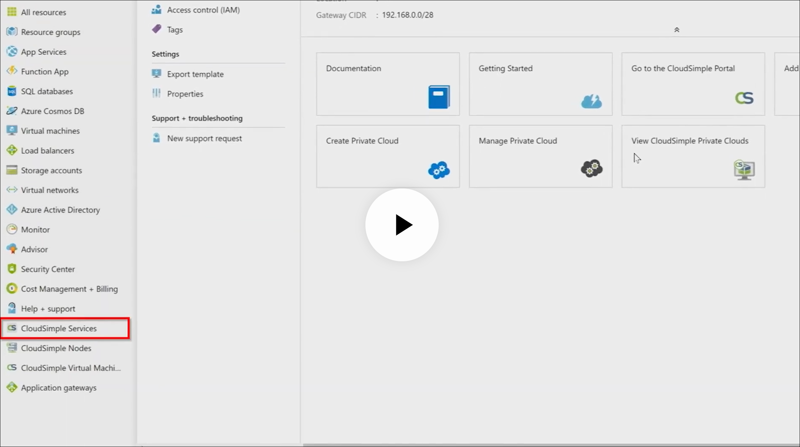
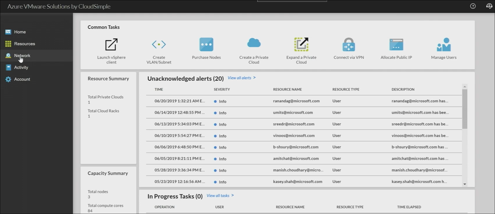
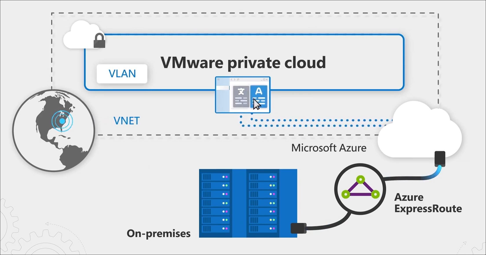
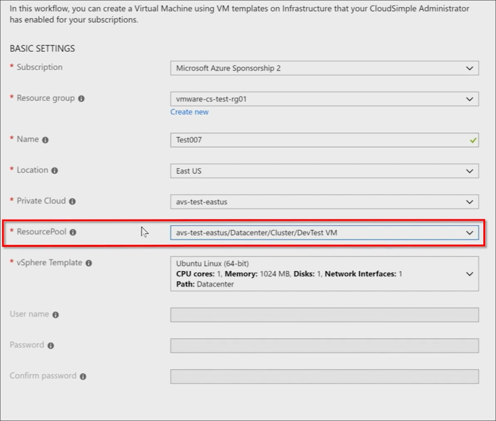
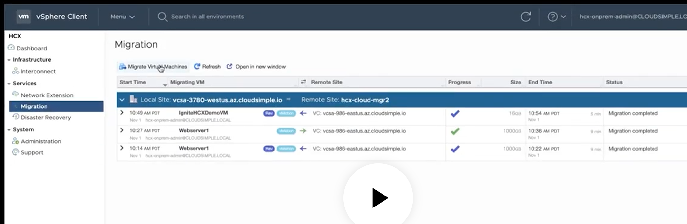
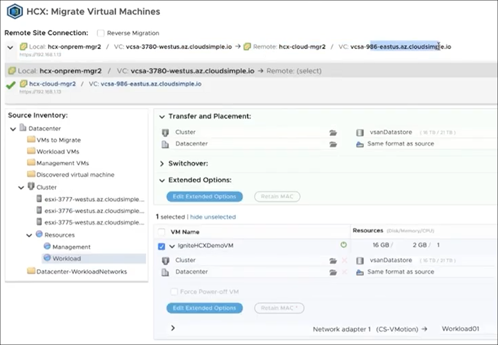
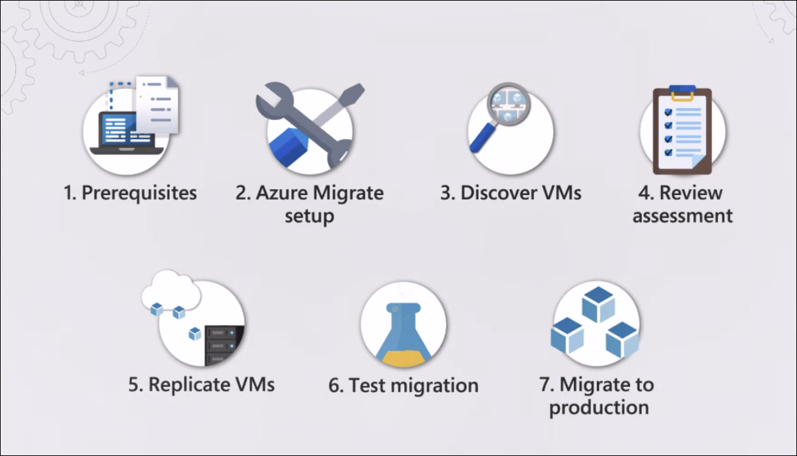
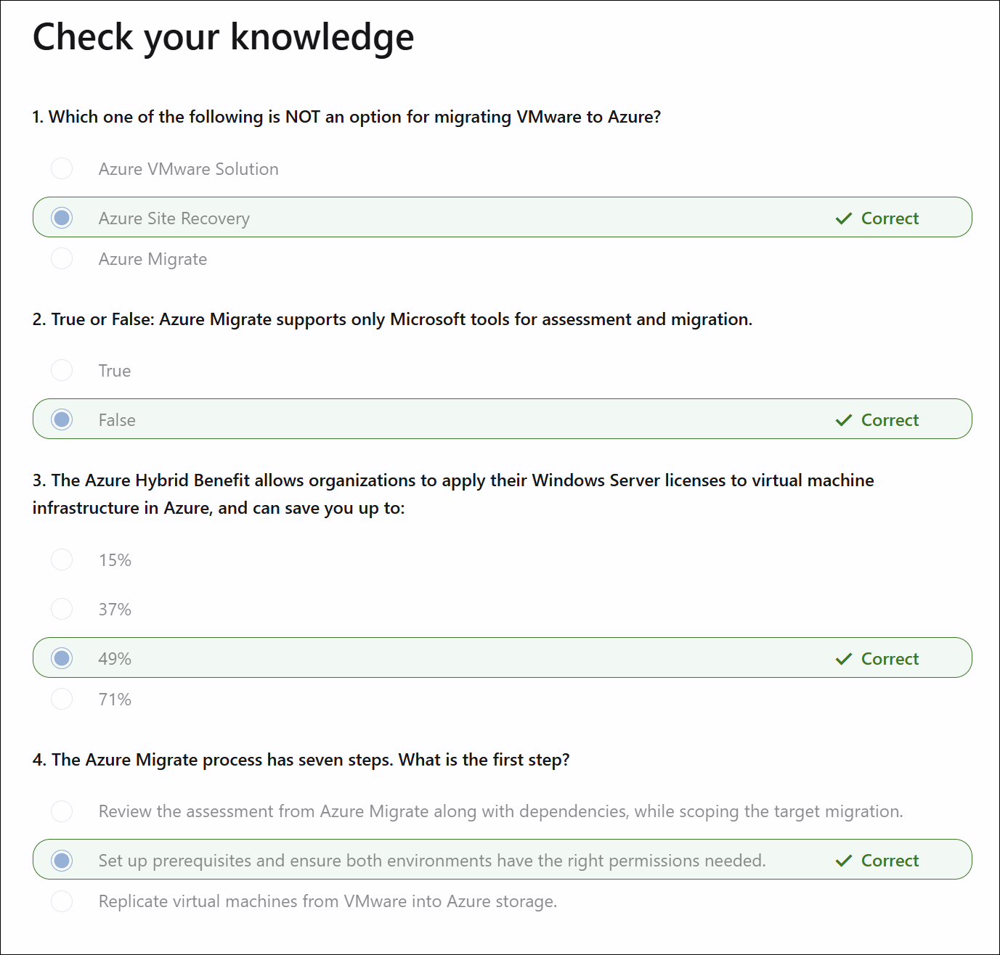

# Lab 1-2: Introduction to Azure Migrate for server migration

**Module:** [Introduction to Azure Migrate for server migration](https://learn.microsoft.com/en-us/training/modules/m365-azure-migrate-introduction/)

Discover how Azure Migrate enables you to move on-premises VMware or Hyper-V workloads to Azure infrastructure as a service (IaaS). Learn how to migrate workloads without agents, all managed from a single hub.

Learning objectives
After completing this module, you will be able to:

* Describe migration options for moving workloads to Azure IaaS.
* Outline the steps in the migration process.

<!-- omit in toc -->
## Contents

- [Introduction to Azure Migrate for server migration](#introduction-to-azure-migrate-for-server-migration)
- [Understand your migration options](#understand-your-migration-options)
- [Understand the migration process](#understand-the-migration-process)
- [Check your knowledge](#check-your-knowledge)

## Introduction to Azure Migrate for server migration

Thinking about moving your on-premises VMware or Hyper-V workloads to Azure infrastructure as a service (IaaS)? Azure Migrate helps you discover and assess Windows and Linux VMs, identify app dependencies, recommend VM sizing, and migrate workloads at scale. Unlike earlier versions of Azure Migrate or Azure Site Recovery, it now supports discovery, assessment, and agentless migration directly within the hub.

## Understand your migration options

This module focuses on migrating from VMware infrastructure to Azure. If you use Windows Server Hyper-V, the process is similar. Each platform uses a specialized virtual machine appliance installed on your hosts to discover, assess, and replicate the VMs you want to migrate.

For VMware to Azure migrations, there are two main options: Azure VMware Solution (AVS) and Azure Migrate.

**Azure VMware Solution** provisions a native VMware environment on dedicated Azure bare-metal infrastructure. It lets you build private cloud environments in Azure using the same VMware tools and expertise you already have. AVS is well-suited for large-scale migrations in a short time, such as when retiring a data center. This module does not cover AVS in detail. See the Learn more links for additional resources.

**Azure Migrate** is the focus here. It helps improve compute efficiency, offers flexibility to right-size infrastructure, and reduces long-term costs by running VMs in native Azure IaaS. Azure Migrate now includes migration tools previously available only in Azure Site Recovery, fully integrated and optimized for Azure Migrate. It also supports Microsoft and partner tools for both assessment and migration. With simplified end-to-end workflows, you can centrally track and manage projects from a single hub.

**Videos:**

* [How to run VMware in Azure - Demo Tutorial](https://learn.microsoft.com/_themes/docs.theme/master/en-us/_themes/global/video-embed-one-stream.html?id=c8378aa3-a9f8-43ad-ac25-61ec14a6fa31)

  

  
Screenshots

  **Note:** Azure VMware Solution (AVS) is the successor to the service originally named **CloudSimple**. Microsoft acquired CloudSimple in 2019 and rebranded it as AVS.

  

  

  

  Creating a virtual machine in AVS:  
  

  

* [Real life migrations to Azure](https://learn.microsoft.com/_themes/docs.theme/master/en-us/_themes/global/video-embed-one-stream.html?id=4e056272-f664-409d-b27f-46a7608abb51) - includes demonstration of vMotion from on-prem VMware using HCX into Azure VMware instance

  

  
Screenshots

  Migrate virtual machine option in vSphere client:  
  

  HCX (Hybrid Cloud Extension) migration to Azure:
  

  

## Understand the migration process

The Azure Migrate process uses Microsoft's tools for assessment and migration

1. Configure prerequisites and verify permissions in both environments.
2. Create an Azure Migrate project and add assessment and migration tools.
3. Download and deploy a VM appliance in VMware to discover VMs and dependencies.
4. Review assessments and dependencies in Azure Migrate while defining the migration scope.
5. Replicate VMs from VMware to Azure storage.
6. Test VMs in a test virtual network.
7. Migrate VMs to production in a production virtual network.

## Check your knowledge

