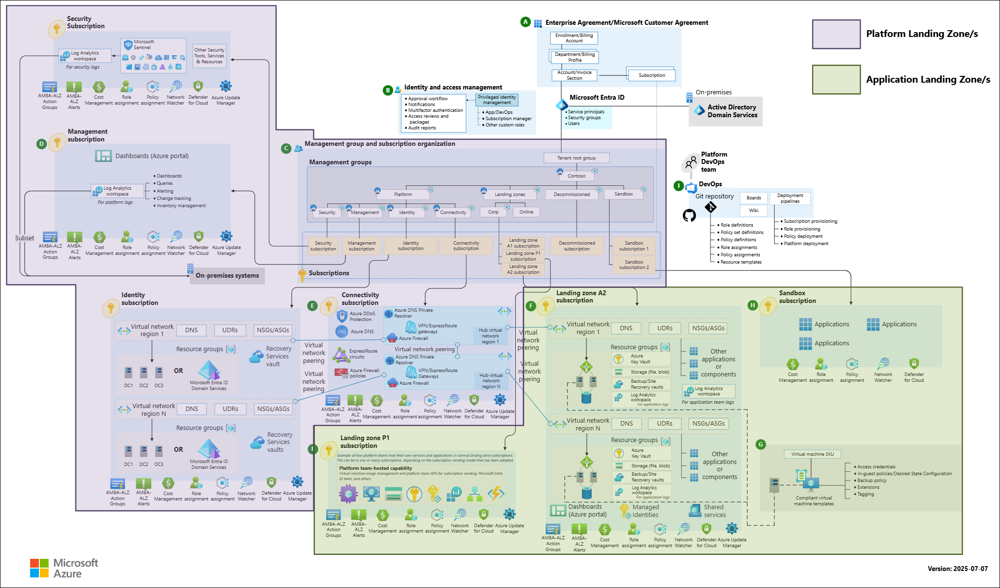

# Lab 1-3 - Introduction to the Microsoft Cloud Adoption Framework

**Module:** [Introduction to the Microsoft Cloud Adoption Framework](https://learn.microsoft.com/en-us/training/modules/cloud-adoption-framework/)

[Microsoft Cloud Adoption Framework for Azure](https://learn.microsoft.com/en-us/azure/cloud-adoption-framework/overview)

This module introduces the Cloud Adoption Framework, a collection of documentation, guidance, best practices, and tools designed to align business, people, and technology strategies.

**Learning objectives**
In this module, you will:

* Use the Cloud Adoption Framework to assess your environment and create a cloud adoption plan.
* Define your motivations for adopting the cloud and set clear objectives to achieve your goals.
* Identify gaps in your strategy, such as missing technology, training needs, or necessary organizational changes.

<!-- omit in toc -->
## Contents

- [Introduction](#introduction)
- [Strategy](#strategy)
  - [Assess your strategy](#assess-your-strategy)
  - [Determine your motivations, mission, and objectives](#determine-your-motivations-mission-and-objectives)
  - [Define your team](#define-your-team)
  - [Prepare your organization](#prepare-your-organization)
  - [Inform your strategy](#inform-your-strategy)
- [Plan](#plan)
  - [Prepare your organization for the cloud](#prepare-your-organization-for-the-cloud)
  - [Prepare your people for the cloud](#prepare-your-people-for-the-cloud)
  - [Discover existing workload inventory](#discover-existing-workload-inventory)
  - [Select migration strategies](#select-migration-strategies)
  - [Assess your workloads for cloud migration](#assess-your-workloads-for-cloud-migration)
  - [Estimate total cost of ownership](#estimate-total-cost-of-ownership)
- [Ready](#ready)
  - [Define a cloud operating model](#define-a-cloud-operating-model)
  - [Implement landing zones](#implement-landing-zones)
  - [Develop necessary skills](#develop-necessary-skills)
  - [Avoid antipatterns](#avoid-antipatterns)
- [Migrate](#migrate)
  - [Plan migration](#plan-migration)
  - [Prepare workloads for the cloud](#prepare-workloads-for-the-cloud)
  - [Execute migrations](#execute-migrations)
  - [Optimize workloads after migration](#optimize-workloads-after-migration)
  - [Decommission source workloads](#decommission-source-workloads)
- [Modernize](#modernize)
  - [Plan your cloud modernization](#plan-your-cloud-modernization)
  - [Execute modernizations in the cloud](#execute-modernizations-in-the-cloud)
  - [Optimize workloads after cloud modernization](#optimize-workloads-after-cloud-modernization)

## Introduction

The Cloud Adoption Framework for Azure is a set of documentation, guidance, best practices, and tools that help align business, organizational readiness, and technology strategies. It provides a clear, actionable path for moving to the cloud.

Cloud adoption changes how organizations acquire and use technology, offering greater flexibility in design and operations. The framework delivers a consistent, proven methodology to guide this transition.

It is built around eight methodologies:

* Strategy
* Plan
* Ready
* Migrate
* Innovate
* Govern
* Manage
* Secure

In this module, you will:

* Use the Cloud Adoption Framework to assess your environment and create a cloud adoption plan.
* Define your motivations for cloud adoption and set objectives to achieve your goals.
* Identify gaps in your strategy, such as missing technology, team training needs, or required organizational changes.

## Strategy

Use the Strategy methodology to build a clear plan for adopting and integrating cloud technologies. A cloud adoption strategy ensures alignment with business goals. The methodology includes five steps.

### Assess your strategy

* [Assess your cloud adoption strategy](https://learn.microsoft.com/en-us/azure/cloud-adoption-framework/strategy/assessment)
* [Cloud Adoption Strategy Evaluator](https://learn.microsoft.com/en-us/assessments/8fefc6d5-97ac-42b3-8e97-d82701e55bab/)

Evaluate your current cloud adoption strategy. Use the assessment results to show your organization’s cloud maturity, highlight gaps, and guide improvements.

### Determine your motivations, mission, and objectives

For a successful cloud adoption journey, start by clarifying your motivations for moving to the cloud. Common drivers include cost savings, agility, scalability, and innovation. Align your strategy with these motivations to better achieve business goals. For instance, if critical business events are a priority, you may need to begin migration early, alongside strategy and planning.

Define a clear mission and objectives to provide direction and purpose. A mission has value only if it leads to action, measurable outcomes, and effective achievement of objectives. Write a mission statement that connects your objectives and key results to your organization’s broader business mission.

Break your mission into actionable steps—these become your objectives. For each objective, define measurable KPIs to track progress. Assign accountability for every key result, and review them regularly with their associated KPIs. A strong mission with well-defined objectives keeps your team focused and motivated throughout the cloud adoption journey.

### Define your team

* [Define your cloud strategy team](https://learn.microsoft.com/en-us/azure/cloud-adoption-framework/strategy/define-your-team)
* [Recommended functions](https://learn.microsoft.com/en-us/azure/cloud-adoption-framework/strategy/define-your-team#recommended-functions)
* [Seek input](https://learn.microsoft.com/en-us/azure/cloud-adoption-framework/strategy/define-your-team#seek-input)

The cloud strategy team ensures alignment between business goals and adoption efforts. Assign each member a role that adds value to cloud adoption. For example, a lead architect can translate business objectives into technical designs, while a compliance team ensures practices meet regulatory requirements.

To maintain alignment, the team should regularly seek input from other business areas, such as HR or marketing. Start with a small core team including IT, finance, and security, then expand as adoption grows. Review team composition often to maintain diverse representation and identify risks and opportunities. Begin with an initial strategy built by the core team, then broaden it as executive support increases.

### Prepare your organization

* [Prepare for organizational alignment](https://learn.microsoft.com/en-us/azure/cloud-adoption-framework/strategy/prepare-organizational-alignment)
* [Leadership buy-in](https://learn.microsoft.com/en-us/azure/cloud-adoption-framework/strategy/prepare-organizational-alignment#leadership-and-executive-buy-in)
* [Understand your organization's capabilities](https://learn.microsoft.com/en-us/azure/cloud-adoption-framework/strategy/prepare-organizational-alignment#understand-your-operating-models-readiness-for-cloud)
* [Transition from project model to delivery model](https://learn.microsoft.com/en-us/azure/cloud-adoption-framework/strategy/prepare-organizational-alignment#shift-from-a-project-model-to-product-model)

Organizational alignment ensures leadership collectively supports your cloud adoption strategy. Start by engaging a few key stakeholders, then expand leadership buy-in as you refine implementation. Leadership must consistently support your vision and strategy.

Alignment across business, digital, IT, and adoption strategies is also critical. If these strategies already exist, make sure your adoption strategy supports their goals. Regularly check in with business, digital, and IT leaders to keep cloud initiatives aligned with changing objectives.

Assess your current capabilities across people, processes, technology, and partners. Review your operating model and identify gaps in culture, roles, skills, or support. Your adoption strategy should account for the resources needed to close those gaps.

To achieve scalability and speed, your organization may need to shift from a project delivery model to a product delivery model. This means moving away from task-based projects with fixed scopes and timelines to a continuous, outcome-driven approach managed by cross-functional teams responsible for development, operations, and governance.

### Inform your strategy

* [Develop a cloud adoption strategy](https://learn.microsoft.com/en-us/azure/cloud-adoption-framework/strategy/#cloud-adoption-strategy-checklist)

After completing the first four steps, consider the following factors to refine your cloud adoption strategy:

**Financial efficiency:** Make strategic choices to maximize value from your investment and reduce unnecessary costs.

**AI:** Integrate AI into your cloud platform to leverage analytics, machine learning, and automation for optimized operations and business growth.

**Resiliency:** Build your cloud infrastructure for resiliency to reduce the impact of disruptions and maintain reliable operations.

**Security:** Start security discussions early, adopt a Zero Trust approach, and explore Microsoft-led workshops to modernize practices.

**Sustainability:** Incorporate sustainability into your strategy to improve operations and strengthen your organization’s reputation.

## Plan

* [Prepare your organization for the cloud](https://learn.microsoft.com/en-us/azure/cloud-adoption-framework/plan/prepare-organization-for-cloud)

Successful cloud adoption goes beyond technical readiness. It requires a plan that turns your strategy into clear, actionable steps tailored to your goals.

### Prepare your organization for the cloud

Organizations must align their structure and processes with cloud adoption goals to deploy, manage, and optimize resources while meeting business objectives.

1. **Map your journey based on organization type.** Startups should focus on cloud-native solutions using the CAF Plan, Ready, and Cloud-native development phases. Enterprises should assess their IT estate and follow the full CAF Plan plus Ready, Migrate, and Modernize phases.

2. **Select a management model that matches your structure.** Small organizations benefit from centralized operations for consistent policy enforcement. Mid-size enterprises should use shared management, with platform teams handling landing zones and workload teams managing operations. Skilled teams can adopt decentralized operations for full ownership.

3. **Plan responsibilities across governance, security, and management.** Governance teams should assess risks and set policies. Security must be integrated into every stage of the lifecycle. Define operational processes that align with business goals. Create an AI strategy and establish teams to support adoption.

4. **Document responsibilities with clear ownership.** Map governance, security, and operations roles with assigned owners. Define partner contributions and communicate all responsibilities to stakeholders. Review and update ownership as your environment evolves.

### Prepare your people for the cloud

Teams need the right skills to adopt and run cloud services effectively, reducing risks and speeding up value delivery.

1. **Identify required skills for Azure adoption.** Teams should know governance, security, identity, networking, and management basics. Azure environment managers need RAMP skills (Ready, Administer, Monitor, Protect). Cloud-native development teams require expertise in platform engineering, containerization, microservices, and AI development.

2. **Close skill gaps with structured training and expert support.** Use Microsoft Learn, personalized training paths, and credentials like Microsoft Applied Skills and certifications. Leverage Microsoft specialists or trusted partners for workshops, architectural reviews, and hands-on guidance.

3. **Maintain cloud skills with continuous learning programs.** Create Azure Dev/Test sandboxes, dedicate weekly time for Microsoft Learn modules, build recognition systems, join Azure community events, and keep curated resources up to date.

Startups can move directly to estimating total cost of ownership. Organizations with existing workloads should begin by discovering their current inventory.

### Discover existing workload inventory

Organizations must understand their application portfolio before planning cloud adoption. This forms the basis for migration planning and business case development.

1. **Discover workload inventory through structured documentation.** Define workload boundaries and use automated tools like Azure Migrate. When automation cannot access certain systems, document assets manually and include all components across environments.

2. **Prioritize workloads by business value and migration feasibility.** Assess criticality, cloud readiness, dependencies, and strategic alignment. Build a prioritized migration backlog that balances business impact with technical feasibility.

3. **Collect business details for each workload to guide decisions.** Document ownership, function, criticality, data sensitivity, compliance needs, operational constraints, and timelines. Use this information to shape migration strategies and maintain business alignment.

### Select migration strategies

Migration strategy selection defines the approach, timeline, and resources for each workload. It must align with business drivers and technical constraints.

1. **Identify business drivers to set migration priorities.** Establish high-level goals, perform a gap analysis, and determine the drivers creating urgency for change.

2. **Match drivers to migration strategies.** Options include Retire for redundant workloads, Rehost for minimal disruption, Replatform for PaaS adoption, Refactor for code optimization, Rearchitect for cloud-native capabilities, Replace with SaaS alternatives, Rebuild for full redevelopment, or Retain for stable workloads.

3. **Validate strategies with selection criteria.** Consider workload stability, Azure compatibility, team skills, modernization timelines, technical debt, architectural limits, and operational requirements.

4. **Decide when to modernize based on resources.** Weigh team skills, time, compatibility needs, and funding to determine whether modernization should occur during migration.

5. **Maintain stakeholder alignment with a communication plan.** Define success metrics, document decisions, coordinate with strategy teams, and schedule review cycles to update strategies as needs change.

### Assess your workloads for cloud migration

Workload assessment identifies technical needs, dependencies, and risks for cloud migration. It guides architecture choices and migration planning.

1. **Evaluate workload architecture to understand structure and dependencies.** Use tools like Azure Migrate for automated discovery, confirm results with subject matter experts, and document diagrams and component lists.

2. **Review application code to find compatibility and modernization opportunities.** Use tools like AppCAT for .NET and Java applications. Check framework and SDK compatibility with Azure, and avoid unnecessary framework changes unless justified by business needs.

3. **Assess databases to capture data architecture and migration requirements.** Identify all databases, including engine types and versions. Map dependencies across applications and services, and decide whether databases should be migrated as shared instances or split by workload.

4. **Maintain a risk register to track migration risks.** Document technical, operational, and organizational risks, and assign mitigation strategies, owners, and timelines for resolution.

### Estimate total cost of ownership

Cost estimation builds the financial foundation for cloud adoption, supporting budget planning, investment decisions, and ongoing optimization.

1. **Plan Azure architecture around business and technical needs.** Document constraints and compliance requirements. Design landing zone and workload architectures by selecting the right Azure services, regions, and configurations.

2. **Estimate costs using planned architecture and usage patterns.** Apply the Azure Pricing Calculator with historical or projected data. Include operational costs such as training and process changes. Reassess estimates if projections exceed budget by identifying high-cost elements and adjusting architecture. Validate assumptions with test deployments and set a cost baseline.

## Ready

* [Prepare for cloud adoption](https://learn.microsoft.com/en-us/azure/cloud-adoption-framework/ready/)
* [Azure setup guide](https://learn.microsoft.com/en-us/azure/cloud-adoption-framework/ready/azure-setup-guide/identity)

The Ready methodology in the Cloud Adoption Framework helps guide preparation by focusing on:

* Setting up your Azure environment
* Defining a cloud operating model
* Implementing landing zones
* Considering operational aspects
* Developing required skills

Together, these elements form a strong foundation for adoption. The Azure setup guide provides step-by-step instructions to organize resources, manage costs, and secure your environment before deploying solutions.

### Define a cloud operating model

* [Choose a cloud operating model](https://learn.microsoft.com/en-us/azure/cloud-adoption-framework/plan/prepare-organization-for-cloud#choose-a-cloud-operating-model)
* [Common operating models](https://learn.microsoft.com/en-us/azure/cloud-adoption-framework/plan/prepare-organization-for-cloud#choose-a-cloud-operating-model)

A cloud operating model defines how technology is managed in the cloud. Its key components include business strategy alignment, organizational structure, change management, operations management, governance and compliance, and security.

This model shifts the focus from hardware to digital assets and workloads, ensuring consistent operations. To choose the right model, compare common approaches and align them with your organization’s needs.

**Common operating models:**

| Operations approach | Best for                                              | Responsibilities                                                                                                                             | Pros                                 | Cons                                                    |
| ------------------- | ----------------------------------------------------- | -------------------------------------------------------------------------------------------------------------------------------------------- | ------------------------------------ | ------------------------------------------------------- |
| Centralized         | Startups, single-cloud estates                        | One cloud team manages every function                                                                                                        | Simpler control, uniform standards   | One team becomes a bottleneck as scale grows            |
| Shared Management   | Mid-size or enterprise estates, hybrid, or multicloud | Platform teams build landing zones, manage shared services, and governance guardrails. Workload teams operate autonomously within guardrails | Balances standards with team agility | Requires clear responsibilities and strong coordination |
| Decentralized       | Tech-savvy startups, innovation programs              | Each team owns every cloud task                                                                                                              | High speed and autonomy              | Weaker standardization, higher risk of security gaps    |

### Implement landing zones

* [What is an Azure landing zone?](https://learn.microsoft.com/en-us/azure/cloud-adoption-framework/ready/landing-zone/)

Landing zones provide a scalable, modular environment for managing the cloud. They establish a foundation for security, governance, and resource management. The implementation you choose depends on organizational needs, required customizations, and technology use. Deployment options include the Azure portal, Bicep, and Terraform.

After deployment, optimize landing zone operations as you scale. Ongoing improvements help you:

* Remove unnecessary costs
* Improve application and service performance
* Identify and address security risks
* Scale efficiently to meet new demands
* Stay compliant with industry standards and regulations
* Build reliable, resilient systems

### Develop necessary skills

* [Environmental (technical) readiness learning paths](https://learn.microsoft.com/en-us/azure/cloud-adoption-framework/ready/suggested-skills#environmental-technical-readiness-learning-paths)
* [Organizational readiness learning paths](https://learn.microsoft.com/en-us/azure/cloud-adoption-framework/ready/suggested-skills#organizational-readiness-learning-paths)

Cloud adoption depends on having the right technical skills and organizational roles. Microsoft offers learning paths to help teams build required expertise. Align teams with cloud adoption functions, which may involve creating new structures or assigning new roles.

### Avoid antipatterns

* [Cloud readiness antipatterns](https://learn.microsoft.com/en-us/azure/cloud-adoption-framework/antipatterns/ready-antipatterns)

Common antipatterns in the readiness phase can slow cloud adoption, including:

* Inadequate preparation
* Misunderstanding cloud service features
* Limited knowledge of cloud provider operations

Avoiding these pitfalls helps ensure a smoother and more successful adoption process.

## Migrate

Migrations involve planning, executing, and optimizing the move of workloads from on-premises data centers or other clouds to Azure. Following recommendations helps reduce risks, control costs, and achieve successful adoption.

* [Migrate workloads](https://learn.microsoft.com/en-us/azure/cloud-adoption-framework/migrate/plan-migration)

### Plan migration

Plan migration with these key steps:

1. **Assess readiness and skills:** Evaluate team capabilities in infrastructure, security, and applications. Use Microsoft partners or Azure solution architects to close gaps.
2. **Choose a data migration path:** Options include ExpressRoute for high bandwidth, VPN gateways for encrypted transfers, Azure Data Box for offline moves, or public internet for non-sensitive data.
3. **Determine migration sequence:** Map dependencies with Azure Migrate, prioritize workloads by criticality, and schedule migrations outside peak business periods.
4. **Select migration methods:** Use near-zero downtime for mission-critical workloads and planned downtime for those that can tolerate maintenance windows.
5. **Define rollback plans:** Create backups, automate recovery scripts, set rollback timeframes, and test recovery in non-production.
6. **Engage stakeholders:** Document strategies with business justifications, share rollback procedures, validate schedules with business constraints, and define success criteria.

### Prepare workloads for the cloud

Prepare workloads for the cloud with these steps:

1. **Fix compatibility issues:** Deploy resources in test subscriptions, identify and resolve compatibility problems, replace hardcoded settings with Azure Key Vault, and remove local dependencies by adopting Azure-native services.
2. **Validate functionality:** Test network connectivity, verify authentication flows, perform functional tests, measure performance with Azure Load Testing, and compare results to source environment baselines.
3. **Build reusable infrastructure:** Create ARM templates or Bicep files, develop automation scripts for configuration, and set up version control workflows.
4. **Document deployments:** Record procedures, configuration requirements, operational runbooks, and troubleshooting guides.

### Execute migrations

1. **Prepare stakeholders** for migration by sharing schedules with assigned responsibilities, confirming technical support availability, and running readiness reviews.

2. **Implement a change freeze** by communicating freeze periods, enforcing change control procedures, and monitoring systems for unauthorized changes.

3. **Finalize the production environment** by deploying infrastructure with tested templates, applying security policies, verifying Azure services, and confirming connectivity.

4. **Execute cutover:**

    * Near-zero downtime: set up database replication, migrate static files, pause writes for synchronization, and redirect traffic.
    * Planned downtime: stop operations, migrate data with validation, test functionality, and redirect traffic.

5. **Maintain fallback options** by keeping source infrastructure, preserving network connectivity, documenting procedures, and monitoring for issues.

6. **Validate success** through performance testing, functional checks, data integrity verification, and formal stakeholder approval.

7. **Support workloads during stabilization** by assigning dedicated teams, updating configuration databases, enhancing monitoring, and documenting lessons learned.

### Optimize workloads after migration

Optimize workloads after migration with these steps:

1. **Fine-tune configurations:** Apply Azure Advisor recommendations, follow service-specific guidance, resolve security issues, and configure monitoring.
2. **Validate critical settings:** Ensure monitoring captures telemetry, confirm cost tracking matches baselines, test backups, and validate security configurations.
3. **Act on user feedback:** Collect input via surveys and interviews, log issues in tracking tools, assign ownership, and share improvements.
4. **Schedule regular reviews:** Use Well-Architected Framework tools quarterly to review costs, assess performance, and document optimization actions.
5. **Optimize hybrid and multicloud dependencies:** Monitor with Azure Arc, secure cross-environment communication, explore PaaS replacements, and plan migrations.
6. **Share outcomes:** Track cost savings in Azure Cost Management, measure performance gains, document benefits, and present results to stakeholders.

### Decommission source workloads

Decommission source workloads with these steps:

1. **Obtain stakeholder approval:** Secure written approval from business owners, document timelines, record decisions in centralized systems, and maintain audit trails.
2. **Reclaim and optimize licenses:** Identify licenses eligible for Azure Hybrid Benefit, update inventories, reallocate unused licenses, and document changes for compliance.
3. **Preserve required data:** Identify data with retention requirements, store it in Azure Blob Storage with compliant configurations, set retrieval procedures, and define lifecycle policies.
4. **Update documentation:** Revise architecture diagrams, adjust operational procedures, update monitoring, and archive legacy documentation with deprecation notices.

For detailed guidance, see *Migrate workloads to Azure* in the Cloud Adoption Framework.

## Modernize

* [Modernize workloads in cloud](https://learn.microsoft.com/en-us/azure/cloud-adoption-framework/modernize/prepare-organization-cloud-modernization)

Cloud modernization improves existing cloud workloads to better meet business needs. It aligns them with cloud best practices without introducing new features.

Prepare your organization for cloud modernization with these steps:

1. **Define modernization:** Create a shared definition focused on improving existing workloads through replatforming, refactoring, and rearchitecting. Exclude new features or complete rewrites. Communicate this definition across teams and establish shared responsibilities among development, operations, security, and architecture.
2. **Assess readiness and skills:** Evaluate team capabilities in cloud services, DevOps/CI/CD, modern architecture patterns, and monitoring/automation. Address gaps through training, certifications, hiring, or external expertise from Microsoft or partners.
3. **Prioritize workloads:** Rate workloads by business value (revenue impact, customer experience, compliance, dependencies) and technical risk (technical debt, outdated technology, maintenance needs, performance, scalability). Use a priority matrix to decide which workloads to modernize first.
4. **Plan modernization:** Apply the Azure Well-Architected Framework to identify gaps and create roadmaps across reliability, security, cost optimization, operational excellence, and performance efficiency. Give workload teams decision-making authority within boundaries and ensure alignment through regular check-ins.

### Plan your cloud modernization

Plan cloud modernization with these steps:

1. **Choose a strategy:** Select replatforming for quick wins with minimal code changes (IaaS to PaaS), refactoring to improve code structure while preserving functionality, or rearchitecting to adopt cloud-native patterns like microservices and serverless. Match strategies to component requirements, goals, timelines, and resources. Avoid over-modernization by focusing on business value.
2. **Plan in phases:** Break workloads into manageable parts to deliver incremental value and reduce risk. Organize phases by component, complexity, or business function. Start with low-risk, high-value changes, then sequence remaining phases by value and dependencies. Define clear success criteria for each phase and adapt based on results.
3. **Establish governance:** Integrate approval workflows with existing Change Advisory Boards or create dedicated review boards. Enforce change freezes during major deployments. Prevent scope creep by requiring evaluation and approval for new changes, while maintaining a backlog of future ideas.
4. **Define deployment strategy:** Use in-place deployment for low-risk, reversible updates or parallel deployment for complex, high-risk changes requiring minimal downtime. Apply progressive techniques like canary releases, starting with small user groups and scaling based on monitoring.
5. **Mitigate risks:** Create detailed rollback procedures with steps, responsible parties, and timelines. Automate rollbacks using infrastructure-as-code and blue-green deployments. Assign support teams for deployments and extend monitoring with hypercare periods.
6. **Secure stakeholder approval:** Present tailored value propositions—efficiency for technical teams and outcomes for leaders. Document milestones and timelines, quantify value (e.g., 20–40% cost savings, 50–80% productivity gains), address risks with mitigation plans, and maintain transparent communication and feedback loops.

### Execute modernizations in the cloud

Execute modernizations in the cloud with these steps:

1. **Prepare stakeholders:** Share deployment schedules in advance, including change freeze and go-live windows. Enforce freezes on source and dependent workloads with clear timelines. Communicate final user actions and post-deployment updates such as new URLs or authentication changes. Arrange extended support coverage with escalation procedures. Define fallback procedures with manual workarounds for critical workloads.

2. **Develop in nonproduction:** Follow Well-Architected Framework principles, apply Azure Advisor recommendations, and validate designs through reviews. Build nonproduction environments that mirror production at smaller scales. Implement incremental changes using Git, CI/CD pipelines, and infrastructure-as-code scripts.

3. **Validate changes:** Run unit, integration, and regression tests via CI pipelines. Perform end-to-end testing with manual QA or automated UI tests. Conduct user acceptance testing with stakeholders. Validate performance with Azure Load Testing at 150% expected load. Complete security and compliance checks with vulnerability scans and Microsoft Defender for Cloud. Resolve all critical issues before release.

    * **Build reusable infrastructure:** Create infrastructure-as-code templates for consistency and to reduce manual errors across deployments.
    * **Document deployment:** Record procedures, rollback steps, and validation processes to ensure reliable, repeatable execution.

4. **Deploy modernization:**

    * **In-place:** Schedule maintenance windows, use CI/CD pipelines, and apply progressive rollouts with canary deployments (e.g., App Service slots or Container Apps traffic splitting). Scale traffic gradually to full capacity while monitoring metrics.
    * **Parallel:** Use IaC templates for new environments, enable continuous database replication, migrate files with Azure tools, perform final synchronization with zero loss, and shift traffic gradually with weighted routing before final cutover via DNS or load balancer. Keep the old environment as hot standby for 24–72 hours.

5. **Validate success:** Monitor access, performance, and error rates post-deployment. Announce success only after confirmation from workload owners, testers, and stakeholders that requirements are met.

6. **Support stabilization:** Provide enhanced IT support with shorter SLAs for the first days or weeks. Update runbooks, monitoring, and documentation. Train operations teams on new procedures, refresh asset inventories, and retire legacy components.

### Optimize workloads after cloud modernization

* [Azure Well-Architected Framework](https://learn.microsoft.com/en-us/azure/well-architected/what-is-well-architected-framework)
* [Azure Well-Architected Review tool](https://learn.microsoft.com/en-us/assessments/azure-architecture-review/)

Optimize workloads after cloud modernization with these steps:

1. **Optimize configurations:** Apply Azure Advisor recommendations weekly, prioritizing critical fixes. Adjust service-specific settings using Well-Architected Framework guides. Address security gaps immediately with Microsoft Defender for Cloud, resolving high-severity issues within 48 hours and enabling continuous assessment.

2. **Validate operational readiness:** Ensure Azure Monitor captures all logs, metrics, and traces. Test alerts with chaos testing and update dashboards for the new architecture. Use Microsoft Cost Management to track spending, set alerts, and review utilization weekly for rightsizing. Test backup and recovery with Azure Backup or database point-in-time restore, document RTO/RPO, and confirm all critical data is covered.

3. **Gather feedback and measure outcomes:** Collect structured feedback via surveys, forms, and ticket analysis. Run retrospectives for internal teams. Track issues in Azure DevOps or GitHub Issues, categorize them by severity and business value, assign owners, and review progress monthly. Compare outcomes against goals, report ROI, and communicate results to stakeholders.

4. **Establish continuous modernization:** Conduct workload reviews every few months with Well-Architected reviews or health checks. Automate optimization using Azure Policy, autoscaling rules, and cost anomaly alerts. Share results by documenting optimization patterns, creating playbooks, maintaining knowledge bases, and feeding lessons into broader cloud adoption practices.

For detailed guidance, see *Modernize workloads in cloud* in the Cloud Adoption Framework.
