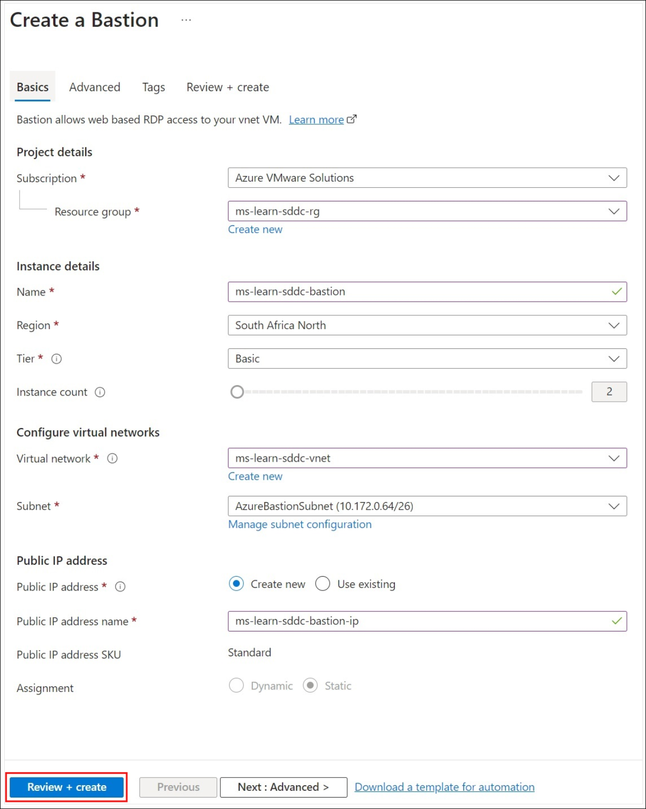
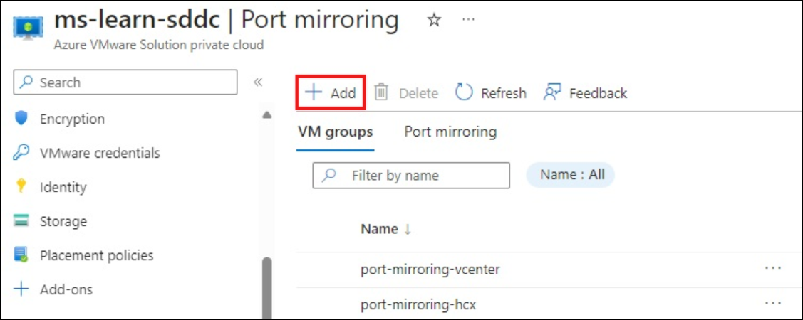

# Lab 1-3 - Prepare to migrate VMware resources to Azure by deploying Azure VMware Solution

**Module:** [Prepare to migrate VMware resources to Azure by deploying Azure VMware Solution](https://learn.microsoft.com/en-us/training/modules/deploy-azure-vmware-solution/)

Learn how to plan an Azure VMware Solution deployment by reviewing requirements and assessing your migration needs. Deploy an Azure VMware Solution private cloud resource to prepare for VMware resource migration. Then configure Azure ExpressRoute Global Reach to connect your on-premises VMware vSphere environment to Azure VMware Solution.

**Learning objectives:**  
By the end of this module, you'll be able to:

* Plan an Azure VMware Solution deployment.
* Connect an on-premises VMware vSphere environment to Azure.

**Prerequisites:**

* Experience managing VMware infrastructure such as vCenter Server, ESXi, NSX Data Center, and vSAN.
* Basic knowledge of networking concepts, including CIDR, BGP routing, DHCP, and IPv4 subnets.

<!-- omit in toc -->
## Contents

* [Introduction](#introduction)
* [Plan an Azure VMware Solution deployment](#plan-an-azure-vmware-solution-deployment)
  * [Evaluate required Azure components](#evaluate-required-azure-components)
  * [Review subscription-eligibility criteria](#review-subscription-eligibility-criteria)
  * [Open a support ticket](#open-a-support-ticket)
  * [Register the resource provider](#register-the-resource-provider)
  * [Assess the migration pattern by using Azure Migrate](#assess-the-migration-pattern-by-using-azure-migrate)
  * [Review the Azure VMware Solution assessment](#review-the-azure-vmware-solution-assessment)
  * [Evaluate solution components](#evaluate-solution-components)
    * [VMware software versions](#vmware-software-versions)
    * [Host maintenance and lifecycle management](#host-maintenance-and-lifecycle-management)
    * [NSX Configuration](#nsx-configuration)
    * [Backup and restoration](#backup-and-restoration)
  * [Check Your Knowledge](#check-your-knowledge)
* [Plan network topology for Azure VMware Solution Deployment](#plan-network-topology-for-azure-vmware-solution-deployment)
  * [IP segments](#ip-segments)
  * [Example subnet breakdown](#example-subnet-breakdown)
  * [Azure VMware Solution network connectivity](#azure-vmware-solution-network-connectivity)
  * [ExpressRoute and routing requirements](#expressroute-and-routing-requirements)
  * [Prerequisites for ExpressRoute Global Reach](#prerequisites-for-expressroute-global-reach)
  * [Required network ports](#required-network-ports)
  * [DHCP and DNS resolution considerations](#dhcp-and-dns-resolution-considerations)
* [Deploy Azure VMware Solution](#deploy-azure-vmware-solution)
  * [Register the resource provider](#register-the-resource-provider-1)
    * [Azure CLI](#azure-cli)
    * [PowerShell](#powershell)
    * [Azure portal](#azure-portal)
  * [Deploy Azure VMware Solution using the Azure portal](#deploy-azure-vmware-solution-using-the-azure-portal)
  * [Create an Azure Bastion resource](#create-an-azure-bastion-resource)
  * [Create an Azure VM to use as a jumpbox VM](#create-an-azure-vm-to-use-as-a-jumpbox-vm)
  * [Use Azure Bastion and sign in to vCenter and NSX Manager](#use-azure-bastion-and-sign-in-to-vcenter-and-nsx-manager)
  * [Check Your Knowledge](#check-your-knowledge-1)
* [Connect to an on-premises VMware vSphere environment](#connect-to-an-on-premises-vmware-vsphere-environment)
  * [Establish an ExpressRoute Global Reach connection to the on-premises VMware vSphere environment](#establish-an-expressroute-global-reach-connection-to-the-on-premises-vmware-vsphere-environment)
  * [Peer the Azure VMware Solution private cloud to the on-premises environment by using the authorization key](#peer-the-azure-vmware-solution-private-cloud-to-the-on-premises-environment-by-using-the-authorization-key)
    * [Use the Azure portal to configure peering](#use-the-azure-portal-to-configure-peering)
    * [Use the Azure CLI to configure peering](#use-the-azure-cli-to-configure-peering)
  * [Check Your Knowledge](#check-your-knowledge-2)
* [Configure NSX network components](#configure-nsx-network-components)
  * [Set up NSX Manager components](#set-up-nsx-manager-components)
  * [Create an NSX network segment in the Azure portal](#create-an-nsx-network-segment-in-the-azure-portal)
  * [Create an NSX network segment in the NSX](#create-an-nsx-network-segment-in-the-nsx)
  * [Create a DHCP server or DHCP relay in the Azure portal](#create-a-dhcp-server-or-dhcp-relay-in-the-azure-portal)
  * [Configure port mirroring in the portal](#configure-port-mirroring-in-the-portal)
  * [Configure a DNS forwarder in the Azure portal](#configure-a-dns-forwarder-in-the-azure-portal)

## Introduction

You work for a healthcare company running production workloads on VMware vSphere across multiple offices. Recently, several trends have emerged:

* Some locations have hardware nearing end-of-life, requiring refresh decisions soon.
* The company struggles to acquire infrastructure quickly enough to meet demand. Approvals, requisitions, and logistics often take four to six months or longer.

To address these challenges, the company has chosen to migrate existing VMware workloads to Azure VMware Solution. This service provides vSphere clusters built on dedicated, bare-metal Azure infrastructure. It allows the company to keep its current virtualization platform and operational practices without major changes.

In this module, you'll learn how to plan and deploy Azure VMware Solution, then connect it to your on-premises VMware infrastructure.

## Plan an Azure VMware Solution deployment

Azure VMware Solution provides VMware-based private clouds in Azure. These private clouds are made up of clusters that run on dedicated, bare-metal Azure hosts. You can deploy and manage the hosts through the Azure portal, Azure CLI, or Azure PowerShell. The solution includes VMware ESXi, vCenter Server, vSAN, HCX, and NSX Data Center.

Hardware and software deployments for Azure VMware Solution private clouds are fully automated and integrated within Azure. At a high level, the diagram illustrates how an on-premises VMware environment connects to Azure VMware Solution and integrates with Azure services.


Your company can use Azure VMware Solution to run VMware workloads natively in Azure. Virtual machines (VMs) can be migrated directly from the on-premises VMware environment to Azure VMware Solution, where they operate the same way as on-premises.

Before deployment, plan by completing these steps:

* Evaluate required Azure components
* Review subscription eligibility
* Open a support ticket to request quota
* Register the resource provider
* Assess migration patterns with Azure Migrate
* Review the Azure VMware Solution assessment
* Evaluate Azure VMware Solution components
* Decide on host type and deployment size

### Evaluate required Azure components

Factor in the following Azure components before Azure VMware Solution deployment:

| Component                                    | Notes                                                                                                    |
| -------------------------------------------- | ----------------------------------------------------------------------------------------------------------------------------------------------------------------------------------------------------------------------------------------------------------------------------------------------------------------------- |
| Subscription                                 | Create a new subscription or reuse an existing one.                                                                                                                                                                                                                                                                     |
| Resource group                               | Create a new resource group or reuse an existing one.                                                                                                                                                                                                                                                                   |
| Region                                       | Decide on deployment region.                                                                                                                                                                                                                                                                                            |
| Host location (Availability Zone Deployment) | Place all hosts in one availability zone for a standard private cloud, or in two zones for stretched clusters.                                                                                                                                                                                                          |
| Resource name                                | Provide the name of your Azure VMware Solution private cloud.                                                                                                                                                                                                                                                           |
| Host size                                    | Choose from 4 SKUs: <br> - AV36: 36 cores, 576 GB RAM, 15.20 TB storage, 3.2 TB NVMe cache <br> - AV36P: 36 cores, 768 GB RAM, 19.20 TB storage, 1.5 TB Intel cache <br> - AV52: 52 cores, 1,536 GB RAM, 38.40 TB storage, 1.5 TB Intel cache <br> - AV64*: 64 cores, 1,024 GB RAM, 15.36 TB storage, 3.84 TB NVMe cache |
| Node count                                   | Minimum 3 hosts. <br> Maximum 16 hosts per vSphere cluster. <br> Up to 12 clusters per private cloud. <br> Up to 96 nodes total per private cloud. <br> Clusters can scale up or down as needed.                                                                                                                        |
| Address block for private cloud              | Provide a CIDR block for the private cloud (for management services like vCenter Server and NSX Manager). Use a /22 block (e.g., 10.175.0.0/22). Must not overlap with Azure VNets or on-premises networks.                                                                                                             |
| Azure virtual network (Optional)             | Create a new Azure VNet or reuse an existing one.                                                                                                                                                                                                                                                                       |
| Azure Bastion (Optional)                     | Deploy a PaaS resource that provides RDP access to a jump host.                                                                                                                                                                                                                                                         |
| Jumpbox VM (Optional)                        | Create an Azure VM (server or desktop) to access the vSphere environment after deployment.                                                                                                                                                                                                                              |

(*) An Azure VMware Solution private cloud must be deployed with AV36, AV36P, or AV52 before you can add AV64 hosts.

### Review subscription-eligibility criteria

To deploy Azure VMware Solution, you need an Azure account with a subscription that meets one of these criteria:

* An Azure Enterprise Agreement (EA) subscription with Microsoft
* A Microsoft Customer Agreement (MCA) subscription with Microsoft
* A Cloud Solution Provider (CSP) subscription under an existing CSP Azure-offers contract or Azure plan

### Open a support ticket

Open a support ticket based on your subscription type:

* EA and MCA customers: Submit a support ticket to request additional host quota. Allocation can take up to five business days.
* CSPs: Assign an Azure plan to the customer in Partner Center, then open a support ticket there to request additional host quota. Allocation can take up to five business days.

### Register the resource provider

You must register the Microsoft.AzureVMwareSolution resource provider before provisioning hosts. Registration can be done through the Azure portal, PowerShell, or the Azure CLI.

### Assess the migration pattern by using Azure Migrate

Use Azure Migrate to assess your on-premises VMware vSphere environment for Azure VMware Solution readiness. Start by setting up the Azure Migrate appliance for VMware. The appliance discovers on-premises VMs and sends metadata and performance details to the Azure Migrate project.

Within the project, you can create Azure VMware Solution assessments using two sizing criteria:

| Assessment type   | Details                                                                          | Data                                                                                                          |
| ----------------- | -------------------------------------------------------------------------------- | ------------------------------------------------------------------------------------------------------------- |
| Performance-based | Assesses performance data of on-premises VMs over time (daily, weekly, monthly). | Recommended node size is based on CPU, memory usage, node type, storage type, and failures to tolerate (FTT). |
| As is on-premises | Assesses VM sizing from a point-in-time export of the vSphere configuration.     | Recommended node size is based on VM size along with node type, storage type, and failures to tolerate (FTT). |

To run the assessment:

1. In the Azure Migrate project, go to **Servers, databases and web apps > Azure Migrate: discovery and assessment**, then select **Assess**.
2. From the **Assessment type** dropdown, choose **Azure VMware Solution**.
3. In **Discovery Source**, select the discovery method (CSV file, RVTools, or Azure Migrate appliance).
4. Open the **Select machines to assess** tab.
5. Choose **Review + create assessment** to generate the assessment.

### Review the Azure VMware Solution assessment

After the appliance runs in the on-premises vSphere environment, you can review the assessment in the Azure portal. The Azure VMware Solution assessment shows readiness, required node count, usage across nodes, and a monthly cost estimate.

To view the assessment:

1. Go to **Migration goals > Servers**.
2. Select **Assessments** under **Azure Migrate: Server Assessment**.
3. Open the **Azure VMware Solution assessment**.
4. Review and adjust the assessment settings as needed.

The report should look something like this:


The Azure VMware Solution readiness section of the report showcases the following conditions:

| Status                              | Notes                                                                                                  |
| ----------------------------------- | ------------------------------------------------------------------------------------------------------ |
| Ready for Azure VMware Solution     | The VM can be migrated as-is without changes.                                                          |
| Ready with conditions               | The VM might have compatibility issues that need to be resolved before full functionality is achieved. |
| Not ready for Azure VMware Solution | The VM won’t start in Azure VMware Solution; remediation is required.                                  |
| Readiness unknown                   | Azure Migrate couldn’t determine readiness due to insufficient metadata collected on-premises.         |

### Evaluate solution components

The final step is to evaluate all remaining components of the Azure VMware Solution private cloud. This includes software versions, host maintenance, lifecycle management, and backup or restore options.

#### VMware software versions

VMware software versions in new Azure VMware Solution private cloud cluster deployments include:

| Software             | Version       |
| -------------------- | ------------- |
| VCSA/vSphere/vCenter | 7.0 Update 3o |
| ESXi                 | 7.0 Update 3o |
| vSAN                 | 7.0 Update 3  |
| NSX                  | 4.1.1         |

Knowing the VMware versions helps customers understand compatibility with their on-premises environments.

#### Host maintenance and lifecycle management

Azure VMware Solution private clouds include validated versions of VMware vCenter Server, ESXi, vSAN, and NSX. These software bundles are deployed in new installations and during upgrades.

Lifecycle management upgrades don’t require downtime. Each environment automatically stays on the latest validated version of the private cloud software. Microsoft applies updates on a set schedule so that private clouds are never more than one version behind. You’ll be notified of planned upgrades and can defer them if your cloud is within one version of the latest release.

Critical patches and updates are applied as soon as they’re validated. You’ll be notified in advance of any required critical upgrades.

Microsoft manages lifecycle tasks for NSX appliances, including NSX Manager and NSX Edge, and handles initial network setup such as creating the Tier-0 gateway and enabling North-South routing. You’re responsible for NSX SDN configurations, such as network segments, distributed firewall rules, Tier-1 gateways, and load balancers.

#### NSX Configuration

Azure VMware Solution networking and services such as DNS and DHCP can be managed in two ways: through **NSX Manager** or the **Azure Resource Manager portal**.

#### Backup and restoration

Microsoft backs up private cloud vCenter Server and NSX Manager configurations daily, with backups retained for three days. To restore from a backup, open a support request in the Azure portal.

The next unit covers planning considerations for network topology in Azure VMware Solution, outlining key aspects to ensure a successful deployment.

### Check Your Knowledge


## Plan network topology for Azure VMware Solution Deployment

Azure VMware Solution provides a private cloud environment accessible from both on-premises and Azure resources. The next deployment step is planning the network topology.

The Azure VMware Solution environment must handle traffic to Azure services and on-premises VMware environments. Connectivity to Azure resources is provided through a dedicated Azure ExpressRoute circuit. A separate customer-provided ExpressRoute circuit connects to on-premises VMware environments. To enable this connectivity, you need specific IP address ranges and firewall ports.

When Azure VMware Solution is deployed, private networks are created for:

* Management
* Provisioning
* VMware vMotion

These networks are used to access vCenter Server, NSX Manager, and vMotion.

### IP segments

IP addressing must be planned before deploying an Azure VMware Solution private cloud. The service requires a /22 CIDR block for management components. Workload segments, where VMs are deployed, use a separate IP range that you create in NSX Manager.

The management CIDR is divided into smaller segments for vCenter Server, VMware HCX, NSX, and vMotion. Routes must be exchanged between Azure VMware Solution, your Azure environment, and your on-premises environment to support VM migration. The /22 CIDR block you provide must not overlap with existing address blocks in Azure or on-premises.

A VM IP segment is required to create the first NSX segment in the private cloud, enabling VM deployment. Optionally, you can extend on-premises network segments into Azure VMware Solution with VMware HCX Layer 2 Network Extension. These on-premises networks must connect to a vSphere Distributed Switch (vDS), since VMware HCX doesn’t support extending vSphere Standard Switches.

### Example subnet breakdown

The following table shows an example of how the /22 CIDR network address block (10.5.0.0/22 in this example) is carved into different IP segments:

| Network usage            | Subnet  | Example                                    |
| ------------------------ | ------- | ------------------------------------------ |
| Private cloud management | /26     | 10.5.0.0/26                                |
| HCX migrations           | /26     | 10.5.0.64/26                               |
| Global Reach reserved    | /26     | 10.5.0.128/26                              |
| ExpressRoute reserved    | /27     | 10.5.0.192/27                              |
| ExpressRoute peering     | /27     | 10.5.0.224/27                              |
| ESXi management          | /25     | 10.5.1.0/25                                |
| vMotion network          | /25     | 10.5.1.128/25                              |
| Replication network      | /25     | 10.5.2.0/25                                |
| vSAN                     | /25     | 10.5.2.128/25                              |
| HCX uplink               | /26     | 10.5.3.0/26                                |
| Reserved                 | 3 × /26 | 10.5.3.64/26, 10.5.3.128/26, 10.5.3.192/26 |

### Azure VMware Solution network connectivity

After deploying Azure VMware Solution, the next step is establishing network connectivity.

The private cloud runs on dedicated bare-metal servers assigned to a single customer. To access Azure resources, these servers connect through the Azure network backbone. Azure VMware Solution provides an ExpressRoute circuit for communication between the private cloud and Azure services.

For on-premises connectivity, you can enable ExpressRoute Global Reach to link your existing ExpressRoute circuit with the Azure VMware Solution private cloud.

### ExpressRoute and routing requirements

There are two interconnectivity options for Azure VMware Solution:

* **Basic Azure-only interconnectivity**: Azure VMware Solution connects to an Azure virtual network using the built-in ExpressRoute circuit. This enables connectivity between the private cloud and Azure services such as Azure Monitor and Microsoft Defender for Cloud.
* **Full on-premises to private cloud interconnectivity**: Extends the basic model to include connectivity between on-premises environments and Azure VMware Solution. This requires a customer-provided ExpressRoute circuit, either existing or newly purchased.

By default, **ExpressRoute Global Reach** is used for hybrid connectivity. If Global Reach isn’t available in your region or doesn’t meet network or security requirements, alternatives include ExpressRoute Private Peering or IPSec VPN.

The customer-provided ExpressRoute circuit is not included in the Azure VMware Solution private cloud deployment.

### Prerequisites for ExpressRoute Global Reach

Before configuring ExpressRoute Global Reach, ensure the following prerequisites are met:

* A separate, customer-provided ExpressRoute circuit is available to connect on-premises environments to Azure.
* All gateways, including the ExpressRoute provider’s service, support 4-byte Autonomous System Numbers (ASNs), since Azure VMware Solution uses 4-byte public ASNs to advertise network routes.

### Required network ports

If your on-premises network is restrictive, you must allow the following ports:

| Source                                             | Destination                                          | Protocol         | Port         |
| -------------------------------------------------- | ---------------------------------------------------- | ---------------- | ------------ |
| Azure VMware Solution private cloud DNS server     | On-premises DNS server                               | UDP              | 53           |
| On-premises DNS server                             | Azure VMware Solution DNS server                     | UDP              | 53           |
| On-premises network                                | Azure VMware Solution vCenter Server                 | TCP (HTTP/HTTPS) | 80, 443      |
| Azure VMware Solution private cloud management net | On-premises Active Directory                         | TCP              | 389/636      |
| Azure VMware Solution private cloud management net | On-premises Active Directory Global Catalog          | TCP              | 3268/3269    |
| On-premises network                                | HCX Cloud Manager                                    | TCP (HTTPS)      | 9443         |
| On-premises Admin Network                          | HCX Cloud Manager                                    | SSH              | 22           |
| HCX Manager                                        | Interconnect (HCX-IX)                                | TCP (HTTPS)      | 8123         |
| HCX Manager                                        | Interconnect (HCX-IX), Network Extension (HCX-NE)    | TCP (HTTPS)      | 9443         |
| Interconnect (HCX-IX)                              | Layer 2 connectivity                                 | TCP (HTTPS)      | 443          |
| HCX Manager, Interconnect (HCX-IX)                 | ESXi Hosts                                           | TCP              | 80, 443, 902 |
| Interconnect (HCX-IX), Network Extension (HCX-NE)  | Interconnect (HCX-IX), Network Extension (HCX-NE)    | UDP              | 4500         |
| On-premises Interconnect (HCX-IX)                  | Cloud Interconnect (HCX-IX)                          | UDP              | 500          |
| On-premises vCenter Server network                 | Azure VMware Solution management network             | TCP              | 8000         |
| HCX Connector                                      | connector.hcx.vmware.com, hybridity.depot.vmware.com | TCP              | 443          |

### DHCP and DNS resolution considerations

VMs running in Azure VMware Solution need DNS for name resolution and may also require DHCP for IP address assignment. You can configure an on-premises VM or an Azure VM for name resolution. For DHCP, you can use the NSX built-in service or a local DHCP server in the private cloud. This avoids routing DHCP broadcasts over the WAN to the on-premises environment.

The next unit covers the deployment of Azure VMware Solution, outlining all steps needed to set up the service in your environment.

## Deploy Azure VMware Solution

After completing the planning steps, you can build the Azure VMware Solution private cloud. This allows your company to deploy a vSphere cluster in Azure and provides a straightforward migration path for workloads. Use the information gathered during planning to ensure a successful deployment.

### Register the resource provider

The resource provider must be registered in your subscription before deployment. You can register it using the Azure CLI, PowerShell, or the Azure portal.

#### Azure CLI

To register the resource provider with the Azure CLI:

1. Start **Azure Cloud Shell**.
2. Sign in to your Azure subscription.
3. Run:

```azurecli
az provider register -n Microsoft.AVS --subscription <your subscription ID>
```

#### PowerShell
To register the resource provider with PowerShell:

1. Start **Azure Cloud Shell**.
2. Sign in to your Azure subscription.
3. Run:

```powershell
Register-AzResourceProvider -ProviderNamespace Microsoft.AVS
```

#### Azure portal

Azure portal
To register the resource provider in the Azure portal:

1. Search for **Subscriptions**.
2. Select the subscription to use.
3. Go to **Resource providers** and search for **Microsoft.AVS**.
4. If it isn’t registered, select **Register**.


### Deploy Azure VMware Solution using the Azure portal

When deploying Azure VMware Solution, ensure you have at least **Contributor** rights to the subscription. You’ll also need the information gathered during planning.

Steps:

1. In the Azure portal, select **Create a resource**.
2. In the search box, type **Azure VMware Solution**, select it, then choose **Create**.
3. On the **Azure VMware Solution** screen, select **Create**.
4. The first deployment screen highlights the prerequisites covered earlier. Review these before continuing.
5. Once confirmed, select **Next: Basics >** to proceed.

    

6. On the **Basics** tab, enter values for the fields:

    

    Here's a description of the value expected in each field

    7. After completing all fields, select **Review + Create**. The Azure VMware Solution deployment typically takes three to four hours.

    8. When deployment is finished, go to the **resource group**, select the **private cloud**, and confirm the **Status** shows **Succeeded**.
    :

      | Field                           | Value                                                                                                                                                           |
    | ------------------------------- | --------------------------------------------------------------------------------------------------------------------------------------------------------------- |
    | Subscription                    | The subscription for the deployment.                                                                                                                            |
    | Resource group                  | The resource group for private cloud resources. Select an existing resource group or create a new one.                                                          |
    | Resource name                   | A name for the Azure VMware Solution private cloud.                                                                                                             |
    | Location                        | The Azure region where Azure VMware Solution can be deployed.                                                                                                   |
    | Size of host                    | The SKU value for the bare-metal nodes.                                                                                                                         |
    | Host location                   | Choose whether to deploy the private cloud in a single availability zone or across two availability zones in the same region (stretched cluster feature).       |
    | Number of hosts                 | The number of hosts for the private cloud cluster. A stretched cluster requires 2× the number of hosts needed, split evenly between the two availability zones. |
    | Address block for private cloud | An IP address block (/22 CIDR) for the private cloud. The block must be unique and not overlap with other Azure Virtual Networks or on-premises networks.       |

7. After completing all fields, select **Review + Create**. The Azure VMware Solution deployment typically takes three to four hours.

8. When deployment is finished, go to the **resource group**, select the **private cloud**, and confirm the **Status** shows **Succeeded**.

    

9. Next, connect the Azure VMware Solution ExpressRoute circuit to an Azure virtual network:

    1. Under **Manage**, select **Connectivity**.
    2. For **Azure vNet connect**, create a new virtual network or choose an existing one. Ensure the virtual network has a **GatewaySubnet** configured for ExpressRoute peering.
    3. After configuration, select **Save**.

        

10. Saving the configuration triggers a build of a few different Azure resources:

    | Azure resource                    | Description                                                                                                                                                              |
    | --------------------------------- | ------------------------------------------------------------------------------------------------------------------------------------------------------------------------ |
    | Virtual network                   | If building a new virtual network with a GatewaySubnet, the virtual network deploys first. If using an existing virtual network, the process moves to the next resource. |
    | Virtual network gateway           | Provides connectivity between the Azure VMware Solution ExpressRoute circuit and an Azure virtual network.                                                               |
    | Virtual network gateway public IP | Provides a public IP used to establish peering between the Azure virtual network and the Azure VMware Solution ExpressRoute circuit.                                     |
    | ExpressRoute authorizations       | Creates two authorizations: one for inbound and one for outbound connectivity, both to and from the Azure VMware Solution private cloud.                                 |

11. When the build completes, connectivity between the Azure VMware Solution private cloud and Azure is established. The deployment completion page will display the **Deployment name**, **Subscription**, **Resource group**, **Correlation ID**, and the list of deployed resources.

    

Azure VMware Solution requires additional configuration to communicate with the on-premises VMware environment. The next unit covers the network configuration steps needed to connect to the Azure VMware Solution private cloud from both Azure and on-premises.

After connectivity between Azure VMware Solution and Azure services is set up, you can use an Azure VM as a jumpbox to access vCenter Server and NSX Manager. Since the management components of the private cloud aren’t publicly accessible, L3 connectivity is required. A jumpbox VM in the connected Azure virtual network provides this access.

### Create an Azure Bastion resource

Azure Bastion provides secure RDP connectivity to your Azure IaaS environment. You can use it initially to connect to the jump host, which lets you sign in to the Azure VMware Solution vCenter and NSX Manager.

After ExpressRoute circuits and ExpressRoute Global Reach are configured for hybrid connectivity, Azure Bastion is no longer required. However, your company may choose to keep it as a backup in case of ExpressRoute connectivity issues.

To create an Azure Bastion resource:

1. In the **Azure portal**, search for **Bastions**.
2. Select **Create** from the menu bar.
3. On the **Create a Bastion** page, configure the new resource with the required details.

    


    | Field                  | Value                                                                                                                                                                                                                                         |
    | ---------------------- | --------------------------------------------------------------------------------------------------------------------------------------------------------------------------------------------------------------------------------------------- |
    | Subscription           | Select the same subscription where Azure VMware Solution is deployed.                                                                                                                                                                         |
    | Resource group         | Select an existing resource group or create a new one.                                                                                                                                                                                        |
    | Name                   | Specify a name for the new Bastion resource.                                                                                                                                                                                                  |
    | Region                 | Select the same region where Azure VMware Solution is deployed.                                                                                                                                                                               |
    | Tier                   | Select **Basic** for this example. You can upgrade to **Standard** later for more instances.                                                                                                                                                  |
    | Instance Count         | Defaults to 2 when **Basic** is chosen.                                                                                                                                                                                                       |
    | Virtual network        | Select the virtual network created during Azure VMware Solution deployment.                                                                                                                                                                   |
    | Subnet                 | Azure Bastion requires a dedicated subnet. In the virtual network created for Azure VMware Solution, go to **Manage subnet configuration**, select **+Subnet**, then create a subnet named **AzureBastionSubnet** with a /27 or larger range. |
    | Public IP address      | Provides RDP and SSH over port 443 to Azure Bastion. Create a new public IP in the same region as Azure VMware Solution and Azure Bastion. This IP must be separate from the Azure VMware Solution deployment.                                |
    | Public IP address name | Enter a name for the public IP resource.                                                                                                                                                                                                      |
    | Public IP address SKU  | Defaults to **Standard**, since Azure Bastion only supports this SKU.                                                                                                                                                                         |
    | Assignment             | Defaults to **Static**. Best practice is to leave it as Static.                                                                                                                                                                               |

### Create an Azure VM to use as a jumpbox VM

Create an Azure VM to serve as a jumpbox after deploying the Azure VMware Solution private cloud and Azure Bastion resource.

The jumpbox VM must:

* Be in the same virtual network and subscription as Azure VMware Solution and Azure Bastion.
* Run either a Windows desktop or server version.
* Be deployed behind the Azure Bastion resource.

You’ll use Azure Bastion to connect to the jumpbox VM through RDP in the Azure portal over TLS.

### Use Azure Bastion and sign in to vCenter and NSX Manager

Use Azure Bastion to connect to the jumpbox VM. From there, open a browser and sign in to both vCenter and NSX Manager.

The Azure portal provides:

* vCenter IP address
* NSX Manager console IP addresses
* Deployment credentials

By accessing the jumpbox through Azure Bastion, you can configure NSX and vCenter.


### Check Your Knowledge


## Connect to an on-premises VMware vSphere environment

After deploying Azure VMware Solution, the next step is configuring network connectivity.

The private cloud runs on dedicated bare-metal servers assigned to a single customer. These servers connect to the Azure network backbone to access Azure resources. Connectivity to Azure services is provided through the Azure VMware Solution ExpressRoute circuit.

To connect with the on-premises environment, you need a customer-provided ExpressRoute circuit combined with an ExpressRoute Global Reach configuration.

### Establish an ExpressRoute Global Reach connection to the on-premises VMware vSphere environment

Global Reach connects your on-premises VMware vSphere environment to the Azure VMware Solution private cloud. It establishes connectivity between the Azure VMware Solution ExpressRoute circuit and a new or existing ExpressRoute circuit for your on-premises environment.

To create an ExpressRoute Global Reach authorization key:

1. In the **Azure VMware Solution private cloud Overview**, under **Manage**, select **Connectivity > ExpressRoute > Request an authorization key**.

    

2. Enter a name for the authorization key.
3. Select **Create**.

    

4. The new key will appear in the authorization key list for the private cloud.

    

Use this authorization key and the ExpressRoute ID to complete the peering.

### Peer the Azure VMware Solution private cloud to the on-premises environment by using the authorization key

After creating the authorization key, peer the Azure VMware Solution ExpressRoute circuit with the on-premises circuit.

You can configure the peering through the **Azure portal** or the **Azure CLI in Cloud Shell**. In both cases, you’ll need:

* The **resource ID** of the Azure VMware Solution ExpressRoute circuit
* The **authorization key** generated earlier

#### Use the Azure portal to configure peering

To configure peering in the Azure portal:

1. In the **Azure portal**, open the **Azure VMware Solution private cloud**.
2. From **Overview**, under **Manage**, select **Connectivity > ExpressRoute Global Reach > Add**.
3. Create the on-premises cloud connection by either:

   * Selecting the ExpressRoute circuit from the list, or
   * Copying and pasting the circuit ID.
4. Select **Create**.

    

The new connection will then appear in the list of on-premises cloud connections.

#### Use the Azure CLI to configure peering

Use the Azure CLI to set up ExpressRoute peering.

1. Sign in to the Azure portal with the same subscription as the on-premises ExpressRoute circuit.
2. Open Cloud Shell and keep the shell as Bash.
3. Note the values you’ll need:

    * Resource ID of the second circuit
    * Authorization key

4. Create an authorization on the second circuit:

    ```bash
    az network express-route auth create --circuit-name <Circuit2Name> -g <Circuit2ResourceGroupName> -n <AuthorizationName>
    ```

    Example output:

    ```json
    {
      "authorizationKey": "<authorizationKey>",
      "authorizationUseStatus": "Available",
      "etag": "W/\"cfd15a2f-43a1-4361-9403-6a0be00746ed\"",
      "id": "/subscriptions/<SubscriptionID>/resourceGroups/<Circuit2ResourceGroupName>/providers/Microsoft.Network/expressRouteCircuits/<Circuit2Name>/authorizations/<AuthorizationName>",
      "name": "<AuthorizationName>",
      "provisioningState": "Succeeded",
      "resourceGroup": "<Circuit2ResourceGroupName>",
      "type": "Microsoft.Network/expressRouteCircuits/authorizations"
    }
    ```

5. Copy the authorizationKey and the id (resource ID). You’ll use them to establish peering.

6. Create the peering connection from the first circuit, passing the second circuit’s resource ID and authorization key:

    ```bash
    az network express-route peering connection create -g <ResourceGroupName> --circuit-name <Circuit1Name> --peering-name AzurePrivatePeering -n <ConnectionName> --peer-circuit <Circuit2ResourceID> --authorization-key <authorizationKey>
    ```

After the command succeeds, connectivity is established between your on-premises environment and Azure VMware Solution through the two ExpressRoute circuits.

Next, configure NSX networking in the Azure portal. NSX Manager provides the software-defined networking layer for Azure VMware Solution.

### Check Your Knowledge


## Configure NSX network components

Azure VMware Solution uses NSX Manager as its software-defined network layer. The setup includes two gateways:

* An NSX Tier-0 gateway running in active-active mode
* An NSX Tier-1 gateway running in active-standby mode

Both gateways enable communication between logical switch segments and provide East-West as well as North-South connectivity.

### Set up NSX Manager components

After deploying Azure VMware Solution, NSX components are managed under Workload Networking in the Azure portal. The portal provides a simplified interface for VMware administrators and is designed for users who may not be familiar with NSX Manager. Advanced configurations can still be done directly in NSX Manager.

The Azure portal offers four configuration options for NSX components:

* **Segments:** Create network segments that also appear in NSX Manager and vCenter Server
* **DHCP:** Configure a DHCP server or relay if DHCP is required
* **Port mirroring:** Enable port mirroring to troubleshoot network issues
* **DNS:** Set up a DNS forwarder to route DNS requests to a DNS server for resolution

  

### Create an NSX network segment in the Azure portal

Virtual machines created or migrated to Azure VMware Solution must connect to an NSX network segment. You can create a segment in the Azure VMware Solution console within the Azure portal. These segments connect to the default Tier-1 gateway and provide both East-West and North-South connectivity. Once created, the segment appears in NSX Manager and vCenter Server.

Steps in the Azure portal:

1. Select your Azure VMware Solution private cloud.
2. Under Workload Networking, choose Segments > +Add.

    

3. Enter details for the new segment:

    | Field                  | Value                                                                                                                                                    |
    | ---------------------- | -------------------------------------------------------------------------------------------------------------------------------------------------------- |
    | Segment name           | Name of the logical switch, visible in vCenter Server.                                                                                                   |
    | Connected gateway      | Pre-selected and read-only.                                                                                                                              |
    | T1                     | Name of the Tier-1 gateway in NSX Manager. Only the default Tier-1 gateway is visible in the portal; additional gateways must be created in NSX Manager. |
    | Type                   | Overlay network segment supported by Azure VMware Solution.                                                                                              |
    | Subnet Gateway         | Gateway IP address with subnet mask for the logical switch. All VMs attached to this switch share the same subnet.                                       |
    | DHCP ranges (optional) | DHCP ranges for the segment. Requires a configured DHCP server or relay.                                                                                 |

    

4. Select OK to create the segment and attach it to the Tier-1 gateway. It will then be visible in Azure VMware Solution, NSX Manager, and vCenter Server.

### Create an NSX network segment in the NSX

You can also create an NSX network segment directly in the NSX console. These segments connect to the default Tier-1 gateway and provide East-West and North-South connectivity.

Steps:

1. From a Jumpbox VM, connect to NSX Manager. Credentials are available under **Manage > VMware credentials**.
2. In NSX Manager, go to **Networking > Segments** and select **Add Segment**.

    

3. Enter details for the new segment, then select Save.

    

    | Field             | Value                                                                                                                                                    |
    | ----------------- | -------------------------------------------------------------------------------------------------------------------------------------------------------- |
    | Segment name      | Name of the logical switch, visible in vCenter Server.                                                                                                   |a
    | Connected gateway | Name of the Tier-1 gateway in NSX Manager. Only the default Tier-1 gateway is visible in the portal; additional gateways must be created in NSX Manager. |
    | Transport Zone    | Name of the preconfigured overlay Transport Zone (TNTxx-OVERLAY-TZ).                                                                                     |
    | Subnets           | Subnet IP address range in CIDR format. Must use a non-overlapping RFC1918 block to ensure connectivity with VMs on the new segment.                     |

### Create a DHCP server or DHCP relay in the Azure portal

Applications and workloads in a private cloud need DHCP for IP assignments and name resolution. You can use NSX’s built-in DHCP service or a local DHCP server.

In the Azure portal, you can configure a DHCP server or relay from the Azure VMware Solution console. The DHCP component connects to the Tier-1 gateway created during deployment. Any segment with defined DHCP ranges will use these services. After creating the DHCP server or relay, you must assign a subnet or range on an NSX segment to enable DHCP.

Steps:

1. In your Azure VMware Solution private cloud, go to **Workload Networking > DHCP > +Add.**
2. Choose either **DHCP Server** or **DHCP Relay**.
3. Enter a name and provide three IP addresses for a DHCP server (only one IP address is required for a relay).

    

4. Define DHCP ranges on the logical segments configured earlier.
5. Select **OK** to finish.

### Configure port mirroring in the portal

Port mirroring copies network traffic from one port to another so it can be analyzed. A protocol analyzer on the destination port inspects the mirrored traffic. You can mirror traffic from a single VM or a VM group, then send it to another VM or group for troubleshooting. Use this feature only for short-term diagnostics.

Steps to configure in the Azure VMware Solution console:

1. Create the source VM group:

   * Go to **Workload Networking > Port mirroring > VM groups > +Add**.
   * Name the group, select the VMs, then select **OK**.

      

2. Create the destination VM group the same way.

3. Create a port mirroring profile:

   * Ensure both source and destination groups exist.
   * Go to **Port mirroring > Add**.
   * Enter the following:

     * Port mirroring name: Enter a profile name
     * Direction: Choose **Ingress**, **Egress**, or **Bi-directional**
     * Source: Select the source VM group
     * Destination: Select the destination VM group

        

        | Field               | Value                                     |
        | ------------------- | ----------------------------------------- |
        | Port mirroring name | Provide a name for the profile            |
        | Direction           | Select Ingress, Egress, or Bi-directional |
        | Source              | Select the source VM group                |
        | Destination         | Select the destination VM group           |

   * Select **OK**.

The new profile and VM groups will now appear in the Azure VMware Solution console.

### Configure a DNS forwarder in the Azure portal

A DNS forwarder directs specific DNS requests to chosen DNS servers. In Azure VMware Solution, a DNS service and default DNS zone are provided. By default, requests are sent to Cloudflare’s public DNS server. If you need private name resolution, set up conditional forwarding with an FQDN zone to route queries to private DNS servers.

Steps to configure a DNS forwarder:

1. In your VMware Solution private cloud, go to **Workload Networking > DNS > DNS zones > +Add**.
2. Select **FQDN zone**, enter a zone name, and provide up to three DNS server IPs (for example, `10.0.0.53`). Select **OK**.
3. Monitor progress under **Notifications**. A confirmation appears once the zone is created.
4. Repeat the steps to add more FQDN zones, including reverse lookup zones if needed.

When a DNS query arrives, the forwarder checks if the domain matches an FQDN zone. If matched, the query is sent to the specified DNS servers. If not, it defaults to the DNS servers in the default DNS zone.

Do you want me to also put the key configuration fields (zone type, zone name, DNS server IPs) into a markdown table like I did for port mirroring?
