# Lab 2-2 - Migrate VMware vSphere resources from on-premises to Azure VMware Solution

**Module:** [Migrate VMware vSphere resources from on-premises to Azure VMware Solution](https://learn.microsoft.com/en-us/training/modules/migrate-vmware-workloads-on-premises-azure-vmware-solution/)

Plan, deploy, and configure VMware HCX with VMware vSphere to connect your on-premises environment to Azure VMware Solution. Use HCX to migrate virtual machines from vSphere to Azure.

**Learning objectives:**

* Configure VMware HCX to enable on-premises VMware vSphere migrations
* Migrate VMware vSphere resources to Azure VMware Solution with HCX

**Prerequisites:**

* Experience using the Azure portal to access and create resources
* Experience managing VMware infrastructure (ESXi, vCenter Server, NSX, VMware HCX)
* Basic understanding of networking (CIDR, subnets)
* (Optional) An Azure subscription with contributor rights to configure an Azure VMware Solution environment

<!-- omit in toc -->
## Contents

* [Introduction](#introduction)
* [Plan HCX deployment](#plan-hcx-deployment)
  * [What is VMware HCX?](#what-is-vmware-hcx)
  * [VMware HCX versions and compatibility](#vmware-hcx-versions-and-compatibility)
  * [Network connectivity and ports](#network-connectivity-and-ports)
  * [IP addresses for network segmentation](#ip-addresses-for-network-segmentation)
  * [Different migration types](#different-migration-types)
  * [Scenario readiness and preparation for Azure VMware Solution](#scenario-readiness-and-preparation-for-azure-vmware-solution)
  * [Check your knowledge](#check-your-knowledge)
* [Deploy and install VMware HCX](#deploy-and-install-vmware-hcx)
  * [Download VMware HCX Connector](#download-vmware-hcx-connector)
  * [Deploy the VMware HCX Connector OVA on-premises](#deploy-the-vmware-hcx-connector-ova-on-premises)

## Introduction

Azure VMware Solution delivers a complete VMware environment as a service on dedicated bare-metal infrastructure in Azure. Once deployed, it provides access to familiar VMware tools:

| Product        | Description                                                                |
| -------------- | -------------------------------------------------------------------------- |
| ESXi           | Bare-metal servers running VMware virtualization software                  |
| vCenter Server | Centralized management for vSphere ESXi environments                       |
| vSAN           | Software-defined storage built into ESXi                                   |
| NSX            | Software-defined networking and security across datacenters and clouds     |
| VMware HCX     | Hybrid cloud platform enabling VM migrations between on-premises and Azure |

VMware HCX abstracts infrastructure to support VM migrations. Using HCX vMotion, you can migrate live workloads from on-premises vSphere to Azure VMware Solution with minimal downtime. This reduces migration complexity and accelerates cloud adoption.

Once VMs are migrated, they run in Azure close to its native APIs, enabling easier administration and maintenance.

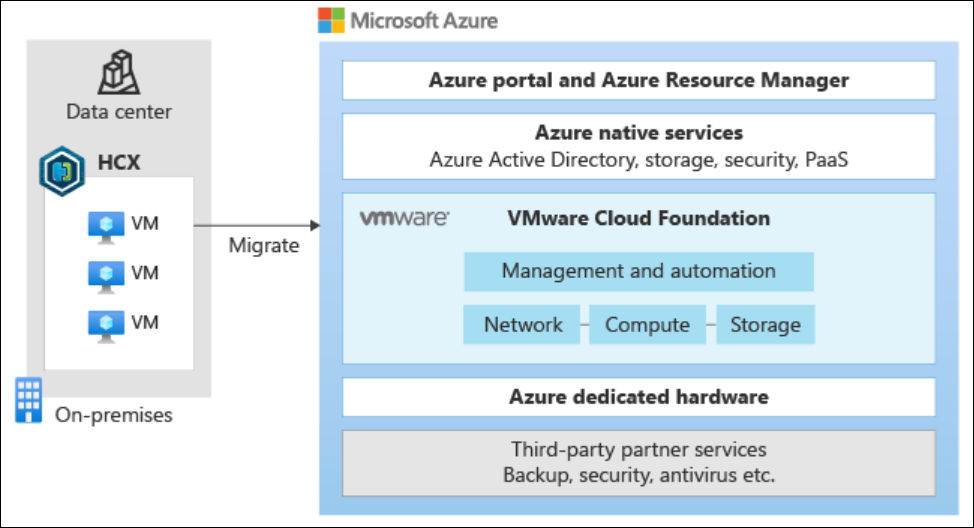

**Example scenario:**

You work for a healthcare company running production workloads on VMware vSphere. The company has chosen to migrate workloads to Azure VMware Solution without changing the virtualization platform or disrupting existing operations. After deploying Azure VMware Solution, the next step is migrating on-premises VMware workloads into Azure.

What will we be doing?

* Plan for the VMware HCX Connector deployment on-premises
* Deploy the VMware HCX Connector and connect it to Azure VMware Solution
* Configure the service to ensure proper setup
* Migrate VMware vSphere workloads from on-premises to Azure VMware Solution

**Main goal:** Migrate on-premises VMware vSphere VMs into Azure VMware Solution quickly, helping the company address aging hardware and reduce the need for new infrastructure purchases.

## Plan HCX deployment

VMware HCX Cloud Manager is deployed as an add-on in Azure VMware Solution. After that, you plan the deployment of the VMware HCX Connector on-premises. To link on-premises VMware vSphere with Azure VMware Solution, you create a *site pair* between the source and destination. This site pair enables network connectivity for management, authentication, and orchestration of VMware HCX services.

### What is VMware HCX?

VMware HCX is a workload mobility platform that simplifies VM migrations with built-in network features. It helps connect on-premises vSphere datacenters to Azure. The HCX appliance integrates on-premises environments with Azure VMware Solution at the networking layer.

As a migration tool, HCX abstracts on-premises and cloud resources to appear as a single pool for vSphere workloads. It supports bidirectional VM migrations between on-premises datacenters and Azure VMware Solution.

Azure VMware Solution automatically deploys and configures HCX Cloud Manager in the private cloud. On-premises, you need to download, activate, and configure HCX Connector. HCX supports up to 10 site connections.

### VMware HCX versions and compatibility

VMware HCX migration patterns require version compatibility between on-premises and cloud environments.

| Component type             | HCX Connector environment requirements | HCX Cloud environment requirements      |
| -------------------------- | -------------------------------------- | --------------------------------------- |
| vSphere (vCenter and ESXi) | 7.0+                                   | 7.0+                                    |
| NSX                        | NSX 3.0.1+                             | For vSphere 7.0, NSX 3.0.1+ is required |

For older vSphere versions (5.0+), HCX Connector must be deployed and downgraded. VMware supports these migrations only for a limited time.

### Network connectivity and ports

Azure VMware Solution provisions an ExpressRoute circuit during deployment. You then peer this circuit to an Azure virtual network for access to Azure resources.

Next, set up connectivity between the on-premises VMware vSphere environment and Azure VMware Solution. By default, Global Reach provides hybrid connectivity. If Global Reach is unavailable due to region, network, or security restrictions, alternatives include ExpressRoute Private Peering or IPSec VPN. Network connectivity must be enabled before deploying VMware HCX Connector and creating a site pairing.

All required ports must be open for communication between on-premises vSphere and Azure VMware Solution.

| Port         | Protocol | Notes                                                                                                                               |
| ------------ | -------- | ----------------------------------------------------------------------------------------------------------------------------------- |
| 4500         | UDP      | VM traffic in source network to VMs in HCX extended network; IX transport path for migration and DR traffic                         |
| 443          | TCP      | HCX services, activation, updates, vMotion control, ESX authentication, NSX API, VM data transfer, metrics, and HTTPS communication |
| 9443         | TCP      | HCX appliance configuration and control, vCenter and management server registration                                                 |
| 45000–44600  | TCP      | VM data transfer                                                                                                                    |
| 5672         | TCP      | Advanced message queue protocol                                                                                                     |
| 31031, 44046 | TCP      | HCX bulk migration and disaster recovery                                                                                            |
| 514          | TCP/UDP  | Syslog originator to syslog collector                                                                                               |
| 80           | TCP      | OVF import, appliance deployment, ESX authentication                                                                                |
| 22           | TCP      | SSH for HCX central CLI                                                                                                             |
| 902          | TCP      | HCX cold migration (bidirectional), OVF import, appliance deployment                                                                |

### IP addresses for network segmentation

Next, you need to factor in the following network segments in the on-premises VMware HCX environment:

| Network segment     | Notes                                                                                                                                                                                                                                                                                                                                                             |
| ------------------- | ----------------------------------------------------------------------------------------------------------------------------------------------------------------------------------------------------------------------------------------------------------------------------------------------------------------------------------------------------------------- |
| Management network  | - Use the same management network as the on-premises VMware cluster. - Select at least two IPs for VMware HCX. - Create a new /26 segment for larger environments. - Present the segment as a port group to the on-premises cluster.                                                                                                                     |
| Uplink network      | - Use the same management network for the uplink network segment.                                                                                                                                                                                                                                                                                                 |
| vMotion network     | - Use the same vMotion network as the on-premises VMware cluster. - Reserve at least two IPs for VMware HCX. - More IPs may be needed for larger deployments. - Expose the vMotion network to a distributed virtual switch or vSwitch0. - If not configured, adjust the setup. - vSphere typically uses nonrouted vMotion segments, which is fine. |
| Replication network | - Use the same segment as the management and uplink networks. - If hosts use a dedicated replication VMkernel, reserve two IPs on this segment. - Use the replication VMkernel for this network.                                                                                                                                                            |

### Different migration types

VMware HCX offers a few different ways to migrate workloads:

| Migration type | Use cases                                                                | Capabilities                                                                                                                                                                                                                                                                            |
| -------------- | ------------------------------------------------------------------------ | --------------------------------------------------------------------------------------------------------------------------------------------------------------------------------------------------------------------------------------------------------------------------------------- |
| Live migration | Production VMs that must stay online with minimal downtime.              | - Migrates a powered-on VM. - Requires VMware HCX-enabled vCenter Server and destination site. - vMotion captures memory, execution state, IP, and MAC. - Duration depends on bandwidth and latency. - VM stays powered on, workloads remain online, no service disruption. |
| Cold migration | Dev/test workloads that may be offline during migration but need moving. | - Transfers a powered-off VM. - Uses same network as HCX vMotion. - Preserves VM IP and MAC addresses.                                                                                                                                                                            |
| Bulk migration | Large numbers of VMs that need migration on a schedule.                  | - Moves VMs in parallel on a predefined schedule. - VMs run at source until cutover. - Service interruption equals a reboot.                                                                                                                                                      |
### Scenario readiness and preparation for Azure VMware Solution

Your production environment requires strict SLA compliance, so live migration is the best option to minimize downtime when moving workloads to Azure VMware Solution. The on-premises vSphere 8.0 setup and required network ports are already configured, ensuring proper connectivity and functionality with HCX Cloud Manager in Azure VMware Solution.

Next, we’ll go over deploying and installing the VMware HCX Connector to start migrating workloads.

### Check your knowledge

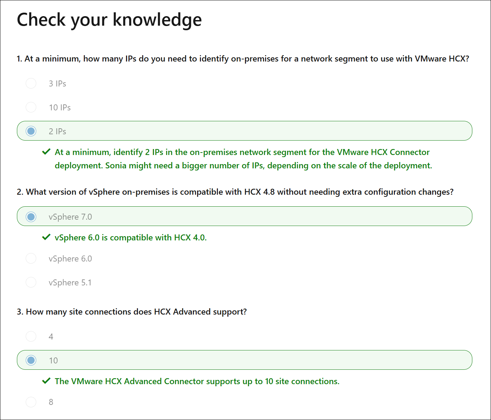

## Deploy and install VMware HCX

VMware HCX is added after deploying Azure VMware Solution in Azure. Before setting up site pairings, deploy and configure the VMware HCX Connector on-premises.

For the exercises, you’ll need an Azure subscription with contributor rights to configure the Azure VMware Solution environment.

### Download VMware HCX Connector

1. In the Azure portal, search for and select the **Azure VMware Solution private cloud**.
2. Under **Manage**, select **Add-ons**.
3. Open the **Migration using VMware HCX** tab, check **I agree with terms and conditions**, then select **Enable and deploy**.

   * This deploys VMware HCX in the private cloud.

      

4. After deployment, return to **Manage > Add-ons**.

   * The **Migration using HCX** tab now shows new options: **HCX plan**, **Configure HCX appliance**, and **Connect with on-premise using HCX keys**.

      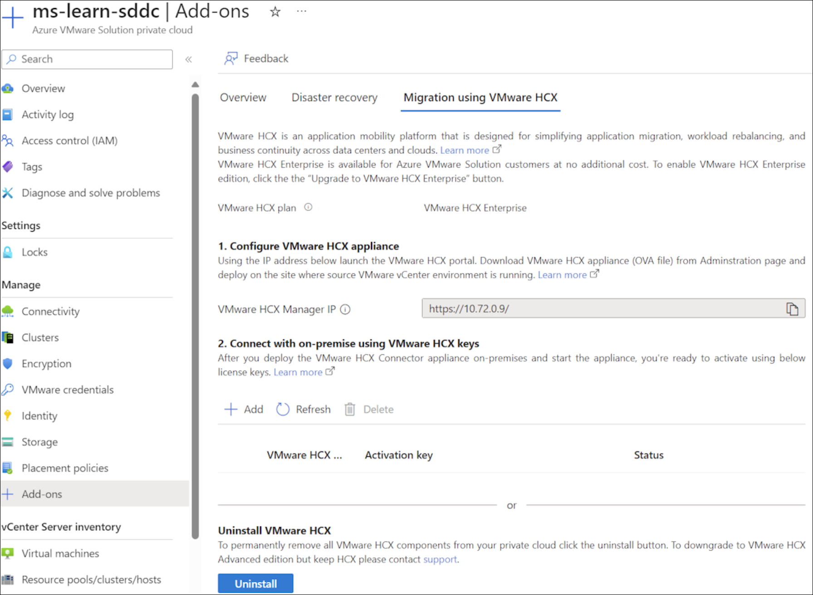

5. Select **+ Add** under **Connect with on-premise using HCX keys**.

   * Enter a VMware HCX key name.
   * Copy the generated activation key for use during the on-premises HCX Connector installation.

      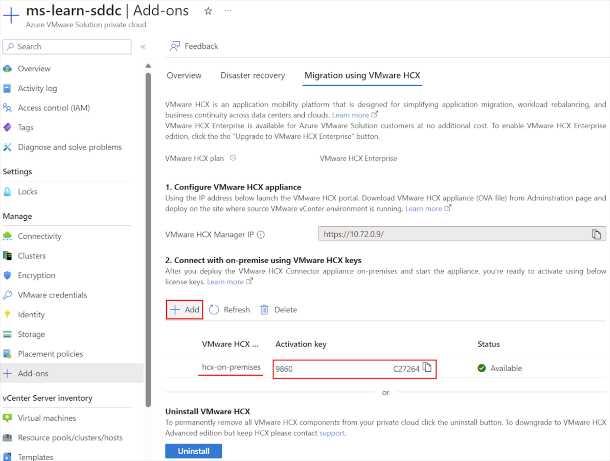

6. In the Azure VMware Solution private cloud, go to **Manage > Identity**.

   * Copy the URLs and credentials for vCenter and NSX-T Manager.

      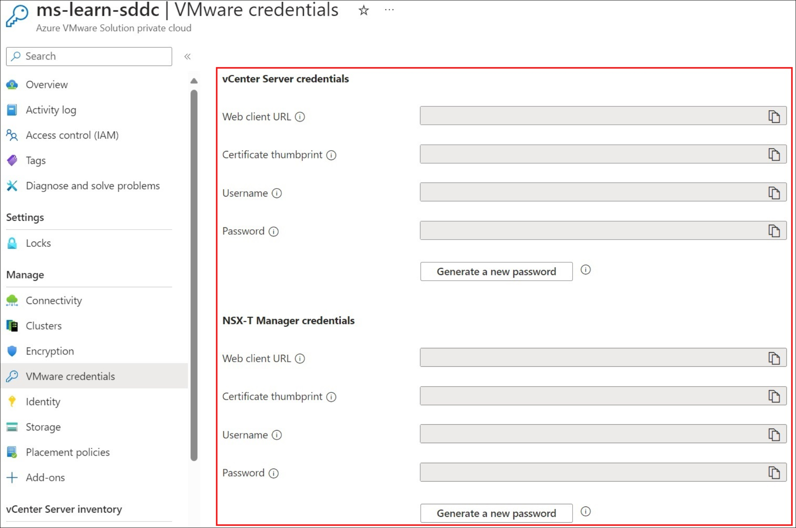

7. From a jump host VM (via Azure Bastion), open a browser and sign in to **VMware HCX Manager** at `https://x.x.x.9` (replace x’s with the CIDR address block).

   * Use `cloudadmin@vsphere.local` credentials.
8. In **VMware HCX Cloud Manager**, navigate to **Administration > System Updates > Check for Updates**.
9. Select **Request Download Link**.

    

10. Choose **VMware HCX** to download the VMware HCX Connector OVA file.

    

11. Monitor the browser’s status bar to track the OVA file download progress.

### Deploy the VMware HCX Connector OVA on-premises

1. Sign in to the **vCenter Server web GUI**.
2. Right-click the datacenter and select **Deploy OVF Template**.

    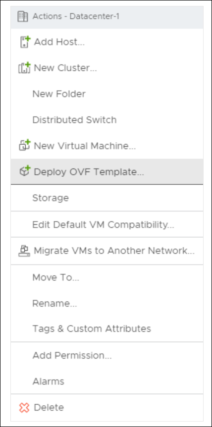

3. Choose the local **VMware HCX Connector OVA file** you downloaded.

    

4. For **Select a name and folder**, enter a name for the appliance, choose the datacenter resource, and select **Next**.

    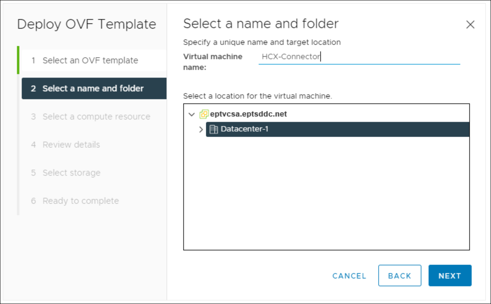

5. For **Select a compute resource**, pick the vSphere cluster and select **Next**.

    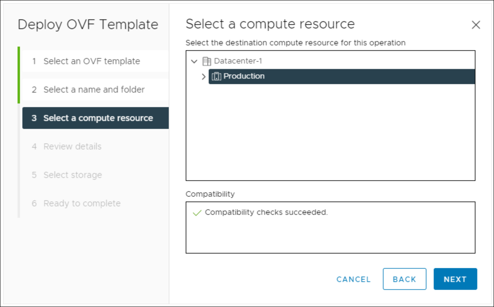

6. Review the advanced configuration options and select **Next**.

    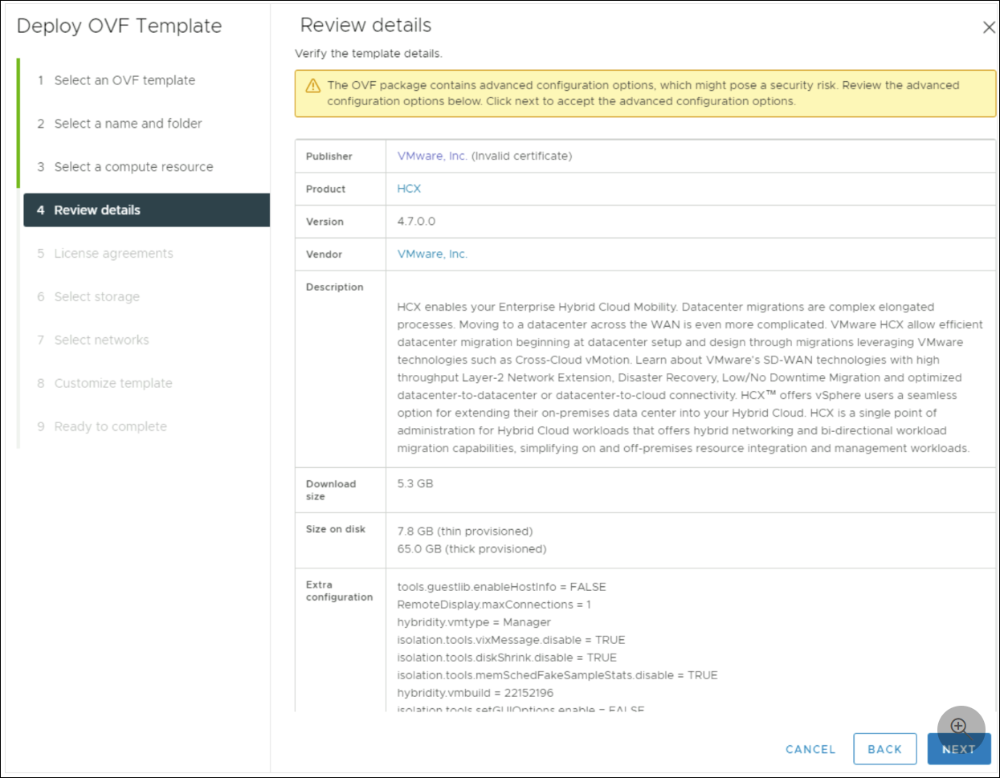

7. Accept the license terms by checking **I accept all license agreements**, then select **Next**.

8. Choose the storage location for the appliance and select **Next**.

    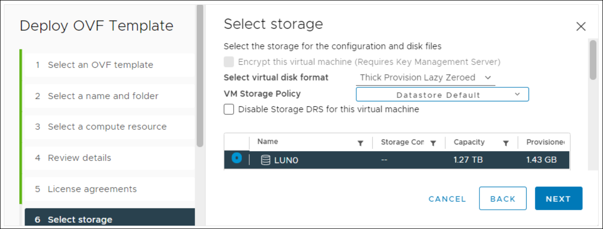

9. Select the **VMware HCX management network segment**, then select **Next**.

    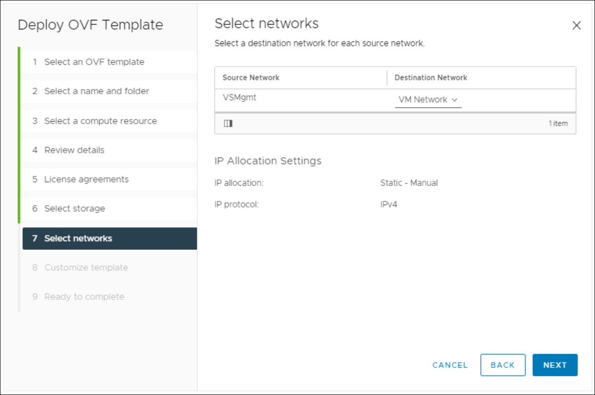

10. In **Customize template**, use the default **admin** account for configuration, enter the required details, and select **Next**.

    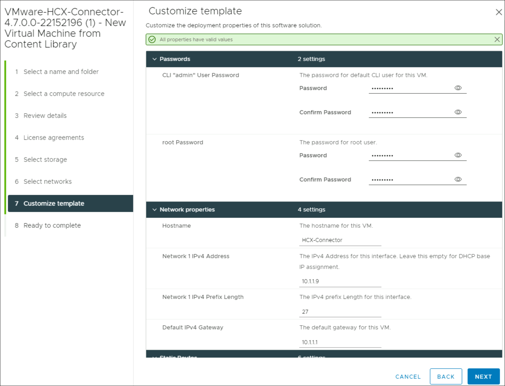

11. On **Ready to complete**, review all settings and select **Finish**.

    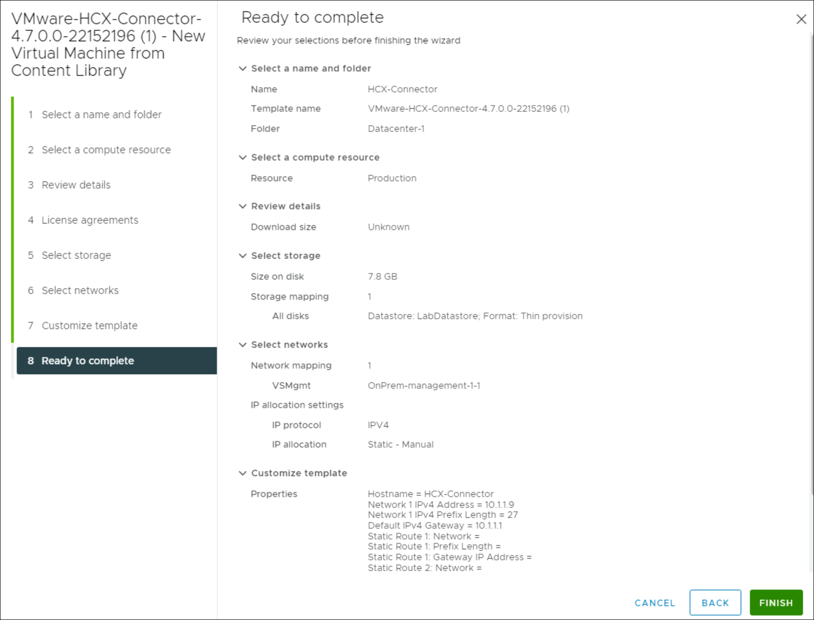

12. After deployment, manually power on the virtual appliance in vCenter Server.
13. Wait 10–15 minutes before continuing with configuration.
