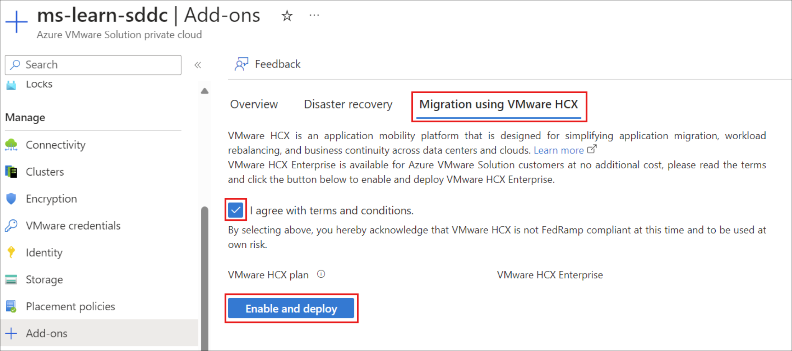
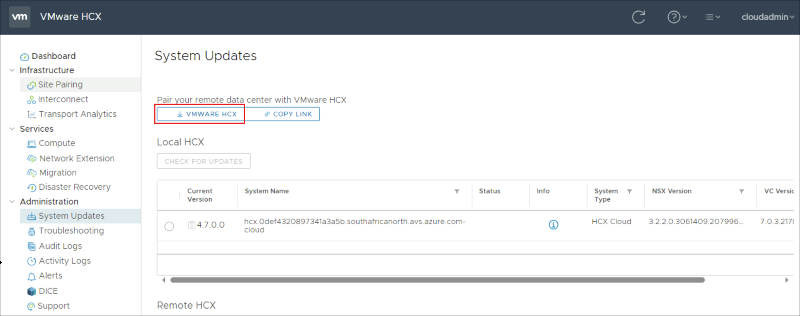
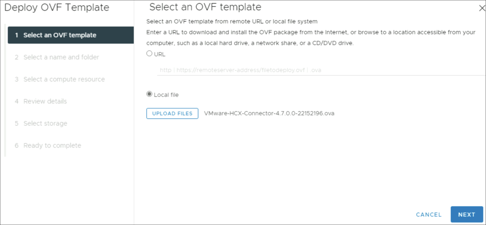
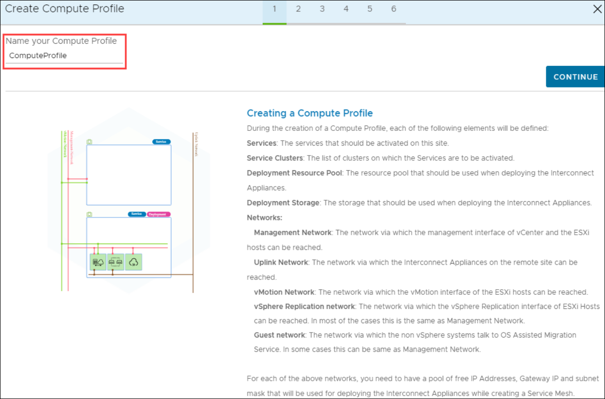

# Lab 2-2 - Migrate VMware vSphere resources from on-premises to Azure VMware Solution

**Module:** [Migrate VMware vSphere resources from on-premises to Azure VMware Solution](https://learn.microsoft.com/en-us/training/modules/migrate-vmware-workloads-on-premises-azure-vmware-solution/)

Plan, deploy, and configure VMware HCX with VMware vSphere to connect your on-premises environment to Azure VMware Solution. Use HCX to migrate virtual machines from vSphere to Azure.

**Learning objectives:**

* Configure VMware HCX to enable on-premises VMware vSphere migrations
* Migrate VMware vSphere resources to Azure VMware Solution with HCX

**Prerequisites:**

* Experience using the Azure portal to access and create resources
* Experience managing VMware infrastructure (ESXi, vCenter Server, NSX, VMware HCX)
* Basic understanding of networking (CIDR, subnets)
* (Optional) An Azure subscription with contributor rights to configure an Azure VMware Solution environment

<!-- omit in toc -->
## Contents

* [Introduction](#introduction)
* [Plan HCX deployment](#plan-hcx-deployment)
  * [What is VMware HCX?](#what-is-vmware-hcx)
  * [VMware HCX versions and compatibility](#vmware-hcx-versions-and-compatibility)
  * [Network connectivity and ports](#network-connectivity-and-ports)
  * [IP addresses for network segmentation](#ip-addresses-for-network-segmentation)
  * [Different migration types](#different-migration-types)
  * [Scenario readiness and preparation for Azure VMware Solution](#scenario-readiness-and-preparation-for-azure-vmware-solution)
  * [Check your knowledge](#check-your-knowledge)
* [Deploy and install VMware HCX](#deploy-and-install-vmware-hcx)
  * [Download VMware HCX Connector](#download-vmware-hcx-connector)
  * [Deploy the VMware HCX Connector OVA on-premises](#deploy-the-vmware-hcx-connector-ova-on-premises)
  * [Activate VMware HCX](#activate-vmware-hcx)
  * [Check your knowledge](#check-your-knowledge-1)
* [Configure networking and compute profiles for VMware HCX](#configure-networking-and-compute-profiles-for-vmware-hcx)
  * [What is a site pair?](#what-is-a-site-pair)
  * [Add a site pair](#add-a-site-pair)
  * [Create network profiles](#create-network-profiles)
  * [Create a compute profile](#create-a-compute-profile)
* [Create a service mesh for VMware HCX](#create-a-service-mesh-for-vmware-hcx)
  * [What is a service mesh?](#what-is-a-service-mesh)
  * [Create a service mesh](#create-a-service-mesh)
* [Migrate virtual machine workloads into Azure VMware Solution](#migrate-virtual-machine-workloads-into-azure-vmware-solution)
  * [Migrate virtual machines](#migrate-virtual-machines)
  * [Steps to migrate virtual machines into Azure VMware Solution using Bulk Migration](#steps-to-migrate-virtual-machines-into-azure-vmware-solution-using-bulk-migration)

## Introduction

Azure VMware Solution delivers a complete VMware environment as a service on dedicated bare-metal infrastructure in Azure. Once deployed, it provides access to familiar VMware tools:

| Product        | Description                                                                |
| -------------- | -------------------------------------------------------------------------- |
| ESXi           | Bare-metal servers running VMware virtualization software                  |
| vCenter Server | Centralized management for vSphere ESXi environments                       |
| vSAN           | Software-defined storage built into ESXi                                   |
| NSX            | Software-defined networking and security across datacenters and clouds     |
| VMware HCX     | Hybrid cloud platform enabling VM migrations between on-premises and Azure |

VMware HCX abstracts infrastructure to support VM migrations. Using HCX vMotion, you can migrate live workloads from on-premises vSphere to Azure VMware Solution with minimal downtime. This reduces migration complexity and accelerates cloud adoption.

Once VMs are migrated, they run in Azure close to its native APIs, enabling easier administration and maintenance.

**Example scenario:**

You work for a healthcare company running production workloads on VMware vSphere. The company has chosen to migrate workloads to Azure VMware Solution without changing the virtualization platform or disrupting existing operations. After deploying Azure VMware Solution, the next step is migrating on-premises VMware workloads into Azure.

What will we be doing?

* Plan for the VMware HCX Connector deployment on-premises
* Deploy the VMware HCX Connector and connect it to Azure VMware Solution
* Configure the service to ensure proper setup
* Migrate VMware vSphere workloads from on-premises to Azure VMware Solution

**Main goal:** Migrate on-premises VMware vSphere VMs into Azure VMware Solution quickly, helping the company address aging hardware and reduce the need for new infrastructure purchases.

## Plan HCX deployment

VMware HCX Cloud Manager is deployed as an add-on in Azure VMware Solution. After that, you plan the deployment of the VMware HCX Connector on-premises. To link on-premises VMware vSphere with Azure VMware Solution, you create a *site pair* between the source and destination. This site pair enables network connectivity for management, authentication, and orchestration of VMware HCX services.

### What is VMware HCX?

VMware HCX is a workload mobility platform that simplifies VM migrations with built-in network features. It helps connect on-premises vSphere datacenters to Azure. The HCX appliance integrates on-premises environments with Azure VMware Solution at the networking layer.

As a migration tool, HCX abstracts on-premises and cloud resources to appear as a single pool for vSphere workloads. It supports bidirectional VM migrations between on-premises datacenters and Azure VMware Solution.

Azure VMware Solution automatically deploys and configures HCX Cloud Manager in the private cloud. On-premises, you need to download, activate, and configure HCX Connector. HCX supports up to 10 site connections.

### VMware HCX versions and compatibility

VMware HCX migration patterns require version compatibility between on-premises and cloud environments.

| Component type             | HCX Connector environment requirements | HCX Cloud environment requirements      |
| -------------------------- | -------------------------------------- | --------------------------------------- |
| vSphere (vCenter and ESXi) | 7.0+                                   | 7.0+                                    |
| NSX                        | NSX 3.0.1+                             | For vSphere 7.0, NSX 3.0.1+ is required |

For older vSphere versions (5.0+), HCX Connector must be deployed and downgraded. VMware supports these migrations only for a limited time.

### Network connectivity and ports

Azure VMware Solution provisions an ExpressRoute circuit during deployment. You then peer this circuit to an Azure virtual network for access to Azure resources.

Next, set up connectivity between the on-premises VMware vSphere environment and Azure VMware Solution. By default, Global Reach provides hybrid connectivity. If Global Reach is unavailable due to region, network, or security restrictions, alternatives include ExpressRoute Private Peering or IPSec VPN. Network connectivity must be enabled before deploying VMware HCX Connector and creating a site pairing.

All required ports must be open for communication between on-premises vSphere and Azure VMware Solution.

| Port         | Protocol | Notes                                                                                                                               |
| ------------ | -------- | ----------------------------------------------------------------------------------------------------------------------------------- |
| 4500         | UDP      | VM traffic in source network to VMs in HCX extended network; IX transport path for migration and DR traffic                         |
| 443          | TCP      | HCX services, activation, updates, vMotion control, ESX authentication, NSX API, VM data transfer, metrics, and HTTPS communication |
| 9443         | TCP      | HCX appliance configuration and control, vCenter and management server registration                                                 |
| 45000–44600  | TCP      | VM data transfer                                                                                                                    |
| 5672         | TCP      | Advanced message queue protocol                                                                                                     |
| 31031, 44046 | TCP      | HCX bulk migration and disaster recovery                                                                                            |
| 514          | TCP/UDP  | Syslog originator to syslog collector                                                                                               |
| 80           | TCP      | OVF import, appliance deployment, ESX authentication                                                                                |
| 22           | TCP      | SSH for HCX central CLI                                                                                                             |
| 902          | TCP      | HCX cold migration (bidirectional), OVF import, appliance deployment                                                                |

### IP addresses for network segmentation

Next, you need to factor in the following network segments in the on-premises VMware HCX environment:

| Network segment     | Notes                                                                                                                                                                                                                                                                                                                                                             |
| ------------------- | ----------------------------------------------------------------------------------------------------------------------------------------------------------------------------------------------------------------------------------------------------------------------------------------------------------------------------------------------------------------- |
| Management network  | - Use the same management network as the on-premises VMware cluster. - Select at least two IPs for VMware HCX. - Create a new /26 segment for larger environments. - Present the segment as a port group to the on-premises cluster.                                                                                                                     |
| Uplink network      | - Use the same management network for the uplink network segment.                                                                                                                                                                                                                                                                                                 |
| vMotion network     | - Use the same vMotion network as the on-premises VMware cluster. - Reserve at least two IPs for VMware HCX. - More IPs may be needed for larger deployments. - Expose the vMotion network to a distributed virtual switch or vSwitch0. - If not configured, adjust the setup. - vSphere typically uses nonrouted vMotion segments, which is fine. |
| Replication network | - Use the same segment as the management and uplink networks. - If hosts use a dedicated replication VMkernel, reserve two IPs on this segment. - Use the replication VMkernel for this network.                                                                                                                                                            |

### Different migration types

VMware HCX offers a few different ways to migrate workloads:

| Migration type | Use cases                                                                | Capabilities                                                                                                                                                                                                                                                                            |
| -------------- | ------------------------------------------------------------------------ | --------------------------------------------------------------------------------------------------------------------------------------------------------------------------------------------------------------------------------------------------------------------------------------- |
| Live migration | Production VMs that must stay online with minimal downtime.              | - Migrates a powered-on VM. - Requires VMware HCX-enabled vCenter Server and destination site. - vMotion captures memory, execution state, IP, and MAC. - Duration depends on bandwidth and latency. - VM stays powered on, workloads remain online, no service disruption. |
| Cold migration | Dev/test workloads that may be offline during migration but need moving. | - Transfers a powered-off VM. - Uses same network as HCX vMotion. - Preserves VM IP and MAC addresses.                                                                                                                                                                            |
| Bulk migration | Large numbers of VMs that need migration on a schedule.                  | - Moves VMs in parallel on a predefined schedule. - VMs run at source until cutover. - Service interruption equals a reboot.                                                                                                                                                      |
### Scenario readiness and preparation for Azure VMware Solution

Your production environment requires strict SLA compliance, so live migration is the best option to minimize downtime when moving workloads to Azure VMware Solution. The on-premises vSphere 8.0 setup and required network ports are already configured, ensuring proper connectivity and functionality with HCX Cloud Manager in Azure VMware Solution.

Next, we’ll go over deploying and installing the VMware HCX Connector to start migrating workloads.

### Check your knowledge

## Deploy and install VMware HCX

VMware HCX is added after deploying Azure VMware Solution in Azure. Before setting up site pairings, deploy and configure the VMware HCX Connector on-premises.

For the exercises, you’ll need an Azure subscription with contributor rights to configure the Azure VMware Solution environment.

### Download VMware HCX Connector

1. In the Azure portal, search for and select the **Azure VMware Solution private cloud**.
2. Under **Manage**, select **Add-ons**.
3. Open the **Migration using VMware HCX** tab, check **I agree with terms and conditions**, then select **Enable and deploy**.

   * This deploys VMware HCX in the private cloud.

      

4. After deployment, return to **Manage > Add-ons**.

   * The **Migration using HCX** tab now shows new options: **HCX plan**, **Configure HCX appliance**, and **Connect with on-premise using HCX keys**.

      

5. Select **+ Add** under **Connect with on-premise using HCX keys**.

   * Enter a VMware HCX key name.
   * Copy the generated activation key for use during the on-premises HCX Connector installation.

      

6. In the Azure VMware Solution private cloud, go to **Manage > Identity**.

   * Copy the URLs and credentials for vCenter and NSX-T Manager.

      

7. From a jump host VM (via Azure Bastion), open a browser and sign in to **VMware HCX Manager** at `https://x.x.x.9` (replace x’s with the CIDR address block).

   * Use `cloudadmin@vsphere.local` credentials.
8. In **VMware HCX Cloud Manager**, navigate to **Administration > System Updates > Check for Updates**.
9. Select **Request Download Link**.

    

10. Choose **VMware HCX** to download the VMware HCX Connector OVA file.

    

11. Monitor the browser’s status bar to track the OVA file download progress.

### Deploy the VMware HCX Connector OVA on-premises

1. Sign in to the **vCenter Server web GUI**.
2. Right-click the datacenter and select **Deploy OVF Template**.

    

3. Choose the local **VMware HCX Connector OVA file** you downloaded.

    

4. For **Select a name and folder**, enter a name for the appliance, choose the datacenter resource, and select **Next**.

    

5. For **Select a compute resource**, pick the vSphere cluster and select **Next**.

    

6. Review the advanced configuration options and select **Next**.

    

7. Accept the license terms by checking **I accept all license agreements**, then select **Next**.

8. Choose the storage location for the appliance and select **Next**.

    

9. Select the **VMware HCX management network segment**, then select **Next**.

    

10. In **Customize template**, use the default **admin** account for configuration, enter the required details, and select **Next**.

    

11. On **Ready to complete**, review all settings and select **Finish**.

    

12. After deployment, manually power on the virtual appliance in vCenter Server.
13. Wait 10–15 minutes before continuing with configuration.

### Activate VMware HCX

1. In the Azure portal, go to **Manage > Add-ons** for your Azure VMware Solution private cloud.
2. Open the **Migration using VMware HCX** tab and select **+ Add**.

    

3. Enter a name for the key. Azure generates a VMware HCX Enterprise key for on-premises use.
4. Sign in to the on-premises **VMware HCX Manager** at `https://x.x.x.x:9443` using the admin credentials created earlier.
5. Enter the HCX License Key and select **Add**.

   * If activation fails, check internet connectivity or configure a proxy.

6. In **Datacenter Location**, choose the closest region and select **Continue**.

    

7. In **System Name**, keep or change the appliance name, then select **Continue**.

    

8. Select **Yes, Continue** to proceed with setup.

    

9. Under **Connect your vCenter**, provide the FQDN or IP of the on-premises vCenter Server and valid credentials, then select **Continue**.

    

10. In **Configure SSO/PSC**, enter the FQDN or IP of the Platform Services Controller, then select **Continue**.

    

11. Review the configuration, then select **Restart**.

    * The restart may take several minutes.

      

12. After the appliance restarts, sign back in.

    * A green circle should appear next to vCenter Server.
    * SSO should confirm VMware HCX Connector is using the Platform Services Controller.

      

Next, you’ll configure a site pairing, networking profiles, and a compute profile.

### Check your knowledge

  

## Configure networking and compute profiles for VMware HCX

After installing VMware HCX Connector on-premises, the next step is to link it with VMware HCX Cloud in Azure VMware Solution. The following units will guide you through the steps required to complete this connection.

### What is a site pair?

The first step is to create a site pair. A site pair establishes the network connectivity required for management, authentication, and orchestration of VMware HCX migration services between a source and destination VMware vSphere environment. In this case, the source is the on-premises VMware vSphere environment, and the destination is Azure VMware Solution. The table below provides more details:

| Component               | Notes                                                                                                                                                                                                                                          |
| -----------------------| ---------------------------------------------------------------------------------------------------------------------------------------------------------------------------------------------------------------------------------------------- |
| HCX Connector (source)  | - Deployed in the on-premises vSphere environment after Azure VMware Solution is deployed. - Creates a unidirectional site pairing to Azure VMware Solution. - Initiates migrations to Azure VMware Solution.                            |
| HCX Cloud (destination) | - Provisioned with Azure VMware Solution when the private cloud is deployed in Azure. - Serves as the destination for VMware HCX site pairing. - Always a software-defined datacenter. - Supports optional layer 2 network extension. |

### Add a site pair

1. Sign in to the on-premises vCenter Server.
2. From **Menu**, select **HCX**.

    

3. Under **Infrastructure**, choose **Site Pairing**.
4. Under **Pair your first site**, select **Connect To Remote Site**.

    

5. Enter the Azure VMware Solution HCX Cloud Manager IP address obtained earlier.
6. Enter the username `cloudadmin@vsphere.local` and the password from the Azure portal.
7. Select **Connect**.
    - If a certificate warning appears, select **Import Certificate** to continue.

      

8. Ensure VMware HCX Connector can route to the HCX Cloud Manager IP over port 443 using Azure ExpressRoute.
9. Once connected, the HCX Site Pairing tab will show the new on-premises HCX Connector paired with the VMware HCX Cloud Manager in Azure VMware Solution.

### Create network profiles

VMware HCX Connector on-premises deploys automated virtual appliances that need multiple IP segments. To support this, you must configure network profiles based on the IP segments identified during the HCX deployment planning phase.

1. Sign in to the on-premises VMware HCX Connector.
2. Create four network profiles:

   * Management
   * vMotion
   * Replication
   * Uplink

3. Go to **Infrastructure > Interconnect > Multi-Site Service Mesh > Network Profiles**.

    

4. Select **Create Network Profile**.
5. For each profile, choose the network and port group, enter a name, and define the segment’s IP pool.
  
6. Select **Create** to complete each profile.

### Create a compute profile

After creating network profiles, you must configure a compute profile. The compute profile defines the compute, storage, and network settings used by VMware HCX to build the service mesh, which enables VM migrations from on-premises to Azure VMware Solution.

1. Go to **Infrastructure > Interconnect > Compute Profiles > Create Compute Profile**.

    

2. Enter a name for the profile and select **Continue**.

    

3. On the services screen, keep all default services enabled and select **Continue**.

    

4. Under **Select Service Resources**, choose one or more service resources (clusters) and select **Continue**.
5. From **Select Datastore**, pick the datastore for deploying VMware HCX Interconnect appliances, then select **Continue**. Note: if multiple resources are chosen, VMware HCX uses the first until full.

    

6. From **Select Management Network Profile**, choose the management network profile created earlier and select **Continue**.

    

7. From **Select Uplink Network Profile**, choose the uplink network profile and select **Continue**.

    

8. From **Select vMotion Network Profile**, choose the vMotion network profile and select **Continue**.

    

9. From **Select vSphere Replication Network Profile**, choose the replication network profile and select **Continue**.

    

10. Review the connection rules and select **Continue**.

    

11. Select **Finish** to create the compute profile.

    

The new compute profile now appears under **Compute Profiles** in **Interconnect**. 

The next step will be setting up a service mesh to complete the VMware HCX Connector configuration.

## Create a service mesh for VMware HCX

After completing the site pairing, network profiles, and compute profile setup, the next step is to configure a service mesh for VMware HCX Manager. The service mesh enables VMware HCX Manager to migrate virtual machines from the on-premises HCX-enabled site to the HCX-enabled destination site in Azure VMware Solution.

### What is a service mesh?

A service mesh is an abstraction layer that simplifies network transport between source and destination sites. It decouples workloads and application services from the underlying networking components required for inter-site communication. The service mesh creates a secure, optimized transport fabric between VMware HCX Manager sites. Once enabled, it allows VMware vSphere VMs to be migrated to Azure VMware Solution.

### Create a service mesh

To successfully establish a service mesh with Azure VMware Solution, you must meet the following networking requirements:

| Requirement                       | Reason                                                                                                                                      |
| --------------------------------- | ------------------------------------------------------------------------------------------------------------------------------------------- |
| UDP ports 500/4500                | Must be open between the VMware HCX Connector uplink and the Azure VMware Solution HCX Cloud uplink network profile addresses.              |
| VMware HCX Manager required ports | Refer to the VMware HCX URL provided at the end of this module for a full list of required open ports between source and destination sites. |

1. In the on-premises VMware HCX Connector dashboard, go to **Infrastructure > Interconnect > Service Mesh > Create Service Mesh**.

    

2. Review the prepopulated sites from site pairing, then select **Continue**. (No changes needed for the first configuration.)
3. From the dropdowns, select both the source and remote compute profiles, then select **Continue**.

    

    

4. Review the services to be enabled, then select **Continue**.

    

5. In **Advanced Configuration - Override Uplink Network Profiles**, select **Continue**. (Optional step.)

    

6. In **Advanced Configuration - Network Extension Appliance Scale Out**, confirm the checkbox for the vMotion distributed switch is already selected. Leave it checked and select **Continue**.
7. In **Advanced Configuration - Traffic Engineering**, select **Continue**.

    

8. Review the topology preview, then select **Continue**.

    

9. Enter a user-friendly name for the service mesh, then select **Finish**.

    

10. Select **View Tasks** to monitor deployment progress.

    

11. When deployment is complete, ensure all services show as green.

    

12. To verify health:

    * On-premises: go to **Interconnect > Appliances** and confirm all tunnel statuses show green and Up.
    * Azure VMware Solution: check the same **Appliances** page for deployed appliances and verify their health.

      

Next, you’ll learn how to migrate VMs from on-premises vSphere to Azure VMware Solution using VMware HCX.

## Migrate virtual machine workloads into Azure VMware Solution

After installing VMware HCX and connecting your on-premises VMware vSphere environment to Azure VMware Solution, the next step is to migrate virtual machines. Use the VMware HCX Connector migration web interface to move VMs running Windows Server and Linux from on-premises to Azure VMware Solution.

### Migrate virtual machines

VMware HCX supports multiple migration methods for moving Windows Server and Linux VMs into Azure VMware Solution, including cold, live, Replication Assisted vMotion (RAV), and bulk migration. You configure these migrations through the on-premises VMware HCX Connector that established site pairing with Azure VMware Solution.

The VMware HCX migration interface also provides VM options to control behaviors and conditions that apply before or after migration.

Avoid taking snapshots of VMs during migration, whether manually or with third-party backup tools, as this can disrupt the process. Disable backups until the VM migration fully completes.

> Try our HCX migration click-through demo. This demo shows how an organization can confidently migrate workloads from an on-premises VMware deployment to a private cloud in Microsoft Azure. [Azure VMware Solution - HCX Migration Demo](https://regale.cloud/Microsoft/play/3210/hcx-migration#/0/0)

### Steps to migrate virtual machines into Azure VMware Solution using Bulk Migration

1. In the on-premises HCX dashboard, go to **Services > Migration**.

    

2. The **Migration Tracking** page opens. Since this is your first migration, no VMs are listed.
3. Select **Migrate**.
4. From the list of available virtual machines, check the names you want to migrate, then select **Add**.

    

5. Configure **Transfer and Placement**, **Switchover**, and **Extended Options** as needed.
6. To apply machine-specific settings, expand a VM under **VM for Migration** and update its Transfer, Placement, and Switchover options.

    

7. Choose the destination network for each VM.

    

8. After configuring networks, select **Validate** or **Go**:

   * **Validate** checks the configuration.
   * **Go** starts the migration.
9. HCX Manager migrates the selected VMs. If validation shows warnings or errors, correct the issues and select **Go** again.
