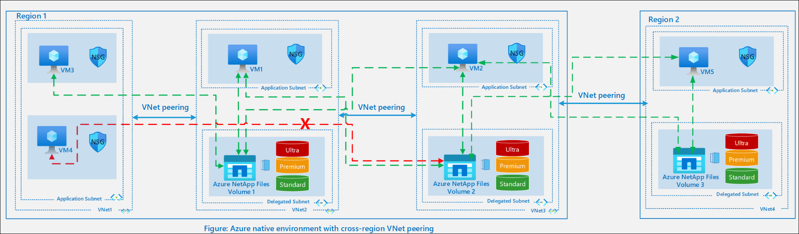

# Lab 2-5: Understand Azure NetApp Files essentials

**Module:** [Understand Azure NetApp Files essentials](https://learn.microsoft.com/en-us/training/modules/azure-netapp-files-essentials/)

Develop core knowledge of Azure NetApp Files and the steps required before creating a volume. This includes the storage hierarchy, capacity pools, and volumes. You’ll also learn about NAS shares, file permissions, and how to manage and monitor Azure NetApp Files resources.

**Learning objectives:**

By the end of this module, you will be able to:

* Describe the service levels in Azure NetApp Files
* Identify the network planning elements needed to design an architecture for Azure NetApp Files
* Explain how to monitor Azure NetApp Files

**Prerequisites:**

* Basic understanding of Azure NetApp Files
* Familiarity with file system protocols such as SMB and NFS

<!-- omit in toc -->
## Contents

* [Introduction](#introduction)
  * [NetApp accounts](#netapp-accounts)
  * [Capacity pools](#capacity-pools)
  * [Quality of Service (QoS) types for capacity pools](#quality-of-service-qos-types-for-capacity-pools)
    * [Automatic (or auto) QoS type](#automatic-or-auto-qos-type)
    * [Manual QoS type](#manual-qos-type)
  * [Volumes](#volumes)
    * [Large volumes](#large-volumes)
* [Service levels for Azure NetApp Files](#service-levels-for-azure-netapp-files)
  * [Service levels](#service-levels)
  * [Throughput limits](#throughput-limits)
    * [Throughput limit scenarios of volumes in an auto QoS capacity pool](#throughput-limit-scenarios-of-volumes-in-an-auto-qos-capacity-pool)
    * [Throughput limit examples of volumes in a manual QoS capacity pool](#throughput-limit-examples-of-volumes-in-a-manual-qos-capacity-pool)
* [Azure NetApp Files limits](#azure-netapp-files-limits)
  * [Determine if a directory is approaching the limit size](#determine-if-a-directory-is-approaching-the-limit-size)
  * [`maxfiles` limits in Azure NetApp Files](#maxfiles-limits-in-azure-netapp-files)
* [Azure NetApp Files network planning](#azure-netapp-files-network-planning)
  * [Network features](#network-features)
  * [Virtual networks for Azure NetApp Files volumes](#virtual-networks-for-azure-netapp-files-volumes)
    * [Azure virtual networks](#azure-virtual-networks)
    * [Subnets](#subnets)
    * [User-defined routes and network security groups](#user-defined-routes-and-network-security-groups)
  * [Azure native environments](#azure-native-environments)
    * [Local VNet](#local-vnet)
    * [VNet peering](#vnet-peering)
    * [Global or cross-region VNet peering](#global-or-cross-region-vnet-peering)
  * [Hybrid environments](#hybrid-environments)
* [Monitor Azure NetApp Files](#monitor-azure-netapp-files)
* [Monitor Azure NetApp Files](#monitor-azure-netapp-files-1)

## Introduction

Before creating a volume in Azure NetApp Files, you must purchase and set up a pool for provisioned capacity. To set up a capacity pool, you must have a NetApp account.

### NetApp accounts

* A NetApp account serves as an administrative grouping of the constituent capacity pools.
* A NetApp account isn't the same as your general Azure storage account.
* A NetApp account is regional in scope.
* You can have multiple NetApp accounts in a region, but each NetApp account is tied to only a single region.

### Capacity pools

Capacity pools are defined by their provisioned size. The size is determined by the purchased SKU, such as a 4-TiB pool. Each pool supports only one service level and belongs to a single NetApp account, though a NetApp account can host multiple pools. Pools can’t be moved between accounts and can’t be deleted until all associated volumes are removed.

You can configure Standard, Premium, or Ultra service-level pools, with the option to enable cool access for cost optimization.

### Quality of Service (QoS) types for capacity pools

The QoS type is an attribute of a capacity pool. It provides the ability to assign the capacity and throughput to the volumes in the capacity pool.

Azure NetApp Files provides two QoS types of capacity pools: auto (default) and manual.

#### Automatic (or auto) QoS type

* When you create a capacity pool, the default QoS type is auto.
* In an auto QoS capacity pool, throughput is assigned automatically to the volumes in the pool, proportional to the size quota assigned to the volumes.
* The maximum throughput allocated to a volume depends on the service level of the capacity pool and the size quota of the volume, which are discussed in the other modules in this learning path.

#### Manual QoS type

When creating a capacity pool, you can set it to use the manual QoS type. Existing pools can also be switched to manual QoS, but the change is permanent. A manual QoS pool can’t be converted back to auto QoS, though volumes can be moved to an auto QoS pool by changing their service level.

With manual QoS, volume capacity and throughput are assigned independently. The combined throughput of all volumes in the pool is capped by the pool’s total throughput, which depends on pool size and service level. For example, a 4-TiB Ultra pool provides up to 512 MiB/s (4 TiB × 128 MiB/s/TiB) that can be shared across volumes.

### Volumes

Volumes are scalable units measured by logical capacity consumption. Their capacity usage is deducted from the provisioned capacity of the pool, while their throughput usage is taken from the pool’s available throughput (see Manual QoS).

Each volume is tied to a single pool, though a pool can host multiple volumes. Volumes can range from 50 GiB to 100 TiB, with large volumes supporting sizes from 50 TiB up to 2,048 TiB.

#### Large volumes

Large volumes begin at a capacity of 50 TiB and scale up to 2,048 TiB.

## Service levels for Azure NetApp Files

Service levels are defined at the capacity pool level. They determine the maximum throughput available to a volume, based on the quota assigned to it.

**Note:** Throughput includes both read and write operations.

### Service levels

Azure NetApp Files offers three service levels: Standard, Premium, and Ultra.

* Standard: Up to 16 MiB/s throughput per 1 TiB of provisioned capacity
* Premium: Up to 64 MiB/s throughput per 1 TiB of provisioned capacity
* Ultra: Up to 128 MiB/s throughput per 1 TiB of provisioned capacity

**Note:** All service levels support the cool access option, which moves infrequently accessed data from the hot tier to the cool tier. Service performance remains the same, though access may vary for data stored in the cool tier.

### Throughput limits

A volume’s throughput limit is defined by three factors:

* The service level of its capacity pool
* The quota assigned to the volume
* The QoS type (auto or manual) of the pool

#### Throughput limit scenarios of volumes in an auto QoS capacity pool

Throughput limits in an auto QoS capacity pool are calculated as:

**Service level throughput per TiB × volume quota**

**Example 1:**
A Premium tier volume with a 2 TiB quota has a throughput limit of 128 MiB/s (2 TiB × 64 MiB/s). This is independent of pool size or actual usage.

**Example 2:**
A Premium tier volume with a 100 GiB quota has a throughput limit of 6.25 MiB/s (0.09765625 TiB × 64 MiB/s). Again, the limit applies regardless of pool size or actual usage.

#### Throughput limit examples of volumes in a manual QoS capacity pool

In a manual QoS capacity pool, capacity and throughput are set independently when creating a volume. The combined throughput of all volumes is limited by the pool size and service level.

Example for an SAP HANA system:

* Data volume: 4 TiB, up to 704 MiB/s
* Log volume: 0.5 TiB, up to 256 MiB/s
* Shared volume: 1 TiB, up to 64 MiB/s
* Backup volume: 4.5 TiB, up to 256 MiB/s

This setup allows tailoring volume sizes and throughput to match application requirements, while staying within the pool’s overall throughput capacity.

## Azure NetApp Files limits

Azure NetApp Files includes several limits, such as volume sizes and throughput caps, that you should be aware of when planning deployments. It’s recommended to bookmark the **Azure NetApp Files resource limits** documentation and refer to it regularly to stay informed of these constraints.

[Resource limits for Azure NetApp Files](https://learn.microsoft.com/en-us/azure/azure-netapp-files/azure-netapp-files-resource-limits)

### Determine if a directory is approaching the limit size

A 320-MB directory in Azure NetApp Files can use up to 655,360 blocks, with each block being 512 bytes (calculated as 320 × 1024 × 1024 ÷ 512). This translates to roughly 4–5 million files at maximum. The actual limit may be lower, depending on factors like the use of non-ASCII characters in filenames.

You can run the **stat** command from a client to check if a directory is nearing the 320-MB metadata size limit. Once this limit is reached, errors such as *No space left on device* will occur.

### `maxfiles` limits in Azure NetApp Files

Azure NetApp Files volumes include a **maxfiles** value, which defines the maximum number of files and folders (inodes) allowed. Once the limit is reached, clients see *out of space* errors when creating files or directories. If this occurs, Microsoft support must be contacted.

The **maxfiles** limit depends on the provisioned size of the volume:

* Regular volumes ≤ 683 GiB: fixed limit of **21,251,126**
* Regular volumes > 683 GiB: ~1 inode per 32 KiB of volume size, up to **2,147,483,632**
* Large volumes: ~1 inode per 32 KiB of volume size, up to **15,938,355,048**

Additional details:

* Each inode consumes ~288 bytes of capacity in the volume. With many inodes, this overhead can add up significantly.
* Files smaller than 64 bytes are stored inside the inode itself, without extra capacity.
* Files larger than 64 bytes consume both inode space and regular data capacity. For example, one million files larger than 64 bytes consume ~274 MiB of inode capacity.

    | Volume size                   | Estimated **maxfiles** limit |
    | ----------------------------- | ---------------------------- |
    | 0 – 683 GiB                   | 21,251,126                   |
    | 1 TiB (1,073,741,824 KiB)     | 31,876,709                   |
    | 10 TiB (10,737,418,240 KiB)   | 318,767,099                  |
    | 50 TiB (53,687,091,200 KiB)   | 1,593,835,519                |
    | 100 TiB (107,374,182,400 KiB) | 2,147,483,632                |

  The following table shows examples of the relationship maxfiles values based on volume sizes for large volumes.

  | Volume size                   | Estimated **maxfiles** limit |
  | ----------------------------- | ---------------------------- |
  | 50 TiB (53,687,091,200 KiB)   | 1,593,835,512                |
  | 100 TiB (107,374,182,400 KiB) | 3,187,671,024                |
  | 200 TiB (214,748,364,800 KiB) | 6,375,342,024                |
  | 500 TiB (536,870,912,000 KiB) | 15,938,355,048               |

To view the **maxfiles** allocation for a specific volume, open the volume’s **Overview** pane and check the *Maximum number of files* field.

For data protection volumes, you can’t set **maxfiles** limits through a quota request. Azure NetApp Files automatically adjusts the maxfiles value to support the number of files being replicated.

## Azure NetApp Files network planning

Network architecture planning is essential when designing application infrastructure. This unit guides you in creating a network design that enables your workloads to fully leverage the features and performance of Azure NetApp Files.

### Network features

Azure NetApp Files volumes must reside in a **delegated subnet** within your Azure Virtual Network. These volumes can be accessed directly from Azure via VNet peering or from on-premises through a Virtual Network Gateway (ExpressRoute or VPN). The delegated subnet is dedicated to Azure NetApp Files and has no internet connectivity.

In supported regions, volumes can use either **Standard** or **Basic** network features:

* **Standard**: Provides higher IP limits, support for NSGs, user-defined routes, and broader connectivity patterns.
* **Basic**: Offers limited IP scaling and selective connectivity patterns, with constraints described in the considerations.

You can switch between Basic and Standard features, though with some restrictions.

For details, see the [Guidelines for Azure NetApp Files network planning](https://learn.microsoft.com/en-us/azure/azure-netapp-files/azure-netapp-files-network-topologies).

### Virtual networks for Azure NetApp Files volumes

This section explains concepts that help you with virtual network planning.

#### Azure virtual networks

Before provisioning an Azure NetApp Files volume, you need to create an Azure virtual network (VNet) or use one that already exists in the same subscription. The VNet defines the network boundary of the volume.

#### Subnets

Subnets divide a virtual network into address spaces that Azure resources can use. When you create an Azure NetApp Files instance, it must be placed in a **delegated subnet**. This subnet is configured with permissions specific to Azure NetApp Files. How nodes connect to the service depends on their location—whether they’re within Azure or external (such as on-premises).

#### User-defined routes and network security groups

If a subnet contains volumes using both **Standard** and **Basic** network features, only the volumes with **Standard** features support user-defined routes (UDRs) and network security groups (NSGs) applied at the delegated subnet level.

**Note:** NSGs can’t be associated at the network interface level for Azure NetApp Files network interfaces.

### Azure native environments

We cover four virtual network scenarios: local VNets, peered VNets, VNets for cross-region replication, and hybrid environments. The following diagram applies to both the local and peered VNet scenarios for an Azure native environment.

#### Local VNet

Resources running on Azure VMs within the same virtual network as the delegated subnet can directly connect to Azure NetApp Files. For example, if **VM 1** and **Volume 1** are both in **Virtual Network 1**, then VM 1 has direct access to that volume.

#### VNet peering

When multiple VNets in the same region need to share resources, you can enable **VNet peering** for secure connectivity over Azure’s backbone.

For example, if **VNet 2** and **VNet 3** are peered, then VM 1 can reach VM 2 or Volume 2, and VM 2 can reach VM 1 or Volume 1.

However, VNet peering doesn’t support transit routing. If **VNet 1** is peered with **VNet 2**, and **VNet 2** is peered with **VNet 3**, resources in VNet 1 can access VNet 2 but not VNet 3 unless VNet 1 and VNet 3 are explicitly peered. In this case, VM 3 can connect to Volume 1, but VM 4 can’t connect to Volume 2 because the spoke VNets aren’t directly peered.

#### Global or cross-region VNet peering

Resources in a peered virtual network can connect to Azure NetApp Files volumes in the delegated subnet of the paired VNet. For example, if **VNet 1** and **VNet 2** are peered, **VM 2** in VNet 2 can access **Volume 1** in VNet 1.

With **Standard network features**, cross-region and global VNet peering are supported. This enables VMs in one region to mount volumes in another region. In the diagram, **VNet 4** in Region 2 hosts a delegated subnet with a volume that **VM 5** can mount. Similarly, **VM 2** in Region 1 can connect to **Volume 3** in Region 2, and **VM 5** in Region 2 can connect to **Volume 2** in Region 1.

### Hybrid environments

On-premises resources can connect to Azure NetApp Files if the Azure VNet hosting the delegated subnet is linked through **VPN** or **ExpressRoute**. For example, if the on-premises network connects to **VNet 1** using a VPN gateway, applications can access file storage in that subnet.

In a **hybrid hub-spoke topology**, the hub VNet provides centralized connectivity to on-premises, while spoke VNets are peered with the hub to isolate workloads. Connectivity options include:

* On-premises VMs (VM1, VM2) → **Volume 1** in the hub via VPN or ExpressRoute
* On-premises VMs (VM1, VM2) → **Volume 2** or **Volume 3** in spokes via VPN + regional peering
* VM3 in the hub → **Volume 2** in Spoke 1 and **Volume 3** in Spoke 2
* VM4 in Spoke 1 and VM5 in Spoke 2 → **Volume 1** in the hub
* VM4 in Spoke 1 → can’t connect to **Volume 3** in Spoke 2; VM5 in Spoke 2 → can’t connect to **Volume 2** in Spoke 1 (no transit routing over peering)

**Important:** If a spoke VNet has its own gateway, on-premises connectivity to Azure NetApp Files volumes in that spoke will prefer the spoke gateway over the hub gateway. In this case, only machines connecting through the spoke gateway can reach the volume.

## Monitor Azure NetApp Files

[Azure NetApp Files Capacity Manager (ANCapacityManager)](https://github.com/ANFTechTeam/ANFCapacityManager)

You should monitor the capacity, activity, service health, and various metrics of your Azure NetApp Files deployment. These tips help you monitor Azure NetApp Files.

| Monitor                             | Description                                                                                                                                                                                       |
| ----------------------------------- | ------------------------------------------------------------------------------------------------------------------------------------------------------------------------------------------------- |
| **Azure Activity Log**              | Provides insight into subscription-level events, such as resource modifications or VM starts. You can view logs in the Azure portal, with PowerShell or CLI, and send them to other destinations. |
| **Azure NetApp Files metrics**      | Offers metrics on allocated storage, actual usage, IOPS, and latency. These help analyze usage patterns and performance. Metrics can be viewed at the capacity pool or volume level.              |
| **Azure Service Health**            | Keeps you updated on the health of your environment. Provides personalized views of Azure services in use, planned maintenance, and health advisories, plus tools to manage alerts.               |
| **Capacity utilization monitoring** | Tracks used and available capacity at the VM level. Capacity can be checked using Windows or Linux clients, and alerts can be configured with **ANFCapacityManager**.                             |

## Monitor Azure NetApp Files

Azure NetApp Files provides metrics on allocated storage, actual storage usage, volume IOPS, and latency. By analyzing these metrics, you can gain a better understanding of the usage pattern and volume performance of your NetApp accounts.
