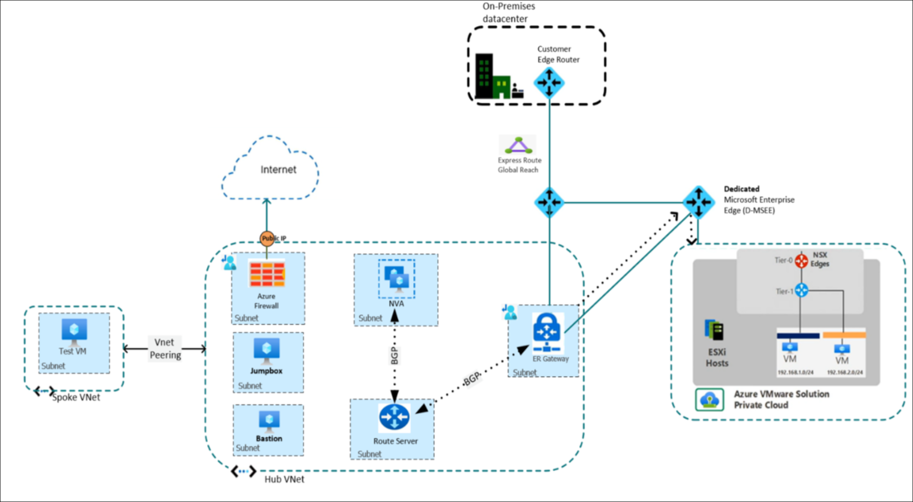

# Lab 2-6: Secure outbound internet connectivity for Azure VMware Solution

**Module:** [Secure outbound internet connectivity for Azure VMware Solution](https://learn.microsoft.com/en-us/training/modules/azure-vmware-solution/)

Learn how to route, control, and inspect outbound network traffic from an Azure VMware Solution private cloud. Define the outbound internet path using a custom or third-party Network Virtual Appliance (NVA) with Azure Route Server and Azure Firewall.

**Learning objectives:**

* Generate and inject a default route using a custom or third-party NVA, with Azure Firewall as the next hop.
* Propagate the default route to the Azure VMware Solution private cloud using Azure Route Server.
* Create network rules in Azure Firewall to allow outbound internet traffic from the private cloud.

**Prerequisites:**

* Beginner-level knowledge of Azure networking concepts: Virtual WAN, VNets, subnets, NSGs, route tables, UDR, ExpressRoute Gateway, and VNet peering.
* Intermediate experience with Azure VMware Solution private cloud, including NSX-T T0/T1 gateways, NSX-T Edge, and Managed SNAT.
* Ability to create a network segment, deploy a VM in it, and test internet connectivity.
* Intermediate experience with custom or third-party NVAs, BGP, Azure Route Server, and Azure Firewall.

<!-- omit in toc -->
## Contents

* [Introduction](#introduction)
  * [Example Scenario](#example-scenario)
  * [What will we be doing?](#what-will-we-be-doing)
  * [What is the main goal?](#what-is-the-main-goal)
* [Default outbound internet connectivity for Azure VMware Solution](#default-outbound-internet-connectivity-for-azure-vmware-solution)

## Introduction

Organizations often face strict network traffic security requirements. In regulated industries like healthcare and finance, noncompliance can lead to costly penalties. This module shows how to secure outbound network traffic from Azure VMware Solution to meet those requirements.

### Example Scenario

Contoso, a healthcare customer, recently migrated its applications from an on-premises VMware environment to Azure VMware Solution.

The network security team wants to replicate the same traffic inspection and control processes in Azure that were used on-premises. This ensures compliance with strict healthcare regulations while supporting digital transformation efforts.

To achieve this, the team plans to control outbound traffic using a Network Virtual Appliance (NVA). All outbound traffic must be routed through a firewall, where rules will allow or deny traffic based on protocol, port, and IP address.

### What will we be doing?

You’ll set up connectivity between the Azure VMware Solution private cloud and Azure. A custom NVA will be deployed to generate the default route, with Azure Firewall as the next hop. Azure Route Server will propagate this route to the private cloud. Finally, Azure Firewall will manage the traffic through network rules.

### What is the main goal?

By the end of this module, you’ll know how to secure and manage outbound internet connectivity from the Azure VMware Solution private cloud using a custom NVA, Azure Route Server, and Azure Firewall.

## Default outbound internet connectivity for Azure VMware Solution
