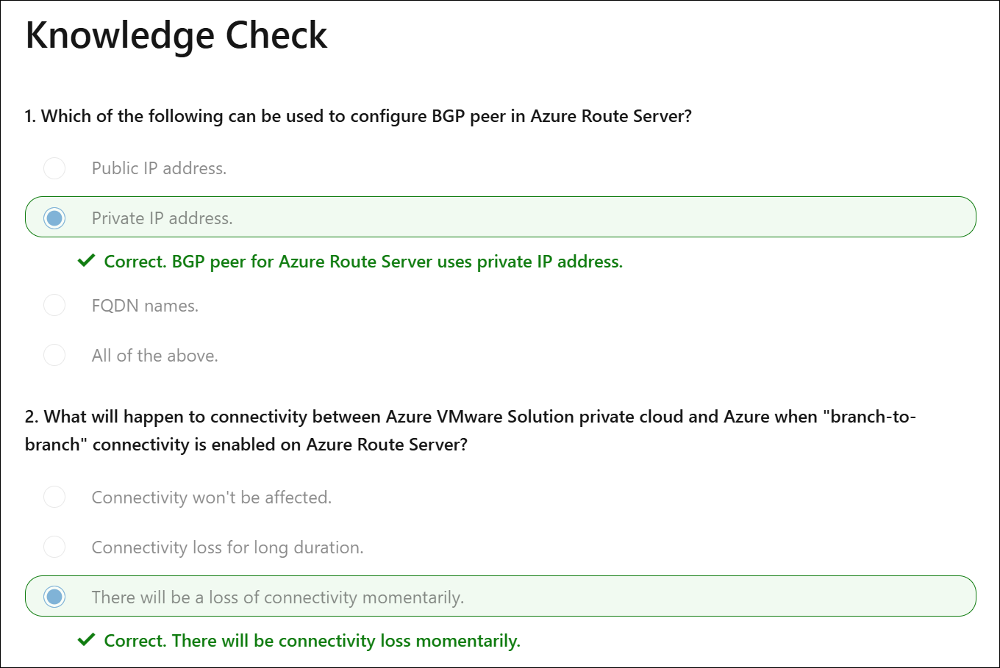

# Lab 2-6: Secure outbound internet connectivity for Azure VMware Solution

**Module:** [Secure outbound internet connectivity for Azure VMware Solution](https://learn.microsoft.com/en-us/training/modules/azure-vmware-solution/)


Learn how to route, control, and inspect outbound network traffic from an Azure VMware Solution private cloud. Define the outbound internet path using a custom or third-party Network Virtual Appliance (NVA) with Azure Route Server and Azure Firewall.

**Learning objectives:**

* Generate and inject a default route using a custom or third-party NVA, with Azure Firewall as the next hop.
* Propagate the default route to the Azure VMware Solution private cloud using Azure Route Server.
* Create network rules in Azure Firewall to allow outbound internet traffic from the private cloud.

**Prerequisites:**

* Beginner-level knowledge of Azure networking concepts: Virtual WAN, VNets, subnets, NSGs, route tables, UDR, ExpressRoute Gateway, and VNet peering.
* Intermediate experience with Azure VMware Solution private cloud, including NSX-T T0/T1 gateways, NSX-T Edge, and Managed SNAT.
* Ability to create a network segment, deploy a VM in it, and test internet connectivity.
* Intermediate experience with custom or third-party NVAs, BGP, Azure Route Server, and Azure Firewall.


<!-- omit in toc -->
## Contents

* [Introduction](#introduction)
  * [Example Scenario](#example-scenario)
  * [What will we be doing?](#what-will-we-be-doing)
  * [What is the main goal?](#what-is-the-main-goal)
* [Default outbound internet connectivity for Azure VMware Solution](#default-outbound-internet-connectivity-for-azure-vmware-solution)
  * [How workloads in Azure VMware Solution connect to the internet:](#how-workloads-in-azure-vmware-solution-connect-to-the-internet)
  * [Controlling internet traffic](#controlling-internet-traffic)
  * [Disable outbound internet connectivity](#disable-outbound-internet-connectivity)
* [Exercise - configure Azure VMware Solution](#exercise---configure-azure-vmware-solution)
  * [Knowledge check](#knowledge-check)
* [Exchange routes with Azure VMware Solution private cloud](#exchange-routes-with-azure-vmware-solution-private-cloud)
  * [Network paths in Azure VMware Solution private cloud](#network-paths-in-azure-vmware-solution-private-cloud)
  * [Network paths in Azure](#network-paths-in-azure)
  * [Enabling network path exchange between Azure VMware Solution and Azure](#enabling-network-path-exchange-between-azure-vmware-solution-and-azure)
* [Exercise - create and configure Azure Route Server](#exercise---create-and-configure-azure-route-server)
  * [Create Resource Group \& Virtual Network](#create-resource-group--virtual-network)
  * [Deploy Azure Route Server](#deploy-azure-route-server)
  * [Enable branch-to-branch connectivity](#enable-branch-to-branch-connectivity)
  * [Knowledge check](#knowledge-check-1)
* [Securing network communication](#securing-network-communication)
  * [Protecting digital assets](#protecting-digital-assets)
  * [Controlling network traffic](#controlling-network-traffic)
  * [Firewall internet route](#firewall-internet-route)
  * [Exercise - create and configure Azure Firewall](#exercise---create-and-configure-azure-firewall)

## Introduction

Organizations often face strict network traffic security requirements. In regulated industries like healthcare and finance, noncompliance can lead to costly penalties. This module shows how to secure outbound network traffic from Azure VMware Solution to meet those requirements.

### Example Scenario

Contoso, a healthcare customer, recently migrated its applications from an on-premises VMware environment to Azure VMware Solution.

The network security team wants to replicate the same traffic inspection and control processes in Azure that were used on-premises. This ensures compliance with strict healthcare regulations while supporting digital transformation efforts.

To achieve this, the team plans to control outbound traffic using a Network Virtual Appliance (NVA). All outbound traffic must be routed through a firewall, where rules will allow or deny traffic based on protocol, port, and IP address.


### What will we be doing?

You’ll set up connectivity between the Azure VMware Solution private cloud and Azure. A custom NVA will be deployed to generate the default route, with Azure Firewall as the next hop. Azure Route Server will propagate this route to the private cloud. Finally, Azure Firewall will manage the traffic through network rules.

### What is the main goal?

By the end of this module, you’ll know how to secure and manage outbound internet connectivity from the Azure VMware Solution private cloud using a custom NVA, Azure Route Server, and Azure Firewall.

## Default outbound internet connectivity for Azure VMware Solution

Azure VMware Solution enables running VMware workloads natively in Azure. You'll start with exploring current options available to VMware workloads for outbound internet connectivity.

### How workloads in Azure VMware Solution connect to the internet:

When you deploy an Azure VMware Solution private cloud, there are several options for outbound internet connectivity.

* If you use **Azure Virtual WAN**, you can inject the default route (0.0.0.0/0) to provide outbound internet access through Azure Firewall or a certified third-party NVA.
* If you don’t use Azure Virtual WAN, you can rely on the **Managed SNAT** capability built into Azure VMware Solution.
* If you need a fixed public IP for outbound traffic, you can assign a **public IP at the NSX Edge**.

The right choice depends on whether you already use services like Azure Virtual WAN and whether a fixed public IP is required for all outbound traffic.

### Controlling internet traffic

Contoso requires strict control over how workloads connect to the internet. These requirements ensure all internet-bound traffic from applications inside and outside Azure VMware Solution exits through a centralized point. To achieve this, Contoso plans to implement customized outbound connectivity on top of the built-in options provided by Azure VMware Solution.

### Disable outbound internet connectivity

To set up customized outbound connectivity, Contoso must first block all outbound internet access from the Azure VMware Solution private cloud. Instructions for disabling this connectivity are provided in the next unit.

## Exercise - configure Azure VMware Solution

Use this process to complete Contoso’s Azure VMware Solution configuration:

1. In the Azure portal, open your **Azure VMware Solution private cloud** and go to **Internet connectivity**. Select **Don’t connect or connect using the default route from Azure** (the default setting after deployment).

    

2. Create an **NSX Manager network segment** in the Azure portal.

    

3. Create a **DHCP server or DHCP relay** in the Azure portal.

    

4. Configure a **DNS forwarder** under **Workload Networking** in the Azure portal.

    

5. Deploy a VM as you would in any VMware vSphere environment.
6. Sign in to the VM and confirm it has no internet connectivity.

With this setup, the Azure VMware Solution private cloud is correctly configured, providing the foundation for securing outbound internet connectivity in the next unit.

### Knowledge check


## Exchange routes with Azure VMware Solution private cloud

Contoso runs a hybrid environment with an on-premises site, Azure cloud services, and an Azure VMware Solution private cloud. The next sections highlight key networking considerations specific to hybrid environments.

### Network paths in Azure VMware Solution private cloud

The private cloud includes a management segment that runs core services such as vSAN, NSX Data Center, and private cloud management. It also supports one or more workload segments for applications. Both management and workload segments use private IP address space. VMs in the same workload segment can communicate with each other, but additional configuration is needed for them to reach outside the private cloud. This is covered in the *Default outbound internet connectivity for Azure VMware Solution* unit.

### Network paths in Azure

Contoso connects its Azure VMware Solution private cloud to Azure using an ExpressRoute gateway. This gateway sits inside a hub VNet that uses private IP space. The hub VNet is also connected to the on-premises site via ExpressRoute and peered with other Azure VNets. Contoso plans to deploy its preferred NVA in the hub VNet.

### Enabling network path exchange between Azure VMware Solution and Azure

Contoso wants to exchange routes between multiple sources, including the on-premises environment, the ExpressRoute gateway, and the NVA. Since the IT team is experienced with Border Gateway Protocol (BGP), they plan to use it in Azure.

Azure enables BGP route exchange with **Azure Route Server (ARS)**. ARS can set the NVA’s private IPs as BGP peers, share its routes with the NVA, and learn routes from it. ARS also supports branch-to-branch connectivity with the ExpressRoute gateway, which links to Azure VMware Solution. This allows ARS to exchange routes with both management and workload segments of the private cloud.

You now have a foundation for understanding route exchange. The next unit will guide you through implementing it.

## Exercise - create and configure Azure Route Server

The following steps show how to create and configure Azure Route Server (ARS) using the Azure CLI. The same can be done using the Azure portal, PowerShell, or Terraform.

### Create Resource Group & Virtual Network

It’s recommended to deploy Azure VMware Solution as part of an **Azure Landing Zone Architecture**. In this setup, the AVS private cloud resides in a separate subscription, while networking services such as ARS, ExpressRoute Gateway, and Azure Firewall are deployed in a **Landing Zone connectivity subscription**.

Start by creating the required resource group, virtual network, subnet, and public IP:

```bash
az group create -l <your-preferred-azure-region> -n <resource-group-name>

az network vnet create \
  -n <vnet-name> \
  -g <resource-group-name> \
  --address-prefix 10.0.0.0/16

az network vnet subnet create \
  -n RouteServerSubnet \
  -g <resource-group-name> \
  --vnet-name <vnet-name> \
  --address-prefix 10.0.0.0/24

az network public-ip create \
  -n <name-for-route-server-pip> \
  -g <resource-group-name> \
  --version IPv4 \
  --sku Standard

$ars_subnet_id=$(az network vnet subnet show \
  --name RouteServerSubnet \
  --resource-group <resource-group-name> \
  --vnet-name <vnet-name> \
  --query id -o tsv)
```

### Deploy Azure Route Server

Azure Route Server uses BGP to exchange routes between an NVA and the ExpressRoute Gateway that connects Azure VMware Solution. Deploy ARS with:

```bash
az network routeserver create \
  --name <routeserver-name> \
  --resource-group <resource-group-name> \
  --hosted-subnet $ars_subnet_id \
  --public-ip-address <name-for-route-server-pip>
```

### Enable branch-to-branch connectivity

Finally, enable branch-to-branch traffic to complete the route exchange setup:

```bash
az network routeserver update \
  --name <routeserver-name> \
  --resource-group <resource-group-name> \
  --allow-b2b-traffic true
```

You’ve now completed two key tasks:

1. Configured Azure VMware Solution private cloud for outbound internet connectivity.
2. Set up a route exchange mechanism between ARS and Azure VMware Solution.

In the next unit, you’ll add security into this design.

### Knowledge check



## Securing network communication

As a healthcare industry leader, Contoso must operate under strict regulatory compliance. Here are key considerations for securing network communication:

### Protecting digital assets

Every VM in Azure and Azure VMware Solution must be protected. All inbound and outbound traffic must be inspected for malicious activity in real time. Contoso also wants IT administrators to control access to potentially risky websites, such as certain social media platforms.

### Controlling network traffic

Contoso runs multiple VNets, each with several subnets. They need clear rules to define which traffic is allowed between subnets. This control ensures only approved traffic flows and overrides Azure’s default policy, which allows subnet-to-subnet communication by default.

### Firewall internet route

After reviewing requirements, Contoso chose **Azure Firewall**, a managed, stateful firewall service. It filters traffic across hybrid networks using ExpressRoute and VPN gateways, making it suitable for Azure VMware Solution. For outbound access, Azure Firewall requires direct internet connectivity, which is enabled by configuring rules on the subnet where it’s deployed.

The next unit provides technical instructions to implement Azure Firewall and enforce these traffic controls, helping meet Contoso’s compliance and security needs.

### Exercise - create and configure Azure Firewall

> Try the **Secure Outbound Internet Connectivity** click-through demo. It demonstrates how to use an Azure VNet with Route Server, a Network Virtual Appliance (NVA), and Azure Firewall to inspect and manage traffic from Azure VMware Solution to the internet. [Click-through demo link](https://regale.cloud/microsoft/play/4174/secure-outbound-internet-connectivity#/0/0)
