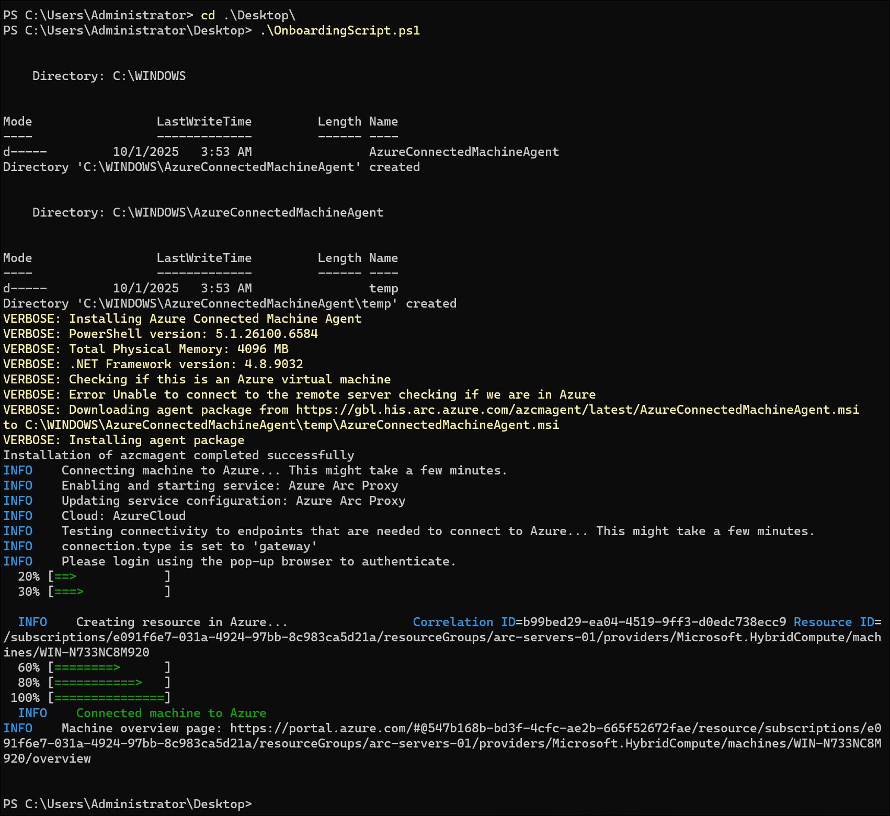

# Lab 4-1: Azure Arc - Onboarding a Server

**Objective:** Get your first Windows/Linux server onboarded into Azure Arc.

* Install the Connected Machine Agent on a VM (Windows + Linux if you can).
* Register the machine with your subscription and confirm it shows in the Azure Portal.
* Explore metadata: resource group, tags, location, identity.

## References

* [Quickstart: Connect a machine to Arc-enabled servers](https://learn.microsoft.com/en-us/azure/azure-arc/servers/quick-enable-hybrid-vm)

## Generate installation script

1. In the Azure portal, open the **Add servers (Azure Arc)** page. Select **Add a single server**, then select **Generate script**.

   **Tip:** You can also go to **Servers - Azure Arc** and select **+Add**.

    

2. On **Basics**:
    * a. Select the subscription and resource group for the machine.
    * b. Choose the **Region** to store server metadata.
    * c. Select the server **Operating system**.
    * d. Under **Connectivity method**:
        * Choose **Public endpoint** or **Private endpoint**.
        * For **Private endpoint**, pick or create a private link scope.
        * To use a proxy, enter the URL in the format http://<proxyURL>:<proxyport>.
        * If using **Public endpoint** with **Azure Arc Gateway**, select or create a Gateway.
    * e. Select **Next**.
    <br><br>
    

3. On **Tags**:
   * a. Review **Physical location** tags and enter values.
   * b. Add any **Custom tags**.
   * c. Select **Next**.
  <br><br>
   

4. In **Download and run script**:
   * a. Review the script; use **Previous** to adjust settings if needed.
   * b. Select **Download** to save the script file.

    See [OnboardingScript.ps1](./scripts/OnboardingScript.ps1)

## Install the agent using the script

1. Copy the downloaded script to the target server.

2. Run the script with administrative privileges.

3. The script will:
   • Download the Connected Machine agent from Microsoft Download Center.
   • Install the agent on the server.
   • Create the Azure Arc–enabled server resource.
   • Link the resource with the agent.

4. Follow the instructions specific to your server’s operating system to complete the onboarding process.

### Windows agent

1. Log in to the Windows server.

2. Open a 64-bit PowerShell command prompt with administrator privileges.

3. Navigate to the folder or network share containing the script.

4. Run the script by executing:

```powershell
./OnboardingScript.ps1
```

**Output:**



**Note:** The script does prompt for interactive authentication


### Linux agent

1. Log in to the Linux server.

2. Run the installation script depending on your connectivity setup:

* For servers with direct access to Azure:

    ```bash
    bash ~/Install_linux_azcmagent.sh
    ```

* For servers using a proxy:

    ```bash
    bash ~/Install_linux_azcmagent.sh --proxy "{proxy-url}:{proxy-port}"
    ```

**Suggestion:** Make the script executable first if needed by running `chmod +x ~/Install_linux_azcmagent.sh`. Also verify that outbound connectivity to Azure endpoints is allowed (directly or via proxy).

## Verify connection with Azure Arc

1. Open the Azure portal and go to the **Hybrid machines** page.
   Tip: You can also search for **Machines - Azure Arc** in the portal.

2. Locate your server in the list.

3. Confirm that the machine shows a **Connected** status.

   

Suggestion: If the status is not connected, check agent logs on the server, verify network connectivity, and confirm that the correct subscription and resource group were selected during onboarding.
