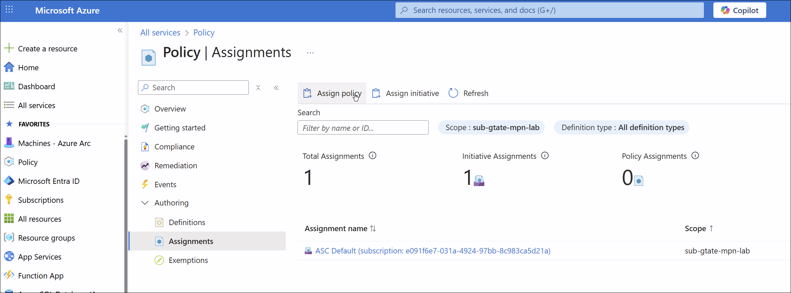
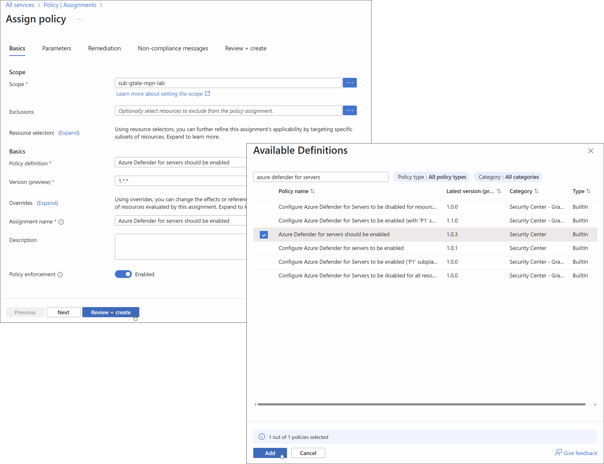
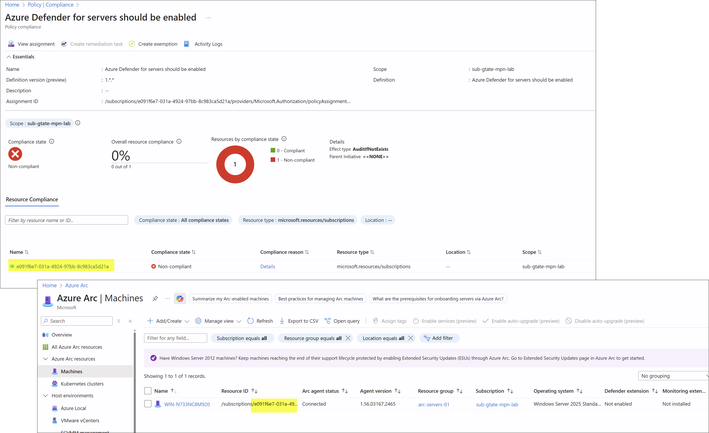
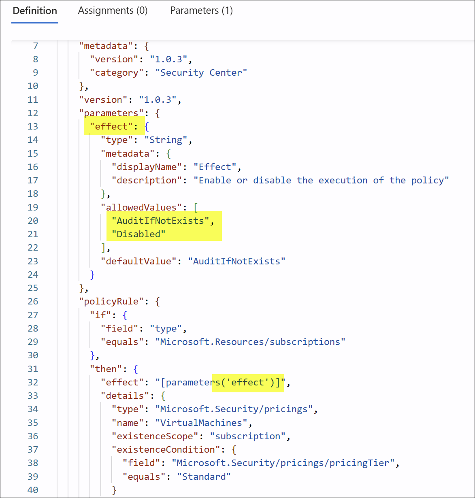

# Lab 4.2 - Azure Arc - Azure Policy and Guest Configuration

**Objective:** Apply governance controls.

* Assign a built-in Azure Policy (e.g., “Audit if Log Analytics agent is not installed”).
* Onboard the server into Guest Configuration.
* Validate compliance reporting in the Portal.

<!-- omit in toc -->
## Contents

* [References](#references)
* [Assign a built-in Azure Policy](#assign-a-built-in-azure-policy)
  * [Create a policy assignment](#create-a-policy-assignment)
  * [Identify non-compliant resources](#identify-non-compliant-resources)

## References

* [Assign policy to assess compliance](https://learn.microsoft.com/en-us/azure/azure-arc/servers/tutorial-assign-policy-portal)

## Assign a built-in Azure Policy

### Create a policy assignment

1. Open the Azure portal and search for **Policy** to launch the Azure Policy service.
2. In the left menu under **Authoring**, select **Assignments**.
3. At the top of the Assignments pane, select **Assign Policy**.

    

4. On the **Assign Policy** page, set the **Scope** by selecting the ellipsis. Choose a management group or subscription, and optionally a resource group. Select **Select** when done.
5. Leave **Exclusions** blank unless you need to exclude resources.
6. Select the **Policy definition** ellipsis to open the list of definitions. Search for **Azure Defender for servers should be enabled**. Select it and choose **Add**.

      

7. The **Assignment name** will auto-fill with the policy name. Keep the default and leave other options unchanged.
8. Skip the additional tabs. Select **Review + Create**, then select **Create**.
9. The policy is now assigned. You can check for noncompliant resources to understand your environment’s compliance state.

### Identify non-compliant resources

1. In the Azure portal, open **Policy**.
2. From the left menu, select **Compliance**.
3. Locate the **Azure Defender for servers should be enabled** policy assignment.
4. Any resources not meeting the assignment will show **Non-compliant** under Compliance state.

      

Compliance is determined by evaluating conditions against resources:

| Resource state | Effect                                                    | Policy evaluation | Compliance state |
| -------------- | --------------------------------------------------------- | ----------------- | ---------------- |
| Exists         | Deny, Audit, Append*, DeployIfNotExist*, AuditIfNotExist* | True              | Non-compliant    |
| Exists         | Deny, Audit, Append*, DeployIfNotExist*, AuditIfNotExist* | False             | Compliant        |
| New            | Audit, AuditIfNotExist*                                   | True              | Non-compliant    |
| New            | Audit, AuditIfNotExist*                                   | False             | Compliant        |

*Append, DeployIfNotExist, and AuditIfNotExist require the IF condition to be **true** and the existence condition to be **false** for a resource to be marked noncompliant.*

