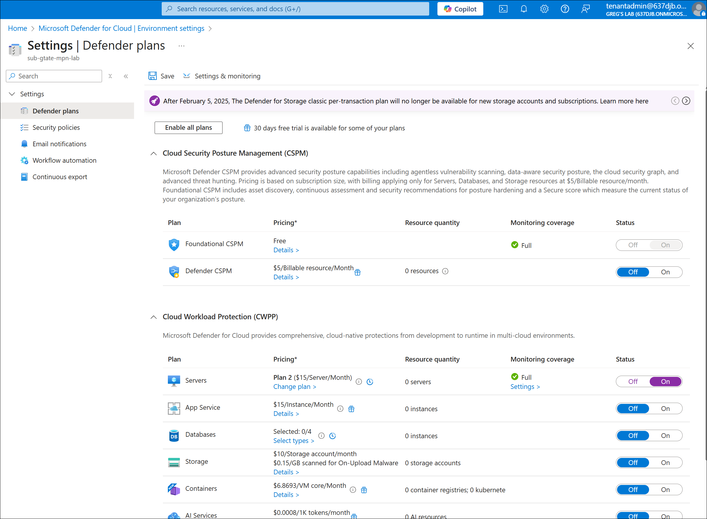
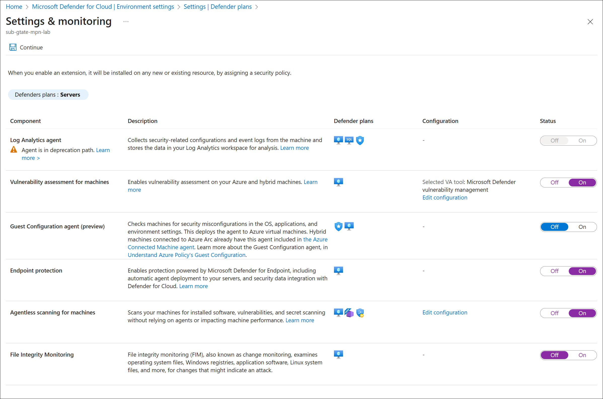
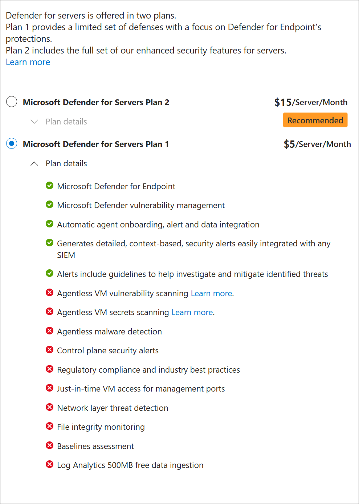

# Lab 4.3 - Security with Defender for Cloud

**Objective:**  Protect Arc-enabled servers by:

1. Enabling Defender for Cloud (Defender for Servers).
2. Reviewing security recommendations and vulnerability findings.
3. Understanding how to *automate Defender onboarding* at the time of Arc installation.

<!-- omit in toc -->
## Contents

* [🧩 Part 1 – Background](#-part-1--background)
* [⚙️ Part 2 – Prerequisites](#️-part-2--prerequisites)
* [🧪 Part 3 – Lab Steps](#-part-3--lab-steps)
  * [**Step 1: Enable Defender for Servers**](#step-1-enable-defender-for-servers)
  * [**Step 2: Connect a Server to Azure Arc**](#step-2-connect-a-server-to-azure-arc)
  * [**Step 3: Validate Defender Integration**](#step-3-validate-defender-integration)
  * [**Step 4: Review Recommendations**](#step-4-review-recommendations)
  * [**Step 5: Trigger Vulnerability Scan**](#step-5-trigger-vulnerability-scan)
* [⚡ Bonus: Automate Defender Deployment at Scale](#-bonus-automate-defender-deployment-at-scale)
* [✅ Validation Checklist](#-validation-checklist)
* [🔗 Reference Docs](#-reference-docs)

## 🧩 Part 1 – Background

Azure **Defender for Servers** is part of **Microsoft Defender for Cloud**.
When you connect a machine via Azure Arc, Defender for Cloud can automatically:

* Install agents (MDE/Log Analytics).
* Start vulnerability scanning.
* Report recommendations.

To make this happen automatically, you must:

* Enable **Defender for Servers plan** in the subscription.
* Ensure the **Log Analytics workspace** is linked to Defender for Cloud.
* Deploy the **Arc Connected Machine Agent** with the proper parameters.

## ⚙️ Part 2 – Prerequisites

1. **Permissions**

   * You need at least **Security Admin** and **Contributor** roles in the subscription.
   * Access to create Arc-enabled servers and modify Defender settings.

2. **Azure Resources**

   * One subscription with Defender for Cloud enabled.
   * A Log Analytics workspace (Defender for Servers Plan 2 preferred).

3. **Connectivity**

   * Outbound HTTPS (443) to Azure endpoints for Arc agent.

## 🧪 Part 3 – Lab Steps

### **Step 1: Enable Defender for Servers**

1. In Azure Portal:

   * Go to **Defender for Cloud → Environment Settings**.
   * Select your subscription.
   * Under **Defender plans**, turn on **Servers** (Plan 2 recommended).

      

      **Workload Settings:**  

      

      **Defender for Servers Plan Features:**  

      

### **Step 2: Connect a Server to Azure Arc**

Use PowerShell or a script (Windows example):

```powershell
# Variables
$ResourceGroup = "ArcLab-RG"
$Location = "eastus"
$SubscriptionId = "<YourSubscriptionID>"

# Download the Connected Machine agent
Invoke-WebRequest -Uri https://aka.ms/AzureConnectedMachineAgent -OutFile AzureConnectedMachineAgent.msi

# Install and connect (Service Principal method)
$ServicePrincipalId = "<AppId>"
$ServicePrincipalSecret = "<Secret>"
$TenantId = "<TenantId>"

msiexec /i AzureConnectedMachineAgent.msi /l*v installationlog.txt /qn `
  ADD_OPINSIGHTS_WORKSPACE=0 `
  /norestart `
  AZCM_AGENT_ALLOW_BILLING=true `
  RESOURCEGROUP=$ResourceGroup `
  LOCATION=$Location `
  SUBSCRIPTION_ID=$SubscriptionId `
  TENANT_ID=$TenantId `
  SERVICE_PRINCIPAL_ID=$ServicePrincipalId `
  SERVICE_PRINCIPAL_SECRET=$ServicePrincipalSecret
```

✅ The key flag here is **`AZCM_AGENT_ALLOW_BILLING=true`** —
this enables Defender for Servers to auto-provision when the Arc agent connects.

---

### **Step 3: Validate Defender Integration**

1. Go to **Defender for Cloud → Inventory**.
2. Filter for “Arc” under **Resource type**.
3. You should see your connected server listed.
4. Within a few minutes, it will:

   * Show as **“Monitored by Defender for Servers”**.
   * Begin collecting vulnerability and security data.

---

### **Step 4: Review Recommendations**

* Navigate to:
  **Defender for Cloud → Workload Protections → Recommendations**
* Review categories like:

  * Missing endpoint protection.
  * Missing system updates.
  * OS vulnerabilities.
* You can remediate directly or export recommendations.

---

### **Step 5: Trigger Vulnerability Scan**

For Windows or Linux Arc-enabled servers:

* Defender automatically deploys the **Microsoft Defender Vulnerability Management (MDVM)** component (Plan 2).
* You can verify by checking:

  ```
  Get-MpComputerStatus
  ```

  or viewing results in **Defender for Cloud → Inventory → Vulnerabilities**.

---

## ⚡ Bonus: Automate Defender Deployment at Scale

If you’re onboarding dozens of servers, use **Azure Policy**:

* Built-in initiative:
  **“Configure machines to automatically install the Azure Monitor and Defender for Servers extensions”**
* Scope it to your Resource Group or Subscription.
* Arc onboarding + policy = automatic Defender + monitoring setup.

---

## ✅ Validation Checklist

| Task                              | Validation                                     |
| --------------------------------- | ---------------------------------------------- |
| Arc agent installed               | Appears in Azure Arc → Servers                 |
| Defender for Servers enabled      | “Defender for Servers” plan shows ON           |
| Auto-billing flag enabled         | `AZCM_AGENT_ALLOW_BILLING=true` used           |
| Recommendations visible           | Security findings appear in Defender for Cloud |
| Vulnerability scan data available | Found under “Vulnerability Assessment” blade   |

---

## 🔗 Reference Docs

* [Enable Defender for Servers](https://learn.microsoft.com/en-us/azure/defender-for-cloud/enable-defender-for-servers)
* [Connect hybrid machines with Azure Arc](https://learn.microsoft.com/en-us/azure/azure-arc/servers/learn/quick-enable-hybrid-vm)
* [Defender for Servers architecture](https://learn.microsoft.com/en-us/azure/defender-for-cloud/defender-for-servers-introduction)
* [Azure Policy for Defender and Arc](https://learn.microsoft.com/en-us/azure/defender-for-cloud/azure-policy-integration)

---

Would you like me to follow this with **Lab 4 – Monitoring & Log Analytics**, using the same hands-on format (commands + portal steps + validation table)?
