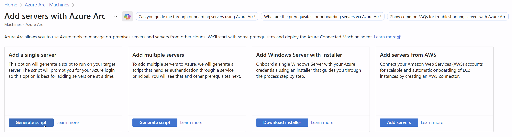
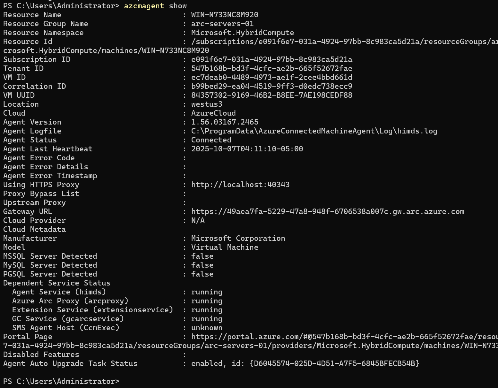
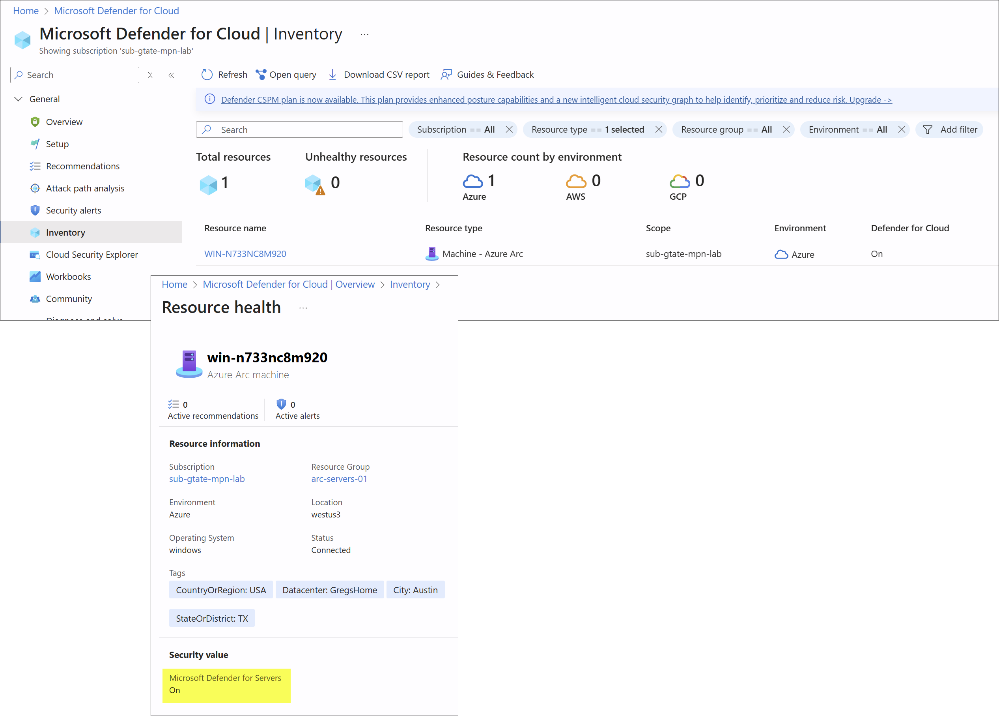
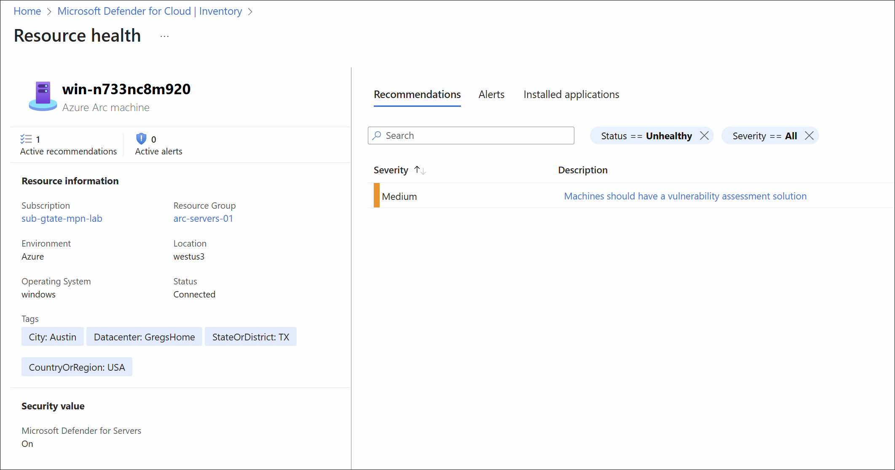
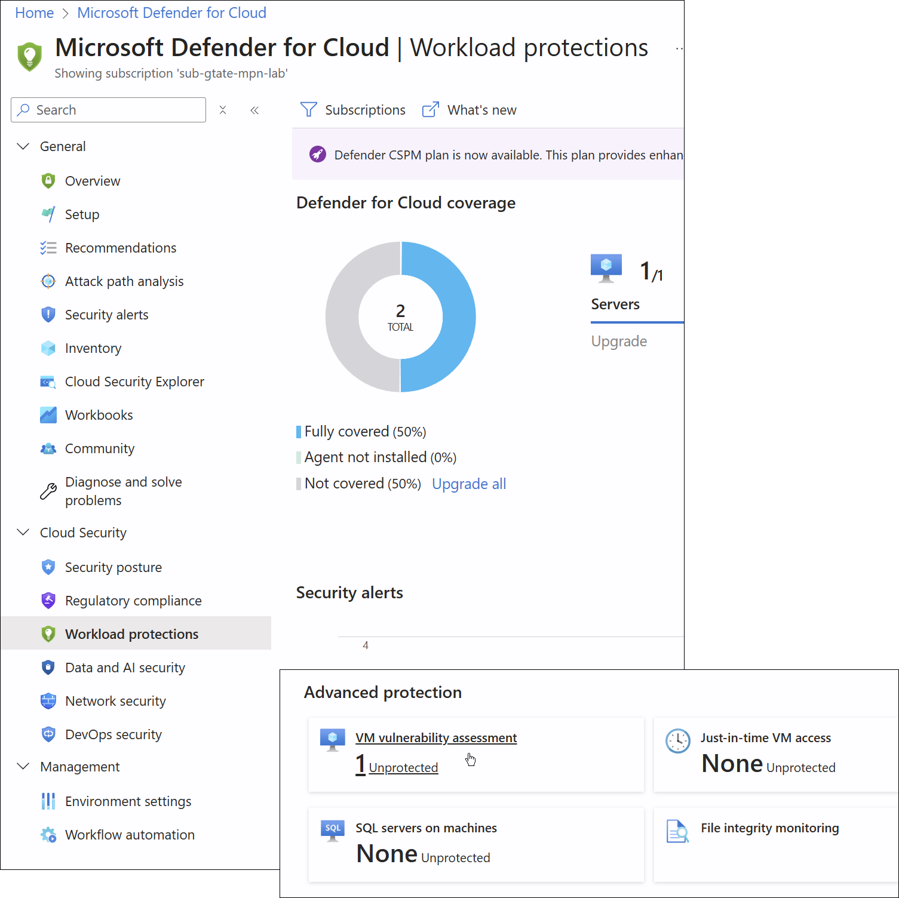

# Lab 4.3 - Security with Defender for Cloud

**Objective:**  Protect Arc-enabled servers by:

1. Enabling Defender for Cloud (Defender for Servers).
2. Reviewing security recommendations and vulnerability findings.
3. Understanding how to *automate Defender onboarding* at the time of Arc installation.

<!-- omit in toc -->
## Contents

* [🧩 Part 1 – Background](#-part-1--background)
* [⚙️ Part 2 – Prerequisites](#️-part-2--prerequisites)
* [🧪 Part 3 – Lab Steps](#-part-3--lab-steps)
  * [Step 1: Enable Defender for Servers](#step-1-enable-defender-for-servers)
  * [Step 2: Connect a Server to Azure Arc](#step-2-connect-a-server-to-azure-arc)
  * [Step 3: Validate Defender Integration](#step-3-validate-defender-integration)
  * [Step 4: Review Recommendations](#step-4-review-recommendations)
  * [Step 5: Trigger Vulnerability Scan](#step-5-trigger-vulnerability-scan)
* [✅ Validation Checklist](#-validation-checklist)
* [🔗 Reference Docs](#-reference-docs)

## 🧩 Part 1 – Background

Azure **Defender for Servers** is part of **Microsoft Defender for Cloud**.
When you connect a machine via Azure Arc, Defender for Cloud can automatically:

* Install agents (MDE/Log Analytics).
* Start vulnerability scanning.
* Report recommendations.

To make this happen automatically, you must:

* Enable **Defender for Servers plan** in the subscription.
* Ensure the **Log Analytics workspace** is linked to Defender for Cloud.
* Deploy the **Arc Connected Machine Agent** with the proper parameters.

## ⚙️ Part 2 – Prerequisites

1. **Permissions**

   * You need at least **Security Admin** and **Contributor** roles in the subscription.
   * Access to create Arc-enabled servers and modify Defender settings.

2. **Azure Resources**

   * One subscription with Defender for Cloud enabled.
   * A Log Analytics workspace (Defender for Servers Plan 2 preferred).

3. **Connectivity**

   * Outbound HTTPS (443) to Azure endpoints for Arc agent.

## 🧪 Part 3 – Lab Steps

### Step 1: Enable Defender for Servers

1. In Azure Portal:

   * Go to **Defender for Cloud → Environment Settings**.
   * Select your subscription.
   * Under **Defender plans**, turn on **Servers** (Plan 2 recommended).

      

      **Workload Settings:**  

      

      **Defender for Servers Plan Features:**  

      

### Step 2: Connect a Server to Azure Arc

Use the PowerShell script from the **Add a single server** tab to register the VM with Azure Arc:

Run `azcmagent show` to confirm connectivity:

### Step 3: Validate Defender Integration

1. Go to **Defender for Cloud → Inventory**.
2. Filter for “Arc” under **Resource type**.
3. You should see your connected server listed.
4. Within a few minutes, it will:

   * Show as **“Monitored by Defender for Servers”**.
   * Begin collecting vulnerability and security data.

  

### Step 4: Review Recommendations

* Navigate to:
  **Defender for Cloud → Workload Protections → Recommendations**
* Review categories like:

  * Missing endpoint protection.
  * Missing system updates.
  * OS vulnerabilities.
* You can remediate directly or export recommendations.

### Step 5: Trigger Vulnerability Scan

For Windows or Linux Arc-enabled servers:

* Defender automatically deploys the **Microsoft Defender Vulnerability Management (MDVM)** component.

View the results in **Defender for Cloud → Inventory → Vulnerabilities**.

  

## ✅ Validation Checklist

| Task                              | Validation                                     |
| --------------------------------- | ---------------------------------------------- |
| Arc agent installed               | Appears in Azure Arc → Servers                 |
| Defender for Servers enabled      | “Defender for Servers” plan shows ON           |
| Recommendations visible           | Security findings appear in Defender for Cloud |
| Vulnerability scan data available | Found under “Vulnerability Assessment” blade   |

---

## 🔗 Reference Docs
